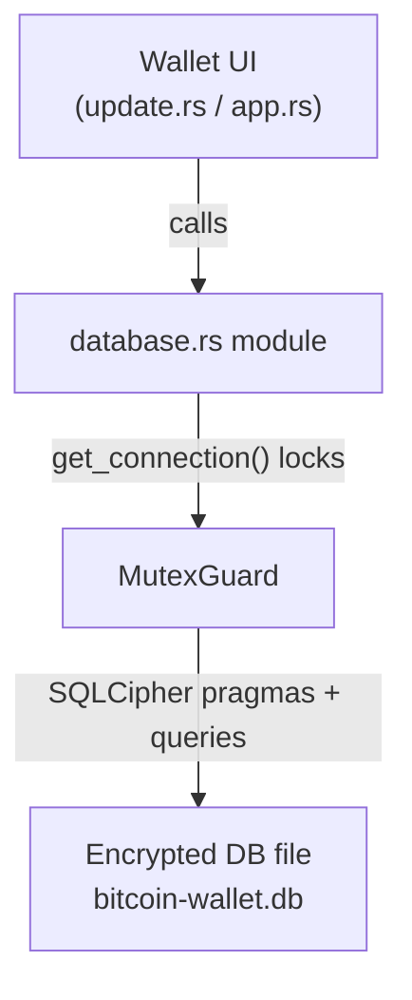

<div align="left">

<details>
<summary><b>📑 Chapter Navigation ▼</b></summary>

### Part I: Core Blockchain Implementation

1. <a href="../01-Introduction.md">Chapter 1: Introduction & Overview</a> - Book introduction, project structure, technical stack
2. <a href="../bitcoin-blockchain/README.md">Chapter 1.2: Introduction to Bitcoin & Blockchain</a> - Bitcoin and blockchain fundamentals
3. <a href="../bitcoin-blockchain/whitepaper-rust/00-Bitcoin-Whitepaper-Summary.md">Chapter 1.3: Bitcoin Whitepaper</a> - Bitcoin Whitepaper
4. <a href="../bitcoin-blockchain/whitepaper-rust/00-Bitcoin-Whitepaper-Rust-Encoding-Summary.md">Chapter 1.4: Bitcoin Whitepaper In Rust</a> - Bitcoin Whitepaper In Rust
5. <a href="../bitcoin-blockchain/Rust-Project-Index.md">Chapter 2.0: Rust Blockchain Project</a> - Blockchain Project
6. <a href="../bitcoin-blockchain/primitives/README.md">Chapter 2.1: Primitives</a> - Core data structures
7. <a href="../bitcoin-blockchain/util/README.md">Chapter 2.2: Utilities</a> - Utility functions and helpers
8. <a href="../bitcoin-blockchain/crypto/README.md">Chapter 2.3: Cryptography</a> - Cryptographic primitives and libraries
9. <a href="../bitcoin-blockchain/chain/README.md">Chapter 2.4: Blockchain (Technical Foundations)</a> - Proof Of Work
10. <a href="../bitcoin-blockchain/store/README.md">Chapter 2.5: Storage Layer</a> - Persistent storage implementation
11. <a href="../bitcoin-blockchain/chain/10-Whitepaper-Step-5-Block-Acceptance.md">Chapter 2.6: Block Acceptance (Whitepaper §5, Step 5)</a> - Proof Of Work
12. <a href="../bitcoin-blockchain/net/README.md">Chapter 2.7: Network Layer</a> - Peer-to-peer networking and protocol
13. <a href="../bitcoin-blockchain/node/README.md">Chapter 2.8: Node Orchestration</a> - Node context and coordination
14. <a href="../bitcoin-blockchain/wallet/README.md">Chapter 2.9: Wallet System</a> - Wallet implementation and key management
15. <a href="../bitcoin-blockchain/web/README.md">Chapter 3: Web API Architecture</a> - REST API implementation
16. <a href="../bitcoin-desktop-ui-iced/03-Desktop-Admin-UI.md">Chapter 4: Desktop Admin Interface</a> - Iced framework architecture
17. <a href="04-Wallet-UI.md">Chapter 5: Wallet User Interface</a> - Wallet UI implementation
18. **Chapter 6: Embedded Database & Persistence** ← *You are here*
19. <a href="../bitcoin-web-ui/06-Web-Admin-UI.md">Chapter 7: Web Admin Interface</a> - React/TypeScript web UI

### Part II: Deployment & Operations

20. <a href="../ci/docker-compose/01-Introduction.md">Chapter 8: Docker Compose Deployment</a> - Docker Compose guide
21. <a href="../ci/kubernetes/README.md">Chapter 9: Kubernetes Deployment</a> - Kubernetes production guide
22. <a href="../rust/README.md">Chapter 10: Rust Language Guide</a> - Rust programming language reference

</details>

</div>

---
<div align="right">

**[← Back to Main Book](../../README.md)**

</div>

---

## Chapter 6: Embedded Database & Persistence

**Part I: Core Blockchain Implementation**

<div align="center">

**📚 [← Chapter 5: Wallet UI](04-Wallet-UI.md)** | **Chapter 6: Embedded Database** | **[Chapter 7: Web Admin UI →](../bitcoin-web-ui/06-Web-Admin-UI.md)** 📚

</div>

---

## Overview

> **Methods involved**
> - `database::init_database` (`bitcoin-wallet-ui-iced/src/database.rs`, [Listing 6.1](05A-Embedded-Database-Code-Listings.md#listing-61-srcdatabasers))
> - `load_settings`, `save_settings` ([Listing 6.1](05A-Embedded-Database-Code-Listings.md#listing-61-srcdatabasers))
> - `save_wallet_address`, `load_wallet_addresses` ([Listing 6.1](05A-Embedded-Database-Code-Listings.md#listing-61-srcdatabasers))
> - `generate_database_password` (`bitcoin-wallet-ui-iced/src/main.rs`, [Listing 5.1](04A-Wallet-UI-Code-Listings.md#listing-51-srcmainrs))

This chapter explains the persistence layer used by `bitcoin-wallet-ui`. The application stores user configuration and wallet addresses in an **encrypted SQLite database** built via SQLCipher (`rusqlite` with the `bundled-sqlcipher` feature).

The two reader-facing goals are:

- **Security**: sensitive values (like API keys) are stored encrypted at rest.
- **Continuity**: wallet addresses and settings survive process restarts.

To keep this chapter readable without a repository open, the complete, verbatim module is provided in **[Chapter 6A: Embedded Database — Complete Code Listings](05A-Embedded-Database-Code-Listings.md)**.

---

## What we store (and why)

> **Methods involved**
> - `create_tables` ([Listing 6.1](05A-Embedded-Database-Code-Listings.md#listing-61-srcdatabasers))

This persistence layer is intentionally small and pragmatic:

- **Settings**: `base_url`, `api_key`
  - required so the UI can reconnect to the node without retyping configuration each time.
- **Wallet addresses**: `address`, optional `label`, `created_at`
  - required so the wallet list is stable and selectable after restart.
- **Schema version**: `schema_version.version`
  - required so the database can evolve safely over time.
- **User profile table**: `users`
  - present to support future UI work; in the current code, the persistence primitives exist (schema + migrations), even if UI integration is minimal.

---

## Architecture: a single encrypted database + a single guarded connection

> **Methods involved**
> - `init_database` ([Listing 6.1](05A-Embedded-Database-Code-Listings.md#listing-61-srcdatabasers))
> - `get_connection` ([Listing 6.1](05A-Embedded-Database-Code-Listings.md#listing-61-srcdatabasers))

The module uses a single global connection:

- `DB_CONN: OnceLock<Mutex<Connection>>`

This is a deliberate trade-off suitable for a GUI application:

- it avoids passing a connection through every call,
- it ensures access is serialized (SQLite `Connection` is not safe to share without synchronization),
- and it keeps the API of the module simple.



---

## Key derivation and database initialization

> **Methods involved**
> - `generate_database_password` ([Listing 5.1](04A-Wallet-UI-Code-Listings.md#listing-51-srcmainrs))
> - `init_database` ([Listing 6.1](05A-Embedded-Database-Code-Listings.md#listing-61-srcdatabasers))
> - `get_database_path` ([Listing 6.1](05A-Embedded-Database-Code-Listings.md#listing-61-srcdatabasers))

The database password is generated by `generate_database_password` (Listing 5.1) and passed into `init_database`. This design emphasizes **zero-interaction UX**: the user is not prompted for a passphrase, but the file is still encrypted at rest.

### Annotated listing: `init_database`

> **Methods involved**
> - `init_database` (verbatim in [Listing 6.1](05A-Embedded-Database-Code-Listings.md#listing-61-srcdatabasers))

```rust
pub fn init_database(password: &str) -> SqliteResult<()> {
    let db_path = get_database_path();

    // 1) Ensure the parent directory exists. This makes the module robust on first run.
    if let Some(parent) = db_path.parent() {
        std::fs::create_dir_all(parent).map_err(|e| {
            // Map an I/O error into a rusqlite error so we keep one error domain.
            rusqlite::Error::SqliteFailure(
                rusqlite::ffi::Error::new(rusqlite::ffi::SQLITE_CANTOPEN),
                Some(format!("Failed to create database directory: {}", e)),
            )
        })?;
    }

    // 2) Open (or create) the SQLite file.
    let conn = Connection::open(&db_path)?;

    // 3) Critical SQLCipher step: set the encryption key *immediately* after opening.
    //    If the key is wrong, subsequent reads will fail with “file is encrypted…”.
    conn.pragma_update(None, "key", password)?;

    // 4) Enable foreign keys (good SQLite hygiene; harmless if unused).
    conn.pragma_update(None, "foreign_keys", "ON")?;

    // 5) Create base schema + apply migrations before the connection is exposed.
    create_tables(&conn)?;
    run_migrations(&conn)?;

    // 6) Store the connection globally for the rest of the process lifetime.
    DB_CONN.set(Mutex::new(conn)).map_err(|_| {
        rusqlite::Error::SqliteFailure(
            rusqlite::ffi::Error::new(rusqlite::ffi::SQLITE_MISUSE),
            Some("Database already initialized".to_string()),
        )
    })?;

    Ok(())
}
```

---

## Connection acquisition: one line that matters (`get_connection`)

> **Methods involved**
> - `get_connection` (verbatim in [Listing 6.1](05A-Embedded-Database-Code-Listings.md#listing-61-srcdatabasers))

`get_connection` is the narrow waist of the module: every read/write operation goes through it. It ensures:

- the database was initialized,
- the global mutex is acquired,
- and errors are mapped to one domain (`rusqlite::Error`).

### Annotated listing: `get_connection`

> **Methods involved**
> - `get_connection` (verbatim in [Listing 6.1](05A-Embedded-Database-Code-Listings.md#listing-61-srcdatabasers))

```rust
fn get_connection() -> SqliteResult<std::sync::MutexGuard<'static, Connection>> {
    // 1) Ensure initialization happened.
    //    This is a runtime requirement: the UI must call `init_database` at startup.
    DB_CONN
        .get()
        .ok_or_else(|| {
            rusqlite::Error::SqliteFailure(
                rusqlite::ffi::Error::new(rusqlite::ffi::SQLITE_MISUSE),
                Some("Database not initialized".to_string()),
            )
        })?
        // 2) Serialize access to the single Connection.
        //    SQLite connections are not safe to share without synchronization.
        .lock()
        .map_err(|_| {
            // A poisoned mutex implies a previous panic while holding the lock.
            // For a UI process, we surface this as a database misuse error.
            rusqlite::Error::SqliteFailure(
                rusqlite::ffi::Error::new(rusqlite::ffi::SQLITE_MISUSE),
                Some("Failed to acquire database lock".to_string()),
            )
        })
}
```

---

## Schema and defaults (`create_tables`)

> **Methods involved**
> - `create_tables` (verbatim in [Listing 6.1](05A-Embedded-Database-Code-Listings.md#listing-61-srcdatabasers))

Read `create_tables` (Listing 6.1) with three lenses:

- **Singleton settings**: `settings.id` has `CHECK (id = 1)` so there can be only one row.
- **Uniqueness**: `wallet_addresses.address` is `UNIQUE` to prevent duplicates.
- **Schema versioning**: `schema_version` is created and initialized to `SCHEMA_VERSION`.

This is the typical baseline for a durable embedded store: create-if-not-exists plus safe defaults.

### Annotated listing: `create_tables`

> **Methods involved**
> - `create_tables` (verbatim in [Listing 6.1](05A-Embedded-Database-Code-Listings.md#listing-61-srcdatabasers))

```rust
fn create_tables(conn: &Connection) -> SqliteResult<()> {
    // The settings table is a singleton: enforced by CHECK(id = 1).
    conn.execute(
        "CREATE TABLE IF NOT EXISTS settings (
            id INTEGER PRIMARY KEY CHECK (id = 1),
            base_url TEXT NOT NULL DEFAULT 'http://127.0.0.1:8080',
            api_key TEXT NOT NULL DEFAULT '',
            created_at TEXT NOT NULL DEFAULT (datetime('now')),
            updated_at TEXT NOT NULL DEFAULT (datetime('now'))
        )",
        [],
    )?;

    // Populate the singleton row once (first-run initialization).
    let count: i64 = conn.query_row("SELECT COUNT(*) FROM settings", [], |row| row.get(0))?;
    if count == 0 {
        conn.execute(
            "INSERT INTO settings (id, base_url, api_key) VALUES (1, 'http://127.0.0.1:8080', ?)",
            params![
                std::env::var(\"BITCOIN_API_WALLET_KEY\")
                    .unwrap_or_else(|_| \"wallet-secret\".to_string())
            ],
        )?;
    }

    // Wallet addresses: UNIQUE(address) prevents duplicates across restarts and re-creates.
    conn.execute(
        "CREATE TABLE IF NOT EXISTS wallet_addresses (
            id INTEGER PRIMARY KEY AUTOINCREMENT,
            address TEXT NOT NULL UNIQUE,
            label TEXT,
            created_at TEXT NOT NULL DEFAULT (datetime('now')),
            updated_at TEXT NOT NULL DEFAULT (datetime('now'))
        )",
        [],
    )?;

    // Optional performance: a lookup index (also helps with ORDER BY / WHERE patterns).
    conn.execute(
        "CREATE INDEX IF NOT EXISTS idx_wallet_addresses_address ON wallet_addresses(address)",
        [],
    )?;

    // User profile table for future features; profile_picture is stored as a BLOB.
    conn.execute(
        "CREATE TABLE IF NOT EXISTS users (
            id INTEGER PRIMARY KEY CHECK (id = 1),
            first_name TEXT,
            last_name TEXT,
            profile_picture BLOB,
            created_at TEXT NOT NULL DEFAULT (datetime('now')),
            updated_at TEXT NOT NULL DEFAULT (datetime('now'))
        )",
        [],
    )?;

    // Schema versioning enables safe evolution over time.
    conn.execute(
        "CREATE TABLE IF NOT EXISTS schema_version (
            version INTEGER PRIMARY KEY
        )",
        [],
    )?;

    let version_count: i64 =
        conn.query_row("SELECT COUNT(*) FROM schema_version", [], |row| row.get(0))?;

    if version_count == 0 {
        conn.execute(
            "INSERT INTO schema_version (version) VALUES (?)",
            params![SCHEMA_VERSION],
        )?;
    }

    Ok(())
}
```

---

## Migrations: evolving the database safely (`run_migrations`)

> **Methods involved**
> - `run_migrations` (verbatim in [Listing 6.1](05A-Embedded-Database-Code-Listings.md#listing-61-srcdatabasers))

Migrations exist to handle one of the most common real-world problems: shipping a new binary against a database created by an older version.

The current code includes a migration to schema version 2:

- change `users.profile_picture_path` (TEXT) into `users.profile_picture` (BLOB).

The key engineering detail is that SQLite does not support changing a column type in place, so the migration uses either:

- table recreation via `execute_batch` within a transaction, or
- adding a missing column and then recreating the table to remove the old column.

### Annotated listing: `run_migrations` (overview-level comments)

> **Methods involved**
> - `run_migrations` (verbatim in [Listing 6.1](05A-Embedded-Database-Code-Listings.md#listing-61-srcdatabasers))

```rust
fn run_migrations(conn: &Connection) -> SqliteResult<()> {
    // Read the version from schema_version; missing row defaults to 0.
    let current_version: i32 = conn
        .query_row("SELECT version FROM schema_version LIMIT 1", [], |row| {
            row.get(0)
        })
        .unwrap_or(0);

    // Migration 1 -> 2:
    // - detect whether legacy column `profile_picture_path` exists
    // - ensure new column `profile_picture` exists (BLOB)
    // - when necessary, recreate the table because SQLite cannot ALTER COLUMN types.
    if current_version < 2 {
        let table_info: Vec<TableColumnInfo> = conn
            .prepare("PRAGMA table_info(users)")?
            .query_map([], |row| {
                Ok((
                    row.get::<_, String>(1)?,
                    row.get::<_, String>(2)?,
                    row.get(3)?,
                    row.get(4)?,
                    row.get(5)?,
                    false,
                ))
            })?
            .collect::<Result<Vec<_>, _>>()?;

        let has_old_column = table_info
            .iter()
            .any(|(name, _, _, _, _, _)| name == "profile_picture_path");
        let has_new_column = table_info
            .iter()
            .any(|(name, _, _, _, _, _)| name == "profile_picture");

        if has_old_column && !has_new_column {
            // Recreate users table in a transaction, copying compatible columns.
            conn.execute_batch(
                "BEGIN TRANSACTION;
                 CREATE TABLE users_new (
                     id INTEGER PRIMARY KEY CHECK (id = 1),
                     first_name TEXT,
                     last_name TEXT,
                     profile_picture BLOB,
                     created_at TEXT NOT NULL DEFAULT (datetime('now')),
                     updated_at TEXT NOT NULL DEFAULT (datetime('now'))
                 );
                 INSERT INTO users_new (id, first_name, last_name, created_at, updated_at)
                 SELECT id, first_name, last_name, created_at, updated_at FROM users;
                 DROP TABLE users;
                 ALTER TABLE users_new RENAME TO users;
                 COMMIT;",
            )?;
        } else if !has_new_column {
            // If the new column is missing, add it. If old column also exists,
            // recreate to remove the old column (SQLite cannot DROP COLUMN).
            conn.execute("ALTER TABLE users ADD COLUMN profile_picture BLOB", [])?;

            if has_old_column {
                conn.execute_batch(
                    "BEGIN TRANSACTION;
                     CREATE TABLE users_new (
                         id INTEGER PRIMARY KEY CHECK (id = 1),
                         first_name TEXT,
                         last_name TEXT,
                         profile_picture BLOB,
                         created_at TEXT NOT NULL DEFAULT (datetime('now')),
                         updated_at TEXT NOT NULL DEFAULT (datetime('now'))
                     );
                     INSERT INTO users_new (id, first_name, last_name, created_at, updated_at)
                     SELECT id, first_name, last_name, created_at, updated_at FROM users;
                     DROP TABLE users;
                     ALTER TABLE users_new RENAME TO users;
                     COMMIT;",
                )?;
            }
        }

        conn.execute("UPDATE schema_version SET version = ?", params![2])?;
    }

    // Finally, ensure schema_version reflects the latest known version.
    if current_version < SCHEMA_VERSION {
        conn.execute(
            "UPDATE schema_version SET version = ?",
            params![SCHEMA_VERSION],
        )?;
    }

    Ok(())
}
```

---

## Settings persistence: load and save

> **Methods involved**
> - `load_settings` (verbatim in [Listing 6.1](05A-Embedded-Database-Code-Listings.md#listing-61-srcdatabasers))
> - `save_settings` (verbatim in [Listing 6.1](05A-Embedded-Database-Code-Listings.md#listing-61-srcdatabasers))

### Annotated listing: `load_settings`

```rust
pub fn load_settings() -> SqliteResult<Settings> {
    // Acquire the global connection mutex.
    let conn = get_connection()?;

    // Because settings is a singleton table, the query expects exactly one row.
    conn.query_row(
        "SELECT base_url, api_key FROM settings WHERE id = 1",
        [],
        |row| {
            Ok(Settings {
                base_url: row.get(0)?,
                api_key: row.get(1)?,
            })
        },
    )
}
```

### Annotated listing: `save_settings`

```rust
pub fn save_settings(settings: &Settings) -> SqliteResult<()> {
    let conn = get_connection()?;

    // Use positional parameters to avoid string concatenation and injection hazards.
    conn.execute(
        "UPDATE settings SET base_url = ?, api_key = ?, updated_at = datetime('now') WHERE id = 1",
        params![settings.base_url, settings.api_key],
    )?;

    Ok(())
}
```

---

## Wallet address persistence: insert-or-update (“upsert”) behavior

> **Methods involved**
> - `WalletAddress::new` (verbatim in [Listing 6.1](05A-Embedded-Database-Code-Listings.md#listing-61-srcdatabasers))
> - `save_wallet_address` (verbatim in [Listing 6.1](05A-Embedded-Database-Code-Listings.md#listing-61-srcdatabasers))
> - `load_wallet_addresses` (verbatim in [Listing 6.1](05A-Embedded-Database-Code-Listings.md#listing-61-srcdatabasers))

The wallet list must be stable under these operations:

- creating a new wallet (insert),
- creating another wallet with the same address (update label; should not duplicate),
- loading all wallets (display list, newest first).

### Annotated listing: `WalletAddress::new`

```rust
impl WalletAddress {
    pub fn new(address: String, label: Option<String>) -> Self {
        // created_at is intentionally empty here: the DB sets it on insert.
        Self {
            address,
            label,
            created_at: String::new(),
        }
    }
}
```

### Reading guide: `save_wallet_address`

`save_wallet_address` is implemented as:

- attempt an `INSERT`,
- if we hit a uniqueness constraint violation, fall back to an `UPDATE`,
- then return the full record by querying the row.

This gives a stable call pattern for the UI: the caller always gets a complete `WalletAddress` back, regardless of whether the operation was insert or update.

### Annotated listing: `save_wallet_address`

> **Methods involved**
> - `save_wallet_address` (verbatim in [Listing 6.1](05A-Embedded-Database-Code-Listings.md#listing-61-srcdatabasers))

```rust
pub fn save_wallet_address(wallet: &WalletAddress) -> SqliteResult<WalletAddress> {
    let conn = get_connection()?;

    // Try an insert first. This covers the common “new wallet created” path.
    match conn.execute(
        "INSERT INTO wallet_addresses (address, label, updated_at) VALUES (?, ?, datetime('now'))",
        params![wallet.address, wallet.label],
    ) {
        Ok(_) => {
            // Re-query to return a complete record, including created_at assigned by SQLite.
            conn.query_row(
                "SELECT address, label, created_at FROM wallet_addresses WHERE address = ?",
                params![wallet.address],
                |row| {
                    Ok(WalletAddress {
                        address: row.get(0)?,
                        label: row.get(1)?,
                        created_at: row.get(2)?,
                    })
                },
            )
        }
        Err(rusqlite::Error::SqliteFailure(err, _))
            if err.code == rusqlite::ErrorCode::ConstraintViolation =>
        {
            // If the address already exists, update mutable fields (label + updated_at).
            conn.execute(
                "UPDATE wallet_addresses SET label = ?, updated_at = datetime('now') WHERE address = ?",
                params![wallet.label, wallet.address],
            )?;

            // Return the updated record so the caller can refresh its model.
            conn.query_row(
                "SELECT address, label, created_at FROM wallet_addresses WHERE address = ?",
                params![wallet.address],
                |row| {
                    Ok(WalletAddress {
                        address: row.get(0)?,
                        label: row.get(1)?,
                        created_at: row.get(2)?,
                    })
                },
            )
        }
        Err(e) => Err(e),
    }
}
```

---

## Integration points in the UI

> **Methods involved**
> - `database::init_database` call site in `main` ([Listing 5.1](04A-Wallet-UI-Code-Listings.md#listing-51-srcmainrs))
> - `WalletApp::new` call to `load_settings`/`load_wallet_addresses` ([Listing 5.4](04A-Wallet-UI-Code-Listings.md#listing-54-srcapprs))
> - `update` call to `save_settings` and `save_wallet_address` ([Listing 5.6](04A-Wallet-UI-Code-Listings.md#listing-56-srcupdaters))

This database layer is integrated at three points:

- **Startup**: `main` initializes the database.
- **Initial model construction**: `WalletApp::new` loads settings and saved wallets.
- **Update loop commits**:
  - `Message::SaveSettings` persists the current base URL and API key.
  - `Message::WalletCreated` persists the newly created wallet address.

This placement is intentional: persistence is a side effect, so it happens in startup wiring (`main`) and in the state machine (`update`), not in the view.

---

## Summary

> **Methods involved**
> - All methods listed in [Listing 6.1](05A-Embedded-Database-Code-Listings.md#listing-61-srcdatabasers)

The persistence module provides a minimal but production-appropriate foundation:

- encryption at rest (SQLCipher),
- a small schema with defaults and constraints,
- migrations for schema evolution,
- and a simple API that the UI can call from `WalletApp::new` and `update`.

Complete code is in [Chapter 6A](05A-Embedded-Database-Code-Listings.md).

---

<div align="center">

**📚 [← Previous: Wallet UI — Code Listings](04A-Wallet-UI-Code-Listings.md)** | **Chapter 6: Embedded Database & Persistence** | **[Next: Embedded Database — Code Listings →](05A-Embedded-Database-Code-Listings.md)** 📚

</div>

---

<div align="center">

**Reading order**

**[← Previous: Wallet UI — Code Listings](04A-Wallet-UI-Code-Listings.md)** | **[Next: Embedded Database — Code Listings →](05A-Embedded-Database-Code-Listings.md)**

</div>

---

