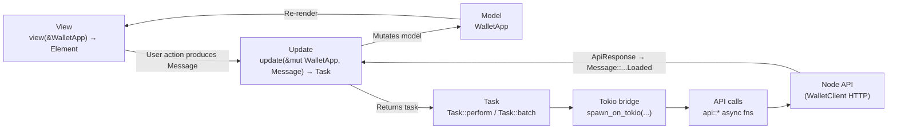
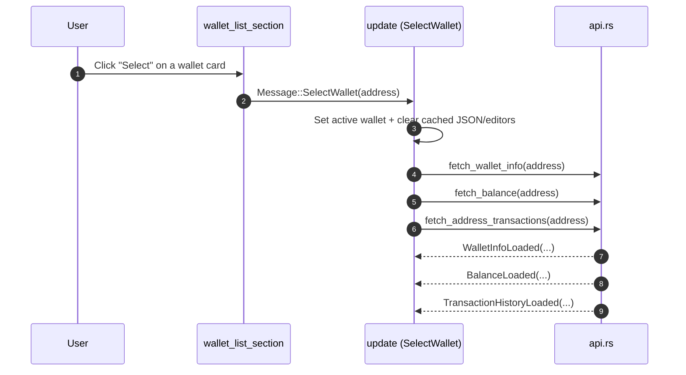
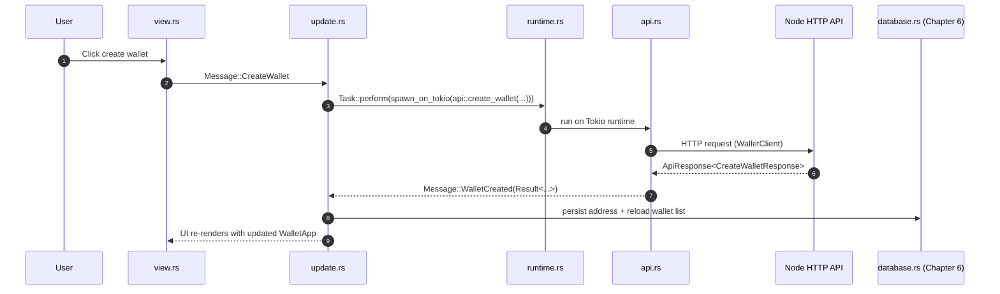

<div align="left">

<details>
<summary><b>📑 Chapter Navigation ▼</b></summary>

### Part I: Core Blockchain Implementation

1. <a href="../01-Introduction.md">Chapter 1: Introduction & Overview</a>
2. <a href="../bitcoin-blockchain/README.md">Chapter 1.2: Introduction to Bitcoin & Blockchain</a>
3. <a href="../bitcoin-blockchain/whitepaper-rust/00-Bitcoin-Whitepaper-Summary.md">Chapter 1.3: Bitcoin Whitepaper</a>
4. <a href="../bitcoin-blockchain/whitepaper-rust/00-Bitcoin-Whitepaper-Rust-Encoding-Summary.md">Chapter 1.4: Bitcoin Whitepaper In Rust</a>
5. <a href="../bitcoin-blockchain/Rust-Project-Index.md">Chapter 2.0: Rust Blockchain Project</a>
6. <a href="../bitcoin-blockchain/primitives/README.md">Chapter 2.1: Primitives</a>
7. <a href="../bitcoin-blockchain/util/README.md">Chapter 2.2: Utilities</a>
8. <a href="../bitcoin-blockchain/crypto/README.md">Chapter 2.3: Cryptography</a>
9. <a href="../bitcoin-blockchain/chain/README.md">Chapter 2.4: Blockchain (Technical Foundations)</a>
10. <a href="../bitcoin-blockchain/store/README.md">Chapter 2.5: Storage Layer</a>
11. <a href="../bitcoin-blockchain/chain/10-Whitepaper-Step-5-Block-Acceptance.md">Chapter 2.6: Block Acceptance</a>
12. <a href="../bitcoin-blockchain/net/README.md">Chapter 2.7: Network Layer</a>
13. <a href="../bitcoin-blockchain/node/README.md">Chapter 2.8: Node Orchestration</a>
14. <a href="../bitcoin-blockchain/wallet/README.md">Chapter 2.9: Wallet System</a>
15. <a href="../bitcoin-blockchain/web/README.md">Chapter 3: Web API Architecture</a>
16. <a href="../bitcoin-desktop-ui-iced/04.1-Desktop-Admin-UI-Iced.md">Chapter 4.1: Desktop Admin (Iced)</a>
17. <a href="../bitcoin-desktop-ui-iced/04.1A-Desktop-Admin-UI-Code-Walkthrough.md">4.1A: Code Walkthrough</a>
18. <a href="../bitcoin-desktop-ui-iced/04.1B-Desktop-Admin-UI-Update-Loop.md">4.1B: Update Loop</a>
19. <a href="../bitcoin-desktop-ui-iced/04.1C-Desktop-Admin-UI-View-Layer.md">4.1C: View Layer</a>
20. <a href="../bitcoin-desktop-ui-tauri/04.2-Desktop-Admin-UI-Tauri.md">Chapter 4.2: Desktop Admin (Tauri)</a>
21. <a href="../bitcoin-desktop-ui-tauri/04.2A-Tauri-Admin-Rust-Backend.md">4.2A: Rust Backend</a>
22. <a href="../bitcoin-desktop-ui-tauri/04.2B-Tauri-Admin-Frontend-Infrastructure.md">4.2B: Frontend Infrastructure</a>
23. <a href="../bitcoin-desktop-ui-tauri/04.2C-Tauri-Admin-Frontend-Pages.md">4.2C: Frontend Pages</a>
24. **Chapter 5.1: Wallet UI (Iced)** ← *You are here*
25. <a href="05.1A-Wallet-UI-Code-Listings.md">5.1A: Code Listings</a>
26. <a href="../bitcoin-wallet-ui-tauri/05.2-Wallet-UI-Tauri.md">Chapter 5.2: Wallet UI (Tauri)</a>
27. <a href="../bitcoin-wallet-ui-tauri/05.2A-Tauri-Wallet-Rust-Backend.md">5.2A: Rust Backend</a>
28. <a href="../bitcoin-wallet-ui-tauri/05.2B-Tauri-Wallet-Frontend-Infrastructure.md">5.2B: Frontend Infrastructure</a>
29. <a href="../bitcoin-wallet-ui-tauri/05.2C-Tauri-Wallet-Frontend-Pages.md">5.2C: Frontend Pages</a>
30. <a href="../embedded-database/06-Embedded-Database.md">Chapter 6: Embedded Database</a>
31. <a href="../embedded-database/06A-Embedded-Database-Code-Listings.md">6A: Code Listings</a>
32. <a href="../bitcoin-web-ui/06-Web-Admin-UI.md">Chapter 7: Web Admin Interface</a>
33. <a href="../bitcoin-web-ui/06A-Web-Admin-UI-Code-Listings.md">7A: Code Listings</a>

### Part II: Deployment & Operations

34. <a href="../ci/docker-compose/01-Introduction.md">Chapter 8: Docker Compose Deployment</a>
35. <a href="../ci/docker-compose/01A-Docker-Compose-Code-Listings.md">8A: Code Listings</a>
36. <a href="../ci/kubernetes/README.md">Chapter 9: Kubernetes Deployment</a>
37. <a href="../ci/kubernetes/01A-Kubernetes-Code-Listings.md">9A: Code Listings</a>

### Part III: Language Reference

38. <a href="../rust/README.md">Chapter 10: Rust Language Guide</a>

</details>

</div>

---
<div align="right">

**[← Back to Main Book](../../README.md)**

</div>

---

## Chapter 5.1: Wallet User Interface (Iced)

**Part I: Core Blockchain Implementation**

<div align="center">

**📚 [← Chapter 4.1: Desktop Admin UI (Iced)](../bitcoin-desktop-ui-iced/04.1-Desktop-Admin-UI-Iced.md)** | **Chapter 5.1: Wallet UI (Iced)** | **[Chapter 6: Embedded Database →](../embedded-database/06-Embedded-Database.md)** 📚

</div>

---

## Overview

> **Methods involved**
> - `main` (`bitcoin-wallet-ui-iced/src/main.rs`, [Listing 5.1](05.1A-Wallet-UI-Code-Listings.md#listing-51-srcmainrs))
> - `WalletApp::new` (`bitcoin-wallet-ui-iced/src/app.rs`, [Listing 5.4](05.1A-Wallet-UI-Code-Listings.md#listing-54-srcapprs))
> - `update` (`bitcoin-wallet-ui-iced/src/update.rs`, [Listing 5.6](05.1A-Wallet-UI-Code-Listings.md#listing-56-srcupdaters))
> - `view` (`bitcoin-wallet-ui-iced/src/view.rs`, [Listing 5.7](05.1A-Wallet-UI-Code-Listings.md#listing-57-srcviewrs))

This walks through the `bitcoin-wallet-ui` application. The UI is built with the Iced framework which is a Rust library for building desktop applications, and the program is organized around the **Model–View–Update (MVU)** pattern:

- **Model**: one `WalletApp` value holds all state.
- **View**: the UI is rendered from `&WalletApp`.
- **Update**: the program reacts to `Message` values and returns `Task<Message>` for async work.


---

## How to read this chapter (and where the code lives)

> **Methods involved**
> - All functions referenced in this chapter are defined in [Chapter 5.1A](05.1A-Wallet-UI-Code-Listings.md)

This chapter explains *how the code works*. The full, verbatim source is in Chapter 5.1A:

- `src/main.rs` ([Listing 5.1](05.1A-Wallet-UI-Code-Listings.md#listing-51-srcmainrs))
- `src/runtime.rs` ([Listing 5.2](05.1A-Wallet-UI-Code-Listings.md#listing-52-srcruntimers))
- `src/types.rs` ([Listing 5.3](05.1A-Wallet-UI-Code-Listings.md#listing-53-srctypesrs))
- `src/app.rs` ([Listing 5.4](05.1A-Wallet-UI-Code-Listings.md#listing-54-srcapprs))
- `src/api.rs` ([Listing 5.5](05.1A-Wallet-UI-Code-Listings.md#listing-55-srcapirs))
- `src/update.rs` ([Listing 5.6](05.1A-Wallet-UI-Code-Listings.md#listing-56-srcupdaters))
- `src/view.rs` ([Listing 5.7](05.1A-Wallet-UI-Code-Listings.md#listing-57-srcviewrs))

In the rest of the chapter, when a method is mentioned, it is always linked to the listing that contains its complete body.

---

## Architectural map (MVU + async tasks)

> **Methods involved**
> - `update` ([Listing 5.6](05.1A-Wallet-UI-Code-Listings.md#listing-56-srcupdaters))
> - `spawn_on_tokio` ([Listing 5.2](05.1A-Wallet-UI-Code-Listings.md#listing-52-srcruntimers))
> - `create_wallet`, `send_tx`, `fetch_wallet_info`, `fetch_balance`, `fetch_address_transactions` ([Listing 5.5](05.1A-Wallet-UI-Code-Listings.md#listing-55-srcapirs))

This wallet UI is a message-driven state machine. The key mechanical idea is that **asynchronous work is expressed as a return value of `update`**, not as a thread that mutates state directly.



---

## Boot sequence and wiring (`main.rs`)

> **Methods involved**
> - `main` ([Listing 5.1](05.1A-Wallet-UI-Code-Listings.md#listing-51-srcmainrs))
> - `generate_database_password` ([Listing 5.1](05.1A-Wallet-UI-Code-Listings.md#listing-51-srcmainrs))
> - `init_runtime` ([Listing 5.2](05.1A-Wallet-UI-Code-Listings.md#listing-52-srcruntimers))
> - `WalletApp::new` ([Listing 5.4](05.1A-Wallet-UI-Code-Listings.md#listing-54-srcapprs))

Read `main` (Listing 5.1) as a wiring function with three responsibilities:

- **Initialize async execution**: `init_runtime` creates a Tokio runtime and stores a global handle (Listing 5.2).
- **Initialize persistence**: the encrypted database is created/opened using a password from `generate_database_password` (Listing 5.1). The database itself is explained in Chapter 6.
- **Start the MVU loop**: `application("Bitcoin Wallet UI", update, view).run_with(WalletApp::new)` hands control to Iced.

After `run_with` is called, the application is driven by messages through `update` and rendering through `view`.

### Annotated listing: `main` and `generate_database_password`

> **Methods involved**
> - `main` (verbatim in [Listing 5.1](05.1A-Wallet-UI-Code-Listings.md#listing-51-srcmainrs))
> - `generate_database_password` (verbatim in [Listing 5.1](05.1A-Wallet-UI-Code-Listings.md#listing-51-srcmainrs))
>
> This annotated version is intended to be read alongside the verbatim source listing.

```rust
fn main() -> iced::Result {
    // 1) Async precondition: the API client needs a Tokio runtime.
    //    We start it *before* the GUI event loop begins.
    init_runtime();

    // 2) Persistence precondition: initialize the encrypted database.
    //    The password is generated deterministically from local machine/user context
    //    so the UI can start without prompting the user for a passphrase.
    let db_password = generate_database_password();
    if let Err(e) = database::init_database(&db_password) {
        // The UI is usable without persistence; failures degrade gracefully.
        eprintln!("Failed to initialize database: {}", e);
    }

    // 3) Enter Iced’s MVU loop.
    //    - `update` is the state machine.
    //    - `view` renders `&WalletApp` into widgets.
    //    - `WalletApp::new` constructs initial state.
    application("Bitcoin Wallet UI", update, view)
        .theme(|_| Theme::Dark)
        .run_with(WalletApp::new)
}

fn generate_database_password() -> String {
    use std::collections::hash_map::DefaultHasher;
    use std::hash::{Hash, Hasher};

    let mut hasher = DefaultHasher::new();

    // The inputs are chosen so:
    // - the same user on the same machine gets the same DB key (so the DB can be reopened),
    // - different users/machines get different DB keys (so copies are not trivially portable).
    if let Ok(username) = std::env::var("USER") {
        username.hash(&mut hasher);
    } else if let Ok(username) = std::env::var("USERNAME") {
        username.hash(&mut hasher);
    }

    if let Some(home) = dirs::home_dir() {
        home.to_string_lossy().hash(&mut hasher);
    }

    "bitcoin-wallet-ui".hash(&mut hasher);

    // The final password is just the hex representation of a 64-bit hash.
    // SQLCipher will derive an internal encryption key from this passphrase.
    format!("{:x}", hasher.finish())
}
```

---

## The async runtime bridge (`runtime.rs`)

> **Methods involved**
> - `init_runtime` ([Listing 5.2](05.1A-Wallet-UI-Code-Listings.md#listing-52-srcruntimers))
> - `spawn_on_tokio` ([Listing 5.2](05.1A-Wallet-UI-Code-Listings.md#listing-52-srcruntimers))

The wallet UI uses Tokio because the HTTP client stack expects a Tokio runtime. The implementation chooses a pragmatic architecture:

- create one Tokio runtime at startup,
- keep it alive in a background thread,
- provide a wrapper (`spawn_on_tokio`) that guarantees futures are executed on Tokio.

This isolates runtime concerns from the rest of the GUI. The update loop can simply write:

- `Task::perform(spawn_on_tokio(api::some_call(...)), Message::SomeLoaded)`

and remain agnostic about runtime details.

### Annotated listing: `spawn_on_tokio`

> **Methods involved**
> - `spawn_on_tokio` (verbatim in [Listing 5.2](05.1A-Wallet-UI-Code-Listings.md#listing-52-srcruntimers))

```rust
pub fn spawn_on_tokio<F>(fut: F) -> impl std::future::Future<Output = F::Output> + Send
where
    F: std::future::Future + Send + 'static,
    F::Output: Send + 'static,
{
    // The Tokio runtime was created in `init_runtime()` and its handle was stored globally.
    // If we reach this point without initialization, it is a program invariant violation.
    let handle = TOKIO_HANDLE
        .get()
        .expect("Tokio runtime not initialized")
        .clone();

    // We return a future that:
    // - spawns the provided future onto Tokio,
    // - awaits the JoinHandle,
    // - unwraps because we treat panics as fatal here (this is a UI process).
    async move { handle.spawn(fut).await.unwrap() }
}
```

---

## The UI’s event protocol (`types.rs`)

> **Methods involved**
> - `Menu::submenu_items` ([Listing 5.3](05.1A-Wallet-UI-Code-Listings.md#listing-53-srctypesrs))
> - `Menu::fmt` via `Display` ([Listing 5.3](05.1A-Wallet-UI-Code-Listings.md#listing-53-srctypesrs))

In MVU, `Message` is the program’s *event protocol* and must be read as such. A useful discipline is to treat `Message` the way you would treat public API endpoints: it is the complete set of things that can happen.

Two design details stand out in this application:

- **Navigation is hierarchical**: `Menu::ALL` defines the top row, and `Menu::Wallet` exposes a submenu via `Menu::submenu_items`.
- **Async completions are explicit**: API responses are turned into `Message::...Loaded(Result<ApiResponse<...>, String>)` values, which return to `update` like any other event.

The full `Menu` and `Message` definitions are in Listing 5.3.

### Annotated listing: `Menu::submenu_items` and `Display`

> **Methods involved**
> - `Menu::submenu_items` (verbatim in [Listing 5.3](05.1A-Wallet-UI-Code-Listings.md#listing-53-srctypesrs))
> - `Menu::fmt` via `Display` (verbatim in [Listing 5.3](05.1A-Wallet-UI-Code-Listings.md#listing-53-srctypesrs))

```rust
impl Menu {
    pub const ALL: [Menu; 5] = [
        // This array is the top-level navigation row.
        // Notably, it does *not* include submenu items like WalletCreate/WalletInfo.
        Menu::Wallet,
        Menu::GetBalance,
        Menu::Send,
        Menu::History,
        Menu::Settings,
    ];

    pub fn submenu_items(&self) -> Vec<Menu> {
        match self {
            // Only the Wallet entry has a submenu; other sections are leaf nodes.
            Menu::Wallet => vec![Menu::WalletCreate, Menu::WalletInfo],
            _ => vec![],
        }
    }
}

impl core::fmt::Display for Menu {
    fn fmt(&self, f: &mut core::fmt::Formatter<'_>) -> core::fmt::Result {
        // The view layer uses `to_string()` to label buttons.
        // Keeping this logic here prevents string literals from spreading across `view.rs`.
        let s = match self {
            Menu::Wallet => "Wallet",
            Menu::WalletCreate => "Create Wallet",
            Menu::WalletInfo => "Get Wallet Info",
            Menu::GetBalance => "Get Balance",
            Menu::Send => "Send",
            Menu::History => "History",
            Menu::Settings => "Settings",
        };
        write!(f, "{}", s)
    }
}
```

---

## The model (`app.rs`)

> **Methods involved**
> - `WalletApp::new` ([Listing 5.4](05.1A-Wallet-UI-Code-Listings.md#listing-54-srcapprs))

`WalletApp` is the entire application state. There is no hidden global state, and the view does not “own” state.

When you read `WalletApp::new` (Listing 5.4), focus on the state that is established before the first render:

- persisted **settings** are loaded (base URL, API key);
- persisted **wallet addresses** are loaded into `saved_wallets`;
- an **active wallet** is selected automatically only if exactly one exists;
- status text is derived from what was loaded.

The remainder of the model fields exist to support rendering and interaction: input values, cached JSON responses, and `text_editor::Content` instances for selectable displays.

### Annotated listing: `WalletApp::new` (startup state)

> **Methods involved**
> - `WalletApp::new` (verbatim in [Listing 5.4](05.1A-Wallet-UI-Code-Listings.md#listing-54-srcapprs))

```rust
impl WalletApp {
    pub fn new() -> (Self, iced::Task<crate::types::Message>) {
        // Load configuration from the encrypted database (Chapter 6).
        // If anything fails, we fall back to defaults so the UI can still start.
        let (base_url, api_key) = match crate::database::load_settings() {
            Ok(settings) => (settings.base_url, settings.api_key),
            Err(_) => {
                (
                    "http://127.0.0.1:8080".into(),
                    std::env::var("BITCOIN_API_WALLET_KEY")
                        .unwrap_or_else(|_| "wallet-secret".into()),
                )
            }
        };

        // Load saved wallet addresses. A UI should not crash because persistence failed;
        // the result is simply an empty wallet list and a status message.
        let saved_wallets = crate::database::load_wallet_addresses().unwrap_or_else(|e| {
            eprintln!("Failed to load wallet addresses: {}", e);
            Vec::new()
        });

        // UX rule: if there is exactly one wallet, select it automatically.
        // If there are multiple, require explicit user selection.
        let (active_wallet_address, from_field) = if saved_wallets.len() == 1 {
            let addr = saved_wallets[0].address.clone();
            (Some(addr.clone()), addr)
        } else {
            (None, String::new())
        };

        // Status is a display-only field; it does not affect program logic.
        let status = if saved_wallets.is_empty() {
            String::new()
        } else {
            format!("Loaded {} saved wallet(s)", saved_wallets.len())
        };

        (
            Self {
                // Initial navigation state.
                menu: Menu::Wallet,
                wallet_submenu_open: false,

                // Loaded configuration.
                base_url,
                api_key,

                // Form state.
                from: from_field,
                to: String::new(),
                amount: String::new(),

                // User feedback/status.
                status,

                // Wallet creation form state and results.
                wallet_label: String::new(),
                new_address: None,
                last_txid: None,

                // Persisted wallets and selection state.
                saved_wallets,
                active_wallet_address,

                // Cached JSON responses (filled by async fetch tasks).
                wallet_info_data: None,
                wallet_balance_data: None,
                transaction_history_data: None,

                // Selectable displays. These “contents” are part of the model so that
                // selection/copy behavior survives re-renders.
                wallet_address_editor: iced::widget::text_editor::Content::new(),
                transaction_id_editor: iced::widget::text_editor::Content::new(),
                wallet_info_editor: iced::widget::text_editor::Content::new(),
                wallet_balance_editor: iced::widget::text_editor::Content::new(),
                transaction_history_editor: iced::widget::text_editor::Content::new(),
            },
            // No async work is required at startup; fetches happen upon navigation/selection.
            iced::Task::none(),
        )
    }
}
```

---

## Update: the state machine (`update.rs`)

> **Methods involved**
> - `update` ([Listing 5.6](05.1A-Wallet-UI-Code-Listings.md#listing-56-srcupdaters))

The wallet UI’s behavioral logic is concentrated in `update` (Listing 5.6). Read it as an explicit state machine with three recurring patterns:

- **Guarded navigation**: some sections require an active wallet; `MenuChanged` enforces those preconditions and sets a status message rather than transitioning.
- **Auto-fetch on transition**: entering `WalletInfo`, `GetBalance`, or `History` returns a task that fetches and populates JSON views.
- **Parallel IO for responsiveness**: selecting a wallet launches multiple fetch tasks using `Task::batch`.

The benefit is auditability: each message is handled once, and every state mutation is visible in one place.

### Reading guide: `update` as a “transaction script”

> **Methods involved**
> - `update` (verbatim in [Listing 5.6](05.1A-Wallet-UI-Code-Listings.md#listing-56-srcupdaters))

When you read `update`, read each match arm as a small “transaction script”:

- **Input messages** (e.g., `BaseUrlChanged`, `AmountChanged`) should only mutate fields.
- **Command messages** (e.g., `CreateWallet`, `SendTx`) should:
  - validate preconditions (wallet selected, amount parses),
  - build request objects,
  - return `Task::perform(...)` or `Task::batch(...)`.
- **Completion messages** (e.g., `WalletCreated`, `TxSent`) should:
  - interpret `success` vs. `error`,
  - update cached JSON/editor content,
  - update status messages,
  - and return `Task::none()`.

### Message-by-message walkthrough (what changes, what tasks are spawned)

> **Methods involved**
> - `update` (verbatim in [Listing 5.6](05.1A-Wallet-UI-Code-Listings.md#listing-56-srcupdaters))
> - `api::create_wallet`, `api::send_tx`, `api::fetch_wallet_info`, `api::fetch_balance`, `api::fetch_address_transactions` ([Listing 5.5](05.1A-Wallet-UI-Code-Listings.md#listing-55-srcapirs))

This section explains the intent behind the most important `Message` variants. Keep Listing 5.6 open as you read; you should be able to locate each match arm by its enum variant name.

#### Navigation: `Message::MenuChanged(Menu)`

- **Why it exists**: navigation in MVU is state; the current screen is `app.menu`.
- **Key invariants enforced**:
  - leaving the **Send** screen clears `to`, `amount`, and any displayed `txid` so the UI does not show stale send state when you come back later.
  - `GetBalance`, `Send`, and `History` require an active wallet; the update loop refuses to enter these screens until the user selects one.
  - `WalletInfo` is refused if no wallets exist at all.
- **Side effects**:
  - when entering `WalletInfo`, `GetBalance`, or `History`, the update loop immediately spawns a fetch task (and clears prior JSON/editor content first).

In practice, this makes screen transitions behave like “entering a page with a fresh query,” which is the mental model users already have from web applications.

#### Hover-driven UI: `WalletSubmenuMouseEnter` / `WalletSubmenuMouseExit`

- **Why it exists**: the Wallet menu is a parent with a submenu; the submenu is driven by pointer hover state.
- **What it changes**: only `app.wallet_submenu_open`.
- **What it does not do**: it does not navigate or spawn tasks.

This separation matters because it keeps “UI chrome state” (hover open/close) distinct from “application state” (which screen and which wallet).

#### Settings editing: `BaseUrlChanged`, `ApiKeyChanged`, and `SaveSettings`

- `BaseUrlChanged` / `ApiKeyChanged`:
  - **What it changes**: updates fields in the model as the user types.
  - **What it does not do**: intentionally does not persist on every keystroke.
- `SaveSettings`:
  - **What it does**: persists the current settings via the database module, then sets a status message.

The intent is to avoid writing to disk during typing while still keeping the UI state always up to date.

#### Wallet creation: `CreateWallet` → `WalletCreated(Result<...>)`

- `CreateWallet`:
  - builds an `ApiConfig` from `app.base_url` and `app.api_key`.
  - derives an optional wallet label from the wallet creation form.
  - spawns an HTTP request via `Task::perform(spawn_on_tokio(api::create_wallet(...)))`.
- `WalletCreated`:
  - on success:
    - persists the returned address to the database,
    - reloads the wallet list,
    - possibly auto-selects it if it is the only wallet,
    - updates `wallet_address_editor` so the address is selectable/copyable,
    - navigates back to the wallet list.
  - on failure:
    - sets a status message and leaves state otherwise stable.

Conceptually, the “create wallet” path is a multi-step commit: remote call → local persistence → local model refresh.

#### Wallet selection: `SelectWallet(address)` and the three-way fan-out

- **Why it exists**: selection is the bridge between “a list of wallets” and “the rest of the application.”
- **What it changes**:
  - sets `active_wallet_address`,
  - populates `from` for the send form,
  - clears cached JSON data + editors to avoid displaying stale responses.
- **What it spawns**:
  - a batch of three parallel tasks: wallet info, balance, transaction history.



The key observation is that *selection does not navigate by itself*; instead it makes the rest of the application eligible to navigate, and it begins warming the data that the next screens will show.

#### Sending: `SendTx` → `TxSent(Result<...>)`

- `SendTx`:
  - enforces the invariant “an active wallet must exist” (otherwise it refuses the command).
  - parses satoshis from `app.amount` (`u64`, defaulting to `0` on parse failure).
  - constructs `SendTransactionRequest { from_address, to_address, amount }`.
  - spawns the HTTP request.
- `TxSent`:
  - on success: fills `last_txid` and updates `transaction_id_editor` so it is selectable/copyable.
  - on failure: clears the editor and sets the error status message.

Because the view is pure, all “success/failure” UI state must be represented explicitly in the model. The `*_editor` fields are a good example: they exist solely so the view can display selectable content.

#### Clipboard and selectable text: `CopyToClipboard` → `ClipboardCopied`

The copy path is intentionally asynchronous, even though it often completes quickly:

- it keeps UI interactions uniform (“button press triggers a task”),
- it allows platform-specific commands without blocking the UI thread,
- and it routes completion back through the update loop to set a consistent status message.

---

## View: pure rendering (`view.rs`)

> **Methods involved**
> - `view` and helpers (`json_data_display`, `wallet_list_section`, `create_wallet_section`, `wallet_info_section`, `get_balance_section`, `send_section`, `history_section`, `settings_section`) ([Listing 5.7](05.1A-Wallet-UI-Code-Listings.md#listing-57-srcviewrs))

The view layer (Listing 5.7) is structured as:

- a single public `view(app)` that builds the overall layout;
- one helper per screen/section;
- a shared JSON display helper that standardizes “copy + scroll + selectable” JSON panels.

The view is intentionally pure: it reads `&WalletApp` and returns `Element<Message>`. All intent is expressed via emitted `Message` values, which return to `update`.

### How the view stays predictable

> **Methods involved**
> - `view` and helpers (verbatim in [Listing 5.7](05.1A-Wallet-UI-Code-Listings.md#listing-57-srcviewrs))

To fully understand `view.rs`, read it with these rules in mind:

- **No mutation**: if you are looking for “what happens when I click,” you should not search in the view; you should look for the `Message` emitted and then find that variant in `update`.
- **UI gating is duplicated intentionally**:
  - the view disables certain buttons when there is no active wallet,
  - the update loop also refuses navigation/commands without an active wallet.

This double layer is not redundant: the view improves UX (disabled buttons communicate affordances), while the update loop enforces correctness (no invalid transitions are possible).

---

## Diagrammed flow: Create wallet

> **Methods involved**
> - `create_wallet_section` ([Listing 5.7](05.1A-Wallet-UI-Code-Listings.md#listing-57-srcviewrs))
> - `update` branches for `Message::CreateWallet` and `Message::WalletCreated` ([Listing 5.6](05.1A-Wallet-UI-Code-Listings.md#listing-56-srcupdaters))
> - `api::create_wallet` ([Listing 5.5](05.1A-Wallet-UI-Code-Listings.md#listing-55-srcapirs))
> - `spawn_on_tokio` ([Listing 5.2](05.1A-Wallet-UI-Code-Listings.md#listing-52-srcruntimers))



This flow is implemented entirely through message passing and task completion—no UI thread blocking, no background thread mutating shared state.

---

## Summary

> **Methods involved**
> - `main` ([Listing 5.1](05.1A-Wallet-UI-Code-Listings.md#listing-51-srcmainrs))
> - `WalletApp::new` ([Listing 5.4](05.1A-Wallet-UI-Code-Listings.md#listing-54-srcapprs))
> - `update` ([Listing 5.6](05.1A-Wallet-UI-Code-Listings.md#listing-56-srcupdaters))
> - `view` ([Listing 5.7](05.1A-Wallet-UI-Code-Listings.md#listing-57-srcviewrs))

The Wallet UI is best understood as an MVU program with explicit, typed boundaries:

- `types.rs` defines the event protocol (`Message`) and navigation (`Menu`).
- `app.rs` defines the full model (`WalletApp`).
- `update.rs` defines state transitions and orchestrates async work.
- `view.rs` renders and emits messages, without state mutation.

In the next chapter, we will focus on the encrypted embedded database that supports persistence for settings and wallet addresses.

---

<div align="center">

**📚 [← Previous: Desktop Admin Interface (Iced)](../bitcoin-desktop-ui-iced/04.1-Desktop-Admin-UI-Iced.md)** | **Chapter 5.1: Wallet User Interface (Iced)** | **[Chapter 5.1A: Wallet UI (Iced) — Complete Code Listings  →](05.1A-Wallet-UI-Code-Listings.md)** 📚

</div>

---

*This chapter has presented the Wallet UI in a code-first manner, with complete method listings provided in [Chapter 5.1A](05.1A-Wallet-UI-Code-Listings.md). The next chapter examines the embedded SQLCipher persistence layer that allows this UI to retain configuration and wallet state across restarts.*

---

<div align="center">

**Reading order**

**[← Previous: Desktop Admin UI (Iced)](../bitcoin-desktop-ui-iced/04.1-Desktop-Admin-UI-Iced.md)** | **[Next: Wallet UI (Iced) — Code Listings →](05.1A-Wallet-UI-Code-Listings.md)**

</div>

---

