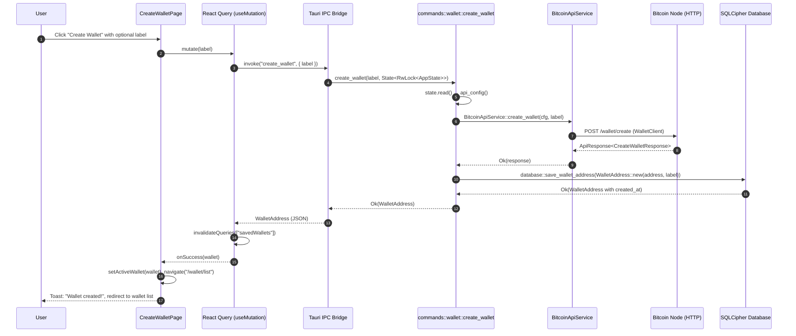
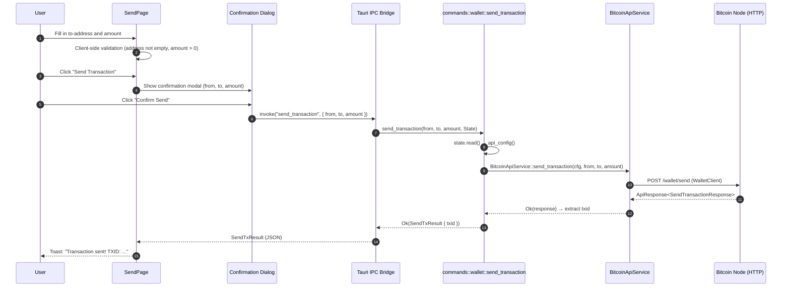

<div align="left">

<details>
<summary><b>📑 Chapter Navigation ▼</b></summary>

### Part I: Core Blockchain Implementation

1. <a href="../01-Introduction.md">Chapter 1: Introduction & Overview</a>
2. <a href="../bitcoin-blockchain/README.md">Chapter 1.2: Introduction to Bitcoin & Blockchain</a>
3. <a href="../bitcoin-blockchain/whitepaper-rust/00-Bitcoin-Whitepaper-Summary.md">Chapter 1.3: Bitcoin Whitepaper</a>
4. <a href="../bitcoin-blockchain/whitepaper-rust/00-Bitcoin-Whitepaper-Rust-Encoding-Summary.md">Chapter 1.4: Bitcoin Whitepaper In Rust</a>
5. <a href="../bitcoin-blockchain/Rust-Project-Index.md">Chapter 2.0: Rust Blockchain Project</a>
6. <a href="../bitcoin-blockchain/primitives/README.md">Chapter 2.1: Primitives</a>
7. <a href="../bitcoin-blockchain/util/README.md">Chapter 2.2: Utilities</a>
8. <a href="../bitcoin-blockchain/crypto/README.md">Chapter 2.3: Cryptography</a>
9. <a href="../bitcoin-blockchain/chain/README.md">Chapter 2.4: Blockchain (Technical Foundations)</a>
10. <a href="../bitcoin-blockchain/store/README.md">Chapter 2.5: Storage Layer</a>
11. <a href="../bitcoin-blockchain/chain/10-Whitepaper-Step-5-Block-Acceptance.md">Chapter 2.6: Block Acceptance</a>
12. <a href="../bitcoin-blockchain/net/README.md">Chapter 2.7: Network Layer</a>
13. <a href="../bitcoin-blockchain/node/README.md">Chapter 2.8: Node Orchestration</a>
14. <a href="../bitcoin-blockchain/wallet/README.md">Chapter 2.9: Wallet System</a>
15. <a href="../bitcoin-blockchain/web/README.md">Chapter 3: Web API Architecture</a>
16. <a href="../bitcoin-desktop-ui-iced/04.1-Desktop-Admin-UI-Iced.md">Chapter 4.1: Desktop Admin (Iced)</a>
17. <a href="../bitcoin-desktop-ui-iced/04.1A-Desktop-Admin-UI-Code-Walkthrough.md">4.1A: Code Walkthrough</a>
18. <a href="../bitcoin-desktop-ui-iced/04.1B-Desktop-Admin-UI-Update-Loop.md">4.1B: Update Loop</a>
19. <a href="../bitcoin-desktop-ui-iced/04.1C-Desktop-Admin-UI-View-Layer.md">4.1C: View Layer</a>
20. <a href="../bitcoin-desktop-ui-tauri/04.2-Desktop-Admin-UI-Tauri.md">Chapter 4.2: Desktop Admin (Tauri)</a>
21. <a href="../bitcoin-desktop-ui-tauri/04.2A-Tauri-Admin-Rust-Backend.md">4.2A: Rust Backend</a>
22. <a href="../bitcoin-desktop-ui-tauri/04.2B-Tauri-Admin-Frontend-Infrastructure.md">4.2B: Frontend Infrastructure</a>
23. <a href="../bitcoin-desktop-ui-tauri/04.2C-Tauri-Admin-Frontend-Pages.md">4.2C: Frontend Pages</a>
24. <a href="../bitcoin-wallet-ui-iced/05.1-Wallet-UI-Iced.md">Chapter 5.1: Wallet UI (Iced)</a>
25. <a href="../bitcoin-wallet-ui-iced/05.1A-Wallet-UI-Code-Listings.md">5.1A: Code Listings</a>
26. **Chapter 5.2: Wallet UI (Tauri)** ← *You are here*
27. <a href="05.2A-Tauri-Wallet-Rust-Backend.md">5.2A: Rust Backend</a>
28. <a href="05.2B-Tauri-Wallet-Frontend-Infrastructure.md">5.2B: Frontend Infrastructure</a>
29. <a href="05.2C-Tauri-Wallet-Frontend-Pages.md">5.2C: Frontend Pages</a>
30. <a href="../embedded-database/06-Embedded-Database.md">Chapter 6: Embedded Database</a>
31. <a href="../embedded-database/06A-Embedded-Database-Code-Listings.md">6A: Code Listings</a>
32. <a href="../bitcoin-web-ui/06-Web-Admin-UI.md">Chapter 7: Web Admin Interface</a>
33. <a href="../bitcoin-web-ui/06A-Web-Admin-UI-Code-Listings.md">7A: Code Listings</a>

### Part II: Deployment & Operations

34. <a href="../ci/docker-compose/01-Introduction.md">Chapter 8: Docker Compose Deployment</a>
35. <a href="../ci/docker-compose/01A-Docker-Compose-Code-Listings.md">8A: Code Listings</a>
36. <a href="../ci/kubernetes/README.md">Chapter 9: Kubernetes Deployment</a>
37. <a href="../ci/kubernetes/01A-Kubernetes-Code-Listings.md">9A: Code Listings</a>

### Part III: Language Reference

38. <a href="../rust/README.md">Chapter 10: Rust Language Guide</a>

</details>

</div>

---

<div align="right">

**[← Back to Main Book](../README.md#table-of-contents)**

</div>

---

# Chapter 5.2: Wallet User Interface (Tauri) — Architecture and Code Walkthrough

This chapter explains the `bitcoin-wallet-ui-tauri` crate: **how a Tauri 2 app provides a full wallet management experience** with encrypted local storage (SQLCipher), **how wallet data flows between the Rust backend and a React/TypeScript frontend**, and **how the application persists wallets, settings, and transaction history across sessions**.

If you have already read Chapter 4.2 (the Tauri Admin UI), you will recognize the same IPC architecture. The key difference here is **local persistence**: the wallet app uses an encrypted SQLCipher database to store wallet addresses and connection settings on the user's machine, while the admin app is stateless.

The goal is that you can read this chapter without having the project open:

- **complete Rust backend coverage** lives in Chapter 5.2A (config, database, models, services, commands)
- **complete React frontend coverage** lives in Chapters 5.2B (infrastructure) and 5.2C (pages)
- each section uses a consistent **Methods involved** box
- diagrams make the IPC boundary, persistence layer, and data flow explicit

<div align="center">

**📚 [← Chapter 4.2: Desktop Admin Interface (Tauri)](../bitcoin-desktop-ui-tauri/04.2-Desktop-Admin-UI-Tauri.md)** | **Chapter 5.2: Wallet User Interface (Tauri)** | **[Next: Chapter 5.2A: Rust Backend →](05.2A-Tauri-Wallet-Rust-Backend.md)** 📚

</div>

---

## What this UI is (in one sentence)

The Tauri wallet UI is a **two-language desktop wallet application**: a Rust backend manages an encrypted SQLCipher database and exposes 13 `#[tauri::command]` handlers that combine local persistence with remote `bitcoin-api` calls, while a React/TypeScript frontend provides wallet management through Tauri's IPC bridge using `invoke()`.

> **Methods involved**
>
> - `main` (Tauri app setup, database initialization, state management, command registration)
> - `generate_database_password` (deterministic SQLCipher key derivation)
> - `database::init_database` (schema creation, migrations)
> - `BitcoinApiService::*` (service layer wrapping `WalletClient` HTTP calls)
> - `commands::*` (13 Tauri command handlers across 3 modules)
> - `useCommands.ts` → `invoke()` (TypeScript-to-Rust bridge with React Query hooks)
> - React pages (7 views), components (4 shared), stores (2 Zustand)

---

## Architecture at a glance

The wallet app has **four layers**, one more than the admin app (Chapter 4.2) because of the persistence requirement:

```
┌──────────────────────────────────────────────────────────────┐
│                    React/TypeScript Frontend                  │
│                                                              │
│  Pages: CreateWallet, WalletList, WalletInfo,                │
│         Balance, Send, History, Settings                     │
│                                                              │
│  State: Zustand (walletStore, toastStore)                    │
│  Data:  React Query (useQuery, useMutation)                  │
│  IPC:   invoke() from @tauri-apps/api/core                   │
├──────────────────────────────────────────────────────────────┤
│                    Tauri IPC Boundary                         │
│              (JSON serialization/deserialization)             │
├──────────────────────────────────────────────────────────────┤
│                    Rust Command Layer                         │
│                                                              │
│  commands/wallet.rs  — 9 wallet commands                     │
│  commands/settings.rs — 3 settings commands                  │
│  commands/health.rs   — 1 health command                     │
│                                                              │
│  State: RwLock<AppState> (active wallet, connection config)  │
├──────────────────────────────────────────────────────────────┤
│          ┌─────────────────┐    ┌──────────────────┐         │
│          │  SQLCipher DB    │    │  Bitcoin API      │         │
│          │  (local)         │    │  (remote HTTP)    │         │
│          │                  │    │                   │         │
│          │  settings        │    │  WalletClient     │         │
│          │  wallet_addresses│    │  AdminClient      │         │
│          │  users           │    │                   │         │
│          │  schema_version  │    │                   │         │
│          └─────────────────┘    └──────────────────┘         │
└──────────────────────────────────────────────────────────────┘
```

The critical insight is that **wallet commands often touch both layers**: creating a wallet calls the remote API to generate an address, then persists it locally in SQLCipher. The command layer orchestrates this two-phase operation.

---

## How this differs from the Admin UI (Chapter 4.2)

> **Methods involved**
>
> - `AppState` (`config/mod.rs`) — wallet app uses `AppState` with active wallet + DB-loaded settings
> - `database/mod.rs` — encrypted persistence layer (not present in admin app)
> - `generate_database_password` (`main.rs`) — deterministic key from user/machine context

| Aspect | Admin UI (Ch. 4.2) | Wallet UI (Ch. 5.2) |
|--------|------------------|--------------------|
| **Purpose** | Blockchain exploration and management | Personal wallet management |
| **State persistence** | None — stateless across restarts | SQLCipher encrypted database |
| **API client** | `AdminClient` (22 commands) | `WalletClient` (5 methods) + `AdminClient` (health) |
| **Managed state** | `RwLock<ApiConfig>` (URL + key) | `RwLock<AppState>` (URL + key + active wallet) |
| **Database** | None | 4 tables: settings, wallet_addresses, users, schema_version |
| **Commands** | 22 across 6 modules | 13 across 3 modules |
| **Frontend pages** | 18 pages | 7 pages |
| **Config source** | Environment variables | Database → env var fallback |
| **Schema versioning** | N/A | Version 2 with migration support |
| **Key generation** | N/A | Deterministic from username + home dir + app name |

The wallet app is architecturally simpler in terms of command count but more sophisticated in its persistence story. Understanding the database layer is essential.

---

## How this differs from the Iced Wallet (Chapter 5.1)

> **Methods involved**
>
> - Both apps share `generate_database_password` (identical implementation)
> - Both apps share the same `database/mod.rs` schema and CRUD operations
> - Both use the same `bitcoin-api` crate for remote API calls

| Aspect | Iced Wallet (Ch. 5.1) | Tauri Wallet (Ch. 5.2) |
|--------|---------------------|----------------------|
| **Language** | Pure Rust | Rust backend + React/TypeScript frontend |
| **Architecture** | MVU (Model-View-Update) | IPC bridge (Tauri commands + React) |
| **State management** | Single `WalletApp` struct | `RwLock<AppState>` (Rust) + Zustand + React Query (TS) |
| **Async model** | `Task<Message>` via `spawn_on_tokio` | Native Tauri `async` commands |
| **Navigation** | `Menu` enum + `Message::MenuChanged` | React Router (`BrowserRouter` + `Routes`) |
| **UI framework** | Iced widgets | React components + Tailwind CSS |
| **Forms** | Direct state binding | React state + validation |
| **Clipboard** | `iced::clipboard` | `@tauri-apps/plugin-clipboard-manager` |
| **Database** | Same SQLCipher schema | Same SQLCipher schema |
| **Password generation** | Identical `generate_database_password` | Identical `generate_database_password` |

The key takeaway: the database layer is **identical** between Iced and Tauri wallets. The difference is entirely in how the UI is built and how state flows.

---

## File-to-responsibility map

> **Methods involved**
>
> - Every file listed here is reproduced verbatim in companion chapters 9.A, 9.B, and 9.C

### Rust Backend (`src-tauri/`)

| File | Responsibility | Companion |
|------|---------------|-----------|
| `Cargo.toml` | Dependencies: tauri, rusqlite (bundled-sqlcipher), bitcoin-api | [5.2A](05.2A-Tauri-Wallet-Rust-Backend.md) |
| `src/main.rs` | App bootstrap: tracing, DB init, Tauri builder with 13 commands | [5.2A](05.2A-Tauri-Wallet-Rust-Backend.md) |
| `src/lib.rs` | Mobile entry point (mirrors `main.rs`) | [5.2A](05.2A-Tauri-Wallet-Rust-Backend.md) |
| `src/config/mod.rs` | `AppState`: active wallet + DB-loaded connection settings | [5.2A](05.2A-Tauri-Wallet-Rust-Backend.md) |
| `src/models/mod.rs` | `SendTxResult`, `ConnectionStatus` data types | [5.2A](05.2A-Tauri-Wallet-Rust-Backend.md) |
| `src/services/bitcoin_api.rs` | `BitcoinApiService`: 6 async methods wrapping `WalletClient`/`AdminClient` | [5.2A](05.2A-Tauri-Wallet-Rust-Backend.md) |
| `src/database/mod.rs` | SQLCipher: init, schema, migrations, CRUD for settings + wallets | [5.2A](05.2A-Tauri-Wallet-Rust-Backend.md) |
| `src/database/tests.rs` | Unit tests for schema, CRUD, constraints, ordering | [5.2A](05.2A-Tauri-Wallet-Rust-Backend.md) |
| `src/commands/wallet.rs` | 9 wallet commands: create, list, select, delete, rename, info, balance, send, history | [5.2A](05.2A-Tauri-Wallet-Rust-Backend.md) |
| `src/commands/settings.rs` | 3 settings commands: get, save, check connection | [5.2A](05.2A-Tauri-Wallet-Rust-Backend.md) |
| `src/commands/health.rs` | 1 health check command | [5.2A](05.2A-Tauri-Wallet-Rust-Backend.md) |
| `tauri.conf.json` | Window config, CSP, plugin permissions | [5.2A](05.2A-Tauri-Wallet-Rust-Backend.md) |
| `capabilities/main.json` | Tauri 2 capability permissions | [5.2A](05.2A-Tauri-Wallet-Rust-Backend.md) |

### React Frontend (`src/`)

| File | Responsibility | Companion |
|------|---------------|-----------|
| `main.tsx` | React + QueryClient + BrowserRouter mount | [5.2B](05.2B-Tauri-Wallet-Frontend-Infrastructure.md) |
| `App.tsx` | 8 routes within `AppLayout` | [5.2B](05.2B-Tauri-Wallet-Frontend-Infrastructure.md) |
| `types/index.ts` | TypeScript interfaces mirroring Rust types | [5.2B](05.2B-Tauri-Wallet-Frontend-Infrastructure.md) |
| `hooks/useCommands.ts` | 13 invoke wrappers + 10 React Query hooks | [5.2B](05.2B-Tauri-Wallet-Frontend-Infrastructure.md) |
| `lib/utils.ts` | Utility functions: truncateAddress, satoshisToBtc, formatDate, cn | [5.2B](05.2B-Tauri-Wallet-Frontend-Infrastructure.md) |
| `store/walletStore.ts` | Zustand: active wallet, theme, status | [5.2B](05.2B-Tauri-Wallet-Frontend-Infrastructure.md) |
| `store/toastStore.ts` | Zustand: toast notifications with auto-dismiss | [5.2B](05.2B-Tauri-Wallet-Frontend-Infrastructure.md) |
| `components/AppLayout.tsx` | Sidebar navigation + active wallet card + connection indicator | [5.2B](05.2B-Tauri-Wallet-Frontend-Infrastructure.md) |
| `components/WalletCard.tsx` | Wallet card with select, rename, delete, copy actions | [5.2B](05.2B-Tauri-Wallet-Frontend-Infrastructure.md) |
| `components/JsonViewer.tsx` | Collapsible JSON display with copy | [5.2B](05.2B-Tauri-Wallet-Frontend-Infrastructure.md) |
| `components/ToastContainer.tsx` | Toast notification overlay | [5.2B](05.2B-Tauri-Wallet-Frontend-Infrastructure.md) |
| `pages/wallet/CreateWalletPage.tsx` | Wallet creation form | [5.2C](05.2C-Tauri-Wallet-Frontend-Pages.md) |
| `pages/wallet/WalletListPage.tsx` | Wallet grid with management actions | [5.2C](05.2C-Tauri-Wallet-Frontend-Pages.md) |
| `pages/wallet/WalletInfoPage.tsx` | Active wallet details + JSON response | [5.2C](05.2C-Tauri-Wallet-Frontend-Pages.md) |
| `pages/wallet/BalancePage.tsx` | Balance display with refresh | [5.2C](05.2C-Tauri-Wallet-Frontend-Pages.md) |
| `pages/wallet/SendPage.tsx` | Send form with confirmation dialog | [5.2C](05.2C-Tauri-Wallet-Frontend-Pages.md) |
| `pages/wallet/HistoryPage.tsx` | Transaction history list | [5.2C](05.2C-Tauri-Wallet-Frontend-Pages.md) |
| `pages/settings/SettingsPage.tsx` | API config + connection test | [5.2C](05.2C-Tauri-Wallet-Frontend-Pages.md) |

---

## Three architectural patterns to understand

Before diving into companion chapters, understanding three patterns will make the rest of the code clear.

### Pattern 1: The two-phase wallet command

Many wallet commands need **both** the remote API and the local database. The `create_wallet` command is the clearest example:

```rust
#[tauri::command]
pub async fn create_wallet(
    label: Option<String>,
    state: State<'_, RwLock<AppState>>,
) -> Result<database::WalletAddress, String> {
    // Phase 1: Remote — call the Bitcoin API to generate a new address
    let cfg = state.read().map_err(|e| e.to_string())?.api_config();
    let response = BitcoinApiService::create_wallet(cfg, label.clone()).await?;
    let address = response.data
        .ok_or("No data returned from wallet creation")?
        .address;

    // Phase 2: Local — persist the address in SQLCipher
    let wallet = database::WalletAddress::new(address, label);
    let saved = database::save_wallet_address(&wallet).map_err(|e| e.to_string())?;

    Ok(saved)
}
```

> **Methods involved**
>
> - `create_wallet` (`commands/wallet.rs`, [Chapter 5.2A](05.2A-Tauri-Wallet-Rust-Backend.md))
> - `BitcoinApiService::create_wallet` (`services/bitcoin_api.rs`, [Chapter 5.2A](05.2A-Tauri-Wallet-Rust-Backend.md))
> - `database::save_wallet_address` (`database/mod.rs`, [Chapter 5.2A](05.2A-Tauri-Wallet-Rust-Backend.md))

The frontend receives a `WalletAddress` with the persisted `created_at` timestamp — it never needs to know that two systems were involved.

### Pattern 2: Database-loaded initial state

Unlike the admin app (which reads environment variables), the wallet app loads its configuration from the encrypted database at startup:

```rust
impl Default for AppState {
    fn default() -> Self {
        let (base_url, api_key) = match crate::database::load_settings() {
            Ok(settings) => (settings.base_url, settings.api_key),
            Err(_) => (
                "http://127.0.0.1:8080".to_string(),
                std::env::var("BITCOIN_API_WALLET_KEY")
                    .unwrap_or_else(|_| "wallet-secret".to_string()),
            ),
        };
        Self { active_wallet: None, base_url, api_key }
    }
}
```

> **Methods involved**
>
> - `AppState::default` (`config/mod.rs`, [Chapter 5.2A](05.2A-Tauri-Wallet-Rust-Backend.md))
> - `database::load_settings` (`database/mod.rs`, [Chapter 5.2A](05.2A-Tauri-Wallet-Rust-Backend.md))

The fallback chain is: database → environment variable → hardcoded default. This means the app works out of the box, gets better when the user saves settings, and can be overridden by environment variables if needed.

### Pattern 3: React Query with Zustand for wallet selection

The frontend uses **two state systems** that work together:

- **Zustand** (`walletStore`) holds the active wallet selection — this is pure client state
- **React Query** (`useCommands.ts`) manages server/API data — fetched, cached, and invalidated

When the user selects a wallet in the list, two things happen:

1. The Zustand store updates `activeWallet` (immediately reflected in the sidebar)
2. React Query hooks like `useWalletInfo(address)` and `useBalance(address)` become enabled (the `enabled: !!address` guard)

When the user creates or deletes a wallet, React Query's `queryClient.invalidateQueries` ensures the wallet list refreshes automatically.

> **Methods involved**
>
> - `useWalletStore` (`store/walletStore.ts`, [Chapter 5.2B](05.2B-Tauri-Wallet-Frontend-Infrastructure.md))
> - `useSavedWallets`, `useCreateWallet`, `useDeleteWallet` (`hooks/useCommands.ts`, [Chapter 5.2B](05.2B-Tauri-Wallet-Frontend-Infrastructure.md))
> - `WalletListPage` (`pages/wallet/WalletListPage.tsx`, [Chapter 5.2C](05.2C-Tauri-Wallet-Frontend-Pages.md))

---

## How to read this chapter (and where the code lives)

This chapter provides the architectural overview and key patterns. The complete code is in three companion chapters:

**[Chapter 5.2A: Rust Backend](05.2A-Tauri-Wallet-Rust-Backend.md)** — Start here if you want to understand the persistence layer and command handlers. Files covered:
- `Cargo.toml`, `main.rs`, `lib.rs`
- `config/mod.rs`, `models/mod.rs`
- `services/bitcoin_api.rs`
- `database/mod.rs` (schema, migrations, CRUD), `database/tests.rs`
- `commands/wallet.rs`, `commands/settings.rs`, `commands/health.rs`
- `tauri.conf.json`, `capabilities/main.json`

**[Chapter 5.2B: Frontend Infrastructure](05.2B-Tauri-Wallet-Frontend-Infrastructure.md)** — Start here if you want to understand how the React app is wired. Files covered:
- `package.json`, `main.tsx`, `App.tsx`
- `types/index.ts`, `hooks/useCommands.ts`, `lib/utils.ts`
- `store/walletStore.ts`, `store/toastStore.ts`
- `components/AppLayout.tsx`, `WalletCard.tsx`, `JsonViewer.tsx`, `ToastContainer.tsx`
- Build config: `vite.config.ts`, `tailwind.config.js`, `index.css`

**[Chapter 5.2C: Frontend Pages](05.2C-Tauri-Wallet-Frontend-Pages.md)** — Start here if you want to understand each wallet screen. Files covered:
- `CreateWalletPage.tsx`, `WalletListPage.tsx`, `WalletInfoPage.tsx`
- `BalancePage.tsx`, `SendPage.tsx`, `HistoryPage.tsx`
- `SettingsPage.tsx`

---

## Diagrammed flow: Create wallet (end-to-end)

> **Methods involved**
>
> - `CreateWalletPage` → `useCreateWallet` → `invoke("create_wallet")` (frontend)
> - `create_wallet` command → `BitcoinApiService::create_wallet` → `database::save_wallet_address` (backend)



This is the most complex flow in the application because it touches all four layers. Most other commands (like `get_saved_wallets` or `get_balance`) touch only two or three layers.

---

## Diagrammed flow: Send transaction

> **Methods involved**
>
> - `SendPage` → `useSendTransaction` → `invoke("send_transaction")` (frontend)
> - `send_transaction` command → `BitcoinApiService::send_transaction` (backend)



Notice the two-step confirmation pattern: the React form validates first, shows a modal, and only after the user confirms does the actual `invoke()` call happen. This is a UX safety feature — sending Bitcoin is irreversible.

---

## The SQLCipher persistence layer

The encrypted database is the defining feature of the wallet app. Here we summarize the design; the full code is in [Chapter 5.2A](05.2A-Tauri-Wallet-Rust-Backend.md).

### Database location

The database file is stored in the user's OS-specific data directory:

- **macOS**: `~/Library/Application Support/bitcoin-wallet-ui/bitcoin-wallet.db`
- **Linux**: `~/.local/share/bitcoin-wallet-ui/bitcoin-wallet.db`
- **Windows**: `%APPDATA%/bitcoin-wallet-ui/bitcoin-wallet.db`

### Encryption key generation

Both the Iced wallet (Chapter 5.1) and this Tauri wallet use the **exact same** key generation function:

```rust
fn generate_database_password() -> String {
    use std::collections::hash_map::DefaultHasher;
    use std::hash::{Hash, Hasher};

    let mut hasher = DefaultHasher::new();

    // Input 1: OS username
    if let Ok(username) = std::env::var("USER") {
        username.hash(&mut hasher);
    } else if let Ok(username) = std::env::var("USERNAME") {
        username.hash(&mut hasher);
    }

    // Input 2: Home directory path
    if let Some(home) = dirs::home_dir() {
        home.to_string_lossy().hash(&mut hasher);
    }

    // Input 3: Application name (salt)
    "bitcoin-wallet-ui".hash(&mut hasher);

    format!("{:x}", hasher.finish())
}
```

> **Methods involved**
>
> - `generate_database_password` (`main.rs`, [Chapter 5.2A](05.2A-Tauri-Wallet-Rust-Backend.md))

The password is deterministic: the same user on the same machine gets the same key every time, so the database can be reopened without prompting. Different users or machines get different keys, so the database file is not trivially portable.

### Schema (version 2)

The database has four tables:

| Table | Purpose | Key constraint |
|-------|---------|---------------|
| `settings` | API connection config (base_url, api_key) | Singleton: `CHECK (id = 1)` |
| `wallet_addresses` | Saved wallet addresses with labels | `address` is `UNIQUE` |
| `users` | User profile (optional) | Singleton: `CHECK (id = 1)` |
| `schema_version` | Tracks migration version | Single row |

The schema version system supports forward migrations. Currently at version 2, the migration from v1 to v2 converted the `users` table from a `profile_picture_path TEXT` column to a `profile_picture BLOB` column.

---

## Summary

The Tauri wallet UI is a four-layer application:

1. **React frontend** (7 pages, 4 components, 2 stores) presents the wallet interface
2. **Tauri IPC** bridges TypeScript `invoke()` calls to Rust `#[tauri::command]` handlers
3. **Rust command layer** (13 commands, 3 modules) orchestrates remote API calls and local persistence
4. **SQLCipher database** (4 tables, schema v2) provides encrypted local storage

The three patterns that repeat throughout the codebase are: two-phase commands (remote + local), database-loaded initial state (with env var fallback), and React Query + Zustand for split client/server state management.

In the companion chapters, we walk through every file in the project, starting with the Rust backend in [Chapter 5.2A](05.2A-Tauri-Wallet-Rust-Backend.md).

---

<div align="center">

**📚 [← Previous: Desktop Admin Interface (Tauri)](../bitcoin-desktop-ui-tauri/04.2-Desktop-Admin-UI-Tauri.md)** | **Chapter 5.2: Wallet User Interface (Tauri)** | **[Chapter 5.2A: Rust Backend →](05.2A-Tauri-Wallet-Rust-Backend.md)** 📚

</div>

---

*This chapter has presented the Wallet UI's architecture and key patterns. The next three companion chapters contain the complete, verbatim source code with detailed annotations: [5.2A](05.2A-Tauri-Wallet-Rust-Backend.md) covers the Rust backend (database, commands, services), [5.2B](05.2B-Tauri-Wallet-Frontend-Infrastructure.md) covers the frontend infrastructure (routing, state, hooks), and [5.2C](05.2C-Tauri-Wallet-Frontend-Pages.md) covers each page component.*

---

<div align="center">

**Reading order**

**[← Previous: Tauri Admin UI](../bitcoin-desktop-ui-tauri/04.2-Desktop-Admin-UI-Tauri.md)** | **[Next: Rust Backend →](05.2A-Tauri-Wallet-Rust-Backend.md)**

</div>

---
