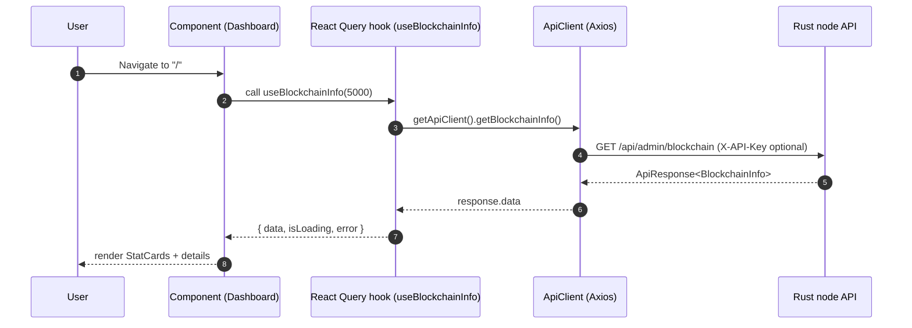
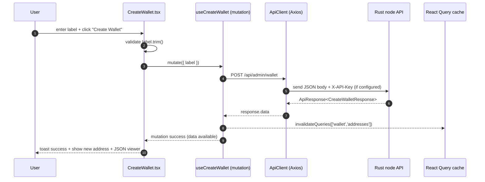

<div align="left">

<details>
<summary><b>Chapter Navigation ▼</b></summary>

### Part I: Foundations & Core Implementation

1. <a href="../00-Quick-Start.md">Chapter 1: Quick Start</a>
2. <a href="../01-Introduction.md">Chapter 2: Introduction & Overview</a>
3. <a href="../bitcoin-blockchain/README.md">Chapter 3: Introduction to Blockchain</a>
4. <a href="../bitcoin-blockchain/whitepaper-rust/00-Bitcoin-Whitepaper-Summary.md">Chapter 4: Bitcoin Whitepaper</a>
5. <a href="../bitcoin-blockchain/whitepaper-rust/00-Bitcoin-Whitepaper-Rust-Encoding-Summary.md">Chapter 5: Bitcoin Whitepaper in Rust</a>
6. <a href="../bitcoin-blockchain/Rust-Project-Index.md">Chapter 6: Rust Blockchain Project</a>
7. <a href="../bitcoin-blockchain/primitives/README.md">Chapter 7: Primitives</a>
8. <a href="../bitcoin-blockchain/util/README.md">Chapter 8: Utilities</a>
9. <a href="../bitcoin-blockchain/crypto/README.md">Chapter 9: Cryptography</a>
10. <a href="../bitcoin-blockchain/chain/01-Domain-Model.md">Chapter 10: Domain Model</a>
11. <a href="../bitcoin-blockchain/chain/02-Blockchain-State-Management.md">Chapter 11: Blockchain State Management</a>
12. <a href="../bitcoin-blockchain/chain/03-Chain-State-and-Storage.md">Chapter 12: Chain State and Storage</a>
13. <a href="../bitcoin-blockchain/chain/04-UTXO-Set.md">Chapter 13: UTXO Set</a>
14. <a href="../bitcoin-blockchain/chain/05-Transaction-Lifecycle.md">Chapter 14: Transaction Lifecycle</a>
15. <a href="../bitcoin-blockchain/chain/06-Block-Lifecycle-and-Mining.md">Chapter 15: Block Lifecycle and Mining</a>
16. <a href="../bitcoin-blockchain/chain/07-Consensus-and-Validation.md">Chapter 16: Consensus and Validation</a>
17. <a href="../bitcoin-blockchain/chain/08-Node-Orchestration.md">Chapter 17: Node Orchestration</a>
18. <a href="../bitcoin-blockchain/chain/09-Transaction-To-Block.md">Chapter 18: Transaction to Block</a>
19. <a href="../bitcoin-blockchain/chain/10-Whitepaper-Step-5-Block-Acceptance.md">Chapter 19: Block Acceptance</a>
20. <a href="../bitcoin-blockchain/store/README.md">Chapter 20: Storage Layer</a>
21. <a href="../bitcoin-blockchain/net/README.md">Chapter 21: Network Layer</a>
22. <a href="../bitcoin-blockchain/node/README.md">Chapter 22: Node Orchestration</a>
23. <a href="../bitcoin-blockchain/wallet/README.md">Chapter 23: Wallet System</a>
24. <a href="../bitcoin-blockchain/web/README.md">Chapter 24: Web API Architecture</a>
25. <a href="../bitcoin-desktop-ui-iced/04.1-Desktop-Admin-UI-Iced.md">Chapter 25: Desktop Admin (Iced)</a>
26. <a href="../bitcoin-desktop-ui-iced/04.1A-Desktop-Admin-UI-Code-Walkthrough.md">25A: Code Walkthrough</a>
27. <a href="../bitcoin-desktop-ui-iced/04.1B-Desktop-Admin-UI-Update-Loop.md">25B: Update Loop</a>
28. <a href="../bitcoin-desktop-ui-iced/04.1C-Desktop-Admin-UI-View-Layer.md">25C: View Layer</a>
29. <a href="../bitcoin-desktop-ui-tauri/04.2-Desktop-Admin-UI-Tauri.md">Chapter 26: Desktop Admin (Tauri)</a>
30. <a href="../bitcoin-desktop-ui-tauri/04.2A-Tauri-Admin-Rust-Backend.md">26A: Rust Backend</a>
31. <a href="../bitcoin-desktop-ui-tauri/04.2B-Tauri-Admin-Frontend-Infrastructure.md">26B: Frontend Infrastructure</a>
32. <a href="../bitcoin-desktop-ui-tauri/04.2C-Tauri-Admin-Frontend-Pages.md">26C: Frontend Pages</a>
33. <a href="../bitcoin-wallet-ui-iced/05.1-Wallet-UI-Iced.md">Chapter 27: Wallet UI (Iced)</a>
34. <a href="../bitcoin-wallet-ui-iced/05.1A-Wallet-UI-Code-Listings.md">27A: Code Listings</a>
35. <a href="../bitcoin-wallet-ui-tauri/05.2-Wallet-UI-Tauri.md">Chapter 28: Wallet UI (Tauri)</a>
36. <a href="../bitcoin-wallet-ui-tauri/05.2A-Tauri-Wallet-Rust-Backend.md">28A: Rust Backend</a>
37. <a href="../bitcoin-wallet-ui-tauri/05.2B-Tauri-Wallet-Frontend-Infrastructure.md">28B: Frontend Infrastructure</a>
38. <a href="../bitcoin-wallet-ui-tauri/05.2C-Tauri-Wallet-Frontend-Pages.md">28C: Frontend Pages</a>
39. <a href="../embedded-database/06-Embedded-Database.md">Chapter 29: Embedded Database</a>
40. <a href="../embedded-database/06A-Embedded-Database-Code-Listings.md">29A: Code Listings</a>
41. **Chapter 30: Web Admin Interface** ← *You are here*
42. <a href="06A-Web-Admin-UI-Code-Listings.md">30A: Code Listings</a>
### Part II: Deployment & Operations

43. <a href="../ci/docker-compose/01-Introduction.md">Chapter 31: Docker Compose Deployment</a>
44. <a href="../ci/docker-compose/01A-Docker-Compose-Code-Listings.md">31A: Code Listings</a>
45. <a href="../ci/kubernetes/README.md">Chapter 32: Kubernetes Deployment</a>
46. <a href="../ci/kubernetes/01A-Kubernetes-Code-Listings.md">32A: Code Listings</a>
### Part III: Language Reference

47. <a href="../rust/README.md">Chapter 33: Rust Language Guide</a>
### Appendices

48. <a href="../Glossary.md">Glossary</a>
49. <a href="../Bibliography.md">Bibliography</a>
50. <a href="../Appendix-Source-Reference.md">Source Reference</a>

</details>

</div>

---
<div align="right">

**[← Back to Main Book](../../README.md)**

</div>

---

# Chapter 30: Web Admin Interface

**Part I: Foundations & Core Implementation**

<div align="center">

**[← Chapter 29: Embedded Database](../embedded-database/06-Embedded-Database.md)** | **Chapter 30: Web Admin Interface** | **[Chapter 31: Docker Compose →](../ci/docker-compose/01-Introduction.md)**
</div>

---

> **Prerequisites:**: This chapter is written in React/TypeScript rather than Rust. You should be comfortable reading JSX and TypeScript type annotations. Familiarity with the REST API from Chapter 15 is helpful — this UI is a client to that API — but we recap the relevant endpoints as they appear.

> **What you will learn in this chapter:**
> - Build a React/TypeScript web admin interface with modern component architecture
> - Implement state management with React Query and authentication patterns
> - Structure the frontend build process and deployment pipeline
> - Apply TypeScript type safety to API integration and response handling

> **If you have read Chapters 17 or 19** (the Tauri admin and wallet UIs), you will recognize the same React Query patterns and component architecture used here. The key difference is transport: this chapter uses HTTP REST calls via Axios rather than Tauri’s IPC bridge. Everything on the React side — hooks, cache management, component structure — transfers directly.

> **Three ways to build the admin UI.** This book implements the same admin functionality three ways: Chapter 16 (Iced) uses pure Rust with the Model-View-Update pattern. Chapter 17 (Tauri) uses a Rust backend with a React frontend connected by IPC. This chapter uses a standalone React frontend calling the REST API over HTTP. All three consume the same `bitcoin-api` crate. The differences are purely in transport (IPC vs. HTTP) and runtime (desktop vs. browser).

## Overview

This chapter explains the Web Admin UI in `bitcoin-web-ui/`: a React + TypeScript single-page application (SPA) that calls the Rust node’s **admin API** (`/api/admin/*`) and renders a professional administrative interface.

This is a **code-centric book chapter**. Every referenced function is either printed in full here or linked to a **complete verbatim listing** in:

- **[Chapter 30A: Web Admin Interface — Complete Code Listings](06A-Web-Admin-UI-Code-Listings.md)**

---

## The architectural spine (what to read first)

To understand the entire application quickly, read the code in this order:

1. **`src/main.tsx`**: bootstraps React into the DOM (Listing 21.1).
2. **`src/App.tsx`**: composes providers + routes + layout (Listing 21.2).
3. **`src/contexts/ApiConfigContext.tsx`**: the “global config” for base URL and API key (Listing 21.3).
4. **`src/services/api.ts`**: the HTTP boundary (one method per endpoint) (Listing 21.4).
5. **`src/hooks/useApi.ts`**: the “query/mutation surface” used by components (Listing 21.5).
6. **Feature components** (Dashboard, Blockchain screens, Wallet screens): each is a thin layer that calls hooks and renders results.

---

## Diagram: the layer boundaries (UI → hooks → HTTP)

```mermaid
flowchart TB
  subgraph UI[UI layer: routes + components]
    App[App.tsx<br/>routes + providers]
    Screens[Screens<br/>Dashboard / Wallet / Mining / ...]
  end

  subgraph Data[Data layer: React Query hooks]
    Hooks[useApi.ts<br/>useQuery / useMutation<br/>cache keys + invalidation]
  end

  subgraph HTTP[HTTP boundary]
    Client[ApiClient (Axios)<br/>one method per endpoint]
  end

  subgraph Server[Rust node]
    API[/api/admin/* endpoints/]
  end

  App --> Screens
  Screens --> Hooks
  Hooks --> Client
  Client --> API
```

The payoff of this structure is local reasoning: each layer has a single responsibility, and we can understand each without reading the others.

- A component answers: “what do we render?”
- A hook answers: “how do we fetch/cache/invalidate?”
- The API client answers: “what URL, what HTTP verb, what headers, what types?”

---

## Diagram: end-to-end data flow (click → API → render)



The key design decision is separation of concerns:

- **Components** render UI and own local form state.
- **Hooks** define cache keys, enablement, invalidation, and mutation feedback.
- **ApiClient** performs the HTTP requests and returns typed responses.

---

## Entry point (`src/main.tsx`)

`main.tsx` is intentionally minimal: it mounts the app and imports global CSS. We get a key architectural advantage: a single composition root (`App`) and a single place where all providers and routing are defined.

Full listing: [Listing 21.1](06A-Web-Admin-UI-Code-Listings.md#listing-211-srcmaintsx).

---

## Composition root: providers + routes (`src/App.tsx`)

`App.tsx` is the most important file for “what exists” in the UI:

- It defines the global **React Query client** (retry policy, focus refetch behavior).
- It enables global **API configuration** via `ApiConfigProvider`.
- It creates the **routing table** for all screens.
- It mounts the `Layout`, which provides the consistent navbar + sidebar.

Full listing: [Listing 21.2](06A-Web-Admin-UI-Code-Listings.md#listing-212-srcapptsx).

---

## Global configuration: base URL and API key (`ApiConfigContext`)

The web UI cannot assume a fixed backend address or key in all deployments. The solution is:

- store `baseURL` and `apiKey` in **React Context**,
- persist them to **localStorage**,
- and update the API client singleton when they change.

This yields a simple rule for the rest of the codebase:

- Components do **not** pass baseURL/apiKey around as props.
- API calls always go through `getApiClient()` and therefore always use the latest config.

Full listing: [Listing 21.3](06A-Web-Admin-UI-Code-Listings.md#listing-213-srccontextsapiconfigcontexttsx).

---

## The HTTP boundary: `ApiClient` (`src/services/api.ts`)

This module is the only place that “knows” about:

- endpoint paths (`/api/admin/...`),
- request shape (GET vs POST),
- and authentication header injection (`X-API-Key`).

Everything above it (hooks/components) is *business/UI logic*; everything below it is *HTTP transport*.

Full listing: [Listing 21.4](06A-Web-Admin-UI-Code-Listings.md#listing-214-srcservicesapits).

> **Warning:** The default web admin configuration does not include rate limiting or CSRF protection. Before deploying to a production environment, add these middleware layers to the API gateway. See Chapter 15 (Web API Architecture) for details on the middleware stack.

---

## The data-access surface: React Query hooks (`src/hooks/useApi.ts`)

Each hook defines the UI’s public “data layer.” We express:

- a **query key** for cache identity,
- a **query function** to call an ApiClient method,
- optional behavior like:
  - `enabled` to gate requests until input exists,
  - `refetchInterval` for auto-refresh,
  - `onSuccess` to invalidate caches and trigger feedback toast messages for mutations.

The most important hooks to understand first are:

- `useBlockchainInfo(refetchInterval?)` for dashboards and global status.
- `useCreateWallet`, `useSendTransaction`, `useGenerateBlocks` for mutations.
- `useAllBlocks` and `useAllTransactions` for on-demand “bulk” screens (`enabled: false`).

Full listing: [Listing 21.5](06A-Web-Admin-UI-Code-Listings.md#listing-215-srchooksuseapits).

---

## The UI shell: layout + navigation (Layout / Navbar / Sidebar)

The UI shell lets the rest of the code stay “page focused.” Two aspects matter most:

- **API configuration UX** is concentrated in the navbar. That means any page can assume the API client is configured; it does not need its own base-url inputs.
- **Sidebar state tracks the current route**, so deep links keep the correct menu open (`openMenuPath` is derived from `location.pathname`).

Full listings: [Listings 7.6–7.8](06A-Web-Admin-UI-Code-Listings.md).

---

## A representative query screen: `Dashboard`

The dashboard is the simplest example of the project’s standard query flow:

1. Call a hook.
2. If loading, render `LoadingSpinner`.
3. If error, render `ErrorMessage`.
4. If data, render a UI view that mixes:
   - “human-friendly” components (`StatCard`),
   - and exact values (formatted timestamps, hashes, etc.).

Full listing: [Listing 21.10](06A-Web-Admin-UI-Code-Listings.md#listing-2110-srccomponentsdashboarddashboardtsx).

---

## A representative mutation screen: `CreateWallet`

The “create wallet” screen demonstrates the project’s mutation conventions:

- UI handles local form state (`label`).
- Hook handles mutation lifecycle + user feedback:
  - success toast,
  - cache invalidation (`wallet/addresses`).

Full listing: [Listing 21.21](06A-Web-Admin-UI-Code-Listings.md#listing-2121-srccomponentswalletcreatewallettsx).

---

## Diagram: mutation flow (create wallet)



---

## A screen that mixes UI state + bulk loading: `AllBlocks` / `AllTransactions`

These screens show the project’s “bulk load escape hatch” pattern:

- React Query hooks are configured with `enabled: false` to avoid auto-fetching.
- The component triggers fetches on-demand via `refetch()`.
- When loading “all pages,” the component uses the API client directly in a loop.

This is a pragmatic compromise: React Query is excellent for caching and typical screen loads, while an explicit loop is simpler for “load everything” workflows.

Full listings: [Listings 7.19 and 7.29](06A-Web-Admin-UI-Code-Listings.md).

---

## Summary

- We built a React/TypeScript web admin interface with modern component architecture.
- We implemented state management with React Query and authentication patterns.
- We structured the frontend build process and deployment pipeline.
- We applied TypeScript type safety to API integration and response handling.

> **Companion Chapter:** Complete React component source code is available in [21A: Code Listings](06A-Web-Admin-UI-Code-Listings.md). In the print edition, these listings appear in the Appendix: Source Reference.

---

## Exercises

1. **Add a Dashboard Widget** — Create a new React component that displays the current block height, pending transaction count, and connected peer count. Use React Query to fetch the data and implement auto-refresh every 10 seconds.

2. **Authentication Flow Analysis** — Trace the authentication flow from login form submission through API call, token storage, and authenticated request headers. Identify what happens when a token expires mid-session and how the UI handles the 401 response.

---

## Summary

The Web Admin UI follows a clean layering approach:

- **Routes and providers** are composed in `App.tsx`.
- **Global configuration** is managed by `ApiConfigContext`.
- **HTTP transport** is isolated in `ApiClient`.
- **Caching + async lifecycle** are expressed in React Query hooks.
- **Components** remain thin and predictable: render based on `data/isLoading/error`.

Continue to the complete listings in Chapter 30A to read any module in full.


## Further Reading

- **[React Documentation](https://react.dev/)** — Official React guides and API reference.
- **[TypeScript Handbook](https://www.typescriptlang.org/docs/handbook/)** — TypeScript language features and best practices.
- **[TanStack Query (React Query)](https://tanstack.com/query/)** — Data fetching and caching for the web UI.

---

<div align="center">

**Reading order**

**[← Previous: Embedded Database — Code Listings](../embedded-database/06A-Embedded-Database-Code-Listings.md)** | **[Next: Web Admin Interface — Code Listings →](06A-Web-Admin-UI-Code-Listings.md)**

</div>

---

