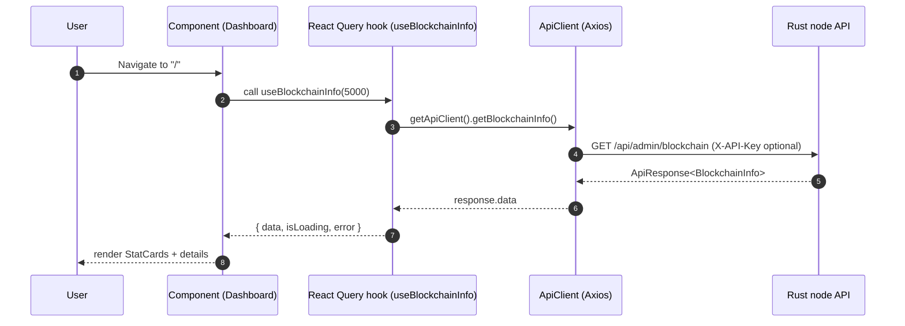
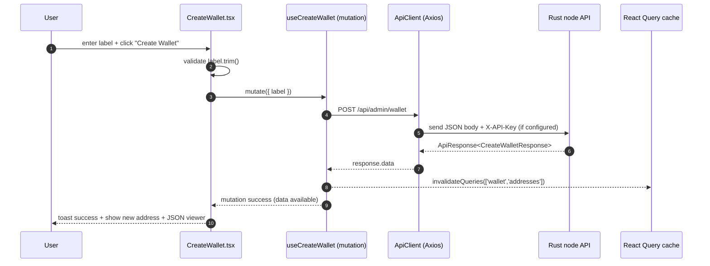

<div align="left">

<details>
<summary><b>Chapter Navigation ▼</b></summary>

### Part I: Foundations & Core Implementation

1. <a href="../01-Introduction.md">Chapter 1: Introduction & Overview</a>
2. <a href="../bitcoin-blockchain/README.md">Chapter 2: Introduction to Bitcoin & Blockchain</a>
3. <a href="../bitcoin-blockchain/whitepaper-rust/00-Bitcoin-Whitepaper-Summary.md">Chapter 3: Bitcoin Whitepaper</a>
4. <a href="../bitcoin-blockchain/whitepaper-rust/00-Bitcoin-Whitepaper-Rust-Encoding-Summary.md">Chapter 4: Bitcoin Whitepaper In Rust</a>
5. <a href="../bitcoin-blockchain/Rust-Project-Index.md">Chapter 5: Rust Blockchain Project</a>
6. <a href="../bitcoin-blockchain/primitives/README.md">Chapter 6: Primitives</a>
7. <a href="../bitcoin-blockchain/util/README.md">Chapter 7: Utilities</a>
8. <a href="../bitcoin-blockchain/crypto/README.md">Chapter 8: Cryptography</a>
9. <a href="../bitcoin-blockchain/chain/README.md">Chapter 9: Blockchain (Technical Foundations)</a>
10. <a href="../bitcoin-blockchain/chain/10-Whitepaper-Step-5-Block-Acceptance.md">Chapter 10: Block Acceptance</a>
11. <a href="../bitcoin-blockchain/store/README.md">Chapter 11: Storage Layer</a>
12. <a href="../bitcoin-blockchain/net/README.md">Chapter 12: Network Layer</a>
13. <a href="../bitcoin-blockchain/node/README.md">Chapter 13: Node Orchestration</a>
14. <a href="../bitcoin-blockchain/wallet/README.md">Chapter 14: Wallet System</a>
15. <a href="../bitcoin-blockchain/web/README.md">Chapter 15: Web API Architecture</a>
16. <a href="../bitcoin-desktop-ui-iced/04.1-Desktop-Admin-UI-Iced.md">Chapter 16: Desktop Admin (Iced)</a>
17. <a href="../bitcoin-desktop-ui-iced/04.1A-Desktop-Admin-UI-Code-Walkthrough.md">16A: Code Walkthrough</a>
18. <a href="../bitcoin-desktop-ui-iced/04.1B-Desktop-Admin-UI-Update-Loop.md">16B: Update Loop</a>
19. <a href="../bitcoin-desktop-ui-iced/04.1C-Desktop-Admin-UI-View-Layer.md">16C: View Layer</a>
20. <a href="../bitcoin-desktop-ui-tauri/04.2-Desktop-Admin-UI-Tauri.md">Chapter 17: Desktop Admin (Tauri)</a>
21. <a href="../bitcoin-desktop-ui-tauri/04.2A-Tauri-Admin-Rust-Backend.md">17A: Rust Backend</a>
22. <a href="../bitcoin-desktop-ui-tauri/04.2B-Tauri-Admin-Frontend-Infrastructure.md">17B: Frontend Infrastructure</a>
23. <a href="../bitcoin-desktop-ui-tauri/04.2C-Tauri-Admin-Frontend-Pages.md">17C: Frontend Pages</a>
24. <a href="../bitcoin-wallet-ui-iced/05.1-Wallet-UI-Iced.md">Chapter 18: Wallet UI (Iced)</a>
25. <a href="../bitcoin-wallet-ui-iced/05.1A-Wallet-UI-Code-Listings.md">18A: Code Listings</a>
26. <a href="../bitcoin-wallet-ui-tauri/05.2-Wallet-UI-Tauri.md">Chapter 19: Wallet UI (Tauri)</a>
27. <a href="../bitcoin-wallet-ui-tauri/05.2A-Tauri-Wallet-Rust-Backend.md">19A: Rust Backend</a>
28. <a href="../bitcoin-wallet-ui-tauri/05.2B-Tauri-Wallet-Frontend-Infrastructure.md">19B: Frontend Infrastructure</a>
29. <a href="../bitcoin-wallet-ui-tauri/05.2C-Tauri-Wallet-Frontend-Pages.md">19C: Frontend Pages</a>
30. <a href="../embedded-database/06-Embedded-Database.md">Chapter 20: Embedded Database</a>
31. <a href="../embedded-database/06A-Embedded-Database-Code-Listings.md">20A: Code Listings</a>
32. **Chapter 21: Web Admin Interface** ← *You are here*
33. <a href="06A-Web-Admin-UI-Code-Listings.md">21A: Code Listings</a>

### Part II: Deployment & Operations

34. <a href="../ci/docker-compose/01-Introduction.md">Chapter 22: Docker Compose Deployment</a>
35. <a href="../ci/docker-compose/01A-Docker-Compose-Code-Listings.md">22A: Code Listings</a>
36. <a href="../ci/kubernetes/README.md">Chapter 23: Kubernetes Deployment</a>
37. <a href="../ci/kubernetes/01A-Kubernetes-Code-Listings.md">23A: Code Listings</a>

### Part III: Language Reference

38. <a href="../rust/README.md">Chapter 24: Rust Language Guide</a>

</details>

</div>

---
<div align="right">

**[← Back to Main Book](../../README.md)**

</div>

---

## Chapter 21: Web Admin Interface

**Part I: Foundations & Core Implementation**

<div align="center">

**[← Chapter 20: Embedded Database](../embedded-database/06-Embedded-Database.md)** | **Chapter 21: Web Admin Interface** | **[Chapter 22: Docker Compose →](../ci/docker-compose/01-Introduction.md)** 
</div>

---

> **Prerequisites**: This chapter is written in React/TypeScript rather than Rust. You should be comfortable reading JSX and TypeScript type annotations. Familiarity with the REST API from Chapter 15 is helpful — this UI is a client to that API — but we recap the relevant endpoints as they appear.

**What you will learn in this chapter:** How the React SPA is structured (routing, context providers, API client), how it consumes the Rust node’s admin endpoints, and how React Query manages server state so the UI stays in sync with the blockchain without manual refresh logic.

## Overview

This chapter explains the Web Admin UI in `bitcoin-web-ui/`: a React + TypeScript single-page application (SPA) that calls the Rust node’s **admin API** (`/api/admin/*`) and renders a professional administrative interface.

This is a **code-centric book chapter**. Every referenced function is either printed in full here or linked to a **complete verbatim listing** in:

- **[Chapter 21A: Web Admin Interface — Complete Code Listings](06A-Web-Admin-UI-Code-Listings.md)**

---

## The architectural spine (what to read first)

To understand the entire application quickly, read the code in this order:

1. **`src/main.tsx`**: bootstraps React into the DOM (Listing 7.1).
2. **`src/App.tsx`**: composes providers + routes + layout (Listing 7.2).
3. **`src/contexts/ApiConfigContext.tsx`**: the “global config” for base URL and API key (Listing 7.3).
4. **`src/services/api.ts`**: the HTTP boundary (one method per endpoint) (Listing 7.4).
5. **`src/hooks/useApi.ts`**: the “query/mutation surface” used by components (Listing 7.5).
6. **Feature components** (Dashboard, Blockchain screens, Wallet screens): each is a thin layer that calls hooks and renders results.

---

## Diagram: the layer boundaries (UI → hooks → HTTP)

```mermaid
flowchart TB
  subgraph UI[UI layer: routes + components]
    App[App.tsx<br/>routes + providers]
    Screens[Screens<br/>Dashboard / Wallet / Mining / ...]
  end

  subgraph Data[Data layer: React Query hooks]
    Hooks[useApi.ts<br/>useQuery / useMutation<br/>cache keys + invalidation]
  end

  subgraph HTTP[HTTP boundary]
    Client[ApiClient (Axios)<br/>one method per endpoint]
  end

  subgraph Server[Rust node]
    API[/api/admin/* endpoints/]
  end

  App --> Screens
  Screens --> Hooks
  Hooks --> Client
  Client --> API
```

The payoff of this structure is local reasoning: each layer has a single responsibility, and we can understand each without reading the others.

- A component answers: “what do we render?”
- A hook answers: “how do we fetch/cache/invalidate?”
- The API client answers: “what URL, what HTTP verb, what headers, what types?”

---

## Diagram: end-to-end data flow (click → API → render)



The key design decision is separation of concerns:

- **Components** render UI and own local form state.
- **Hooks** define cache keys, enablement, invalidation, and mutation feedback.
- **ApiClient** performs the HTTP requests and returns typed responses.

---

## Entry point (`src/main.tsx`)

`main.tsx` is intentionally minimal: it mounts the app and imports global CSS. We get a key architectural advantage: a single composition root (`App`) and a single place where all providers and routing are defined.

Full listing: [Listing 7.1](06A-Web-Admin-UI-Code-Listings.md#listing-71-srcmaintsx).

---

## Composition root: providers + routes (`src/App.tsx`)

`App.tsx` is the most important file for “what exists” in the UI:

- It defines the global **React Query client** (retry policy, focus refetch behavior).
- It enables global **API configuration** via `ApiConfigProvider`.
- It creates the **routing table** for all screens.
- It mounts the `Layout`, which provides the consistent navbar + sidebar.

Full listing: [Listing 7.2](06A-Web-Admin-UI-Code-Listings.md#listing-72-srcapptsx).

---

## Global configuration: base URL and API key (`ApiConfigContext`)

The web UI cannot assume a fixed backend address or key in all deployments. The solution is:

- store `baseURL` and `apiKey` in **React Context**,
- persist them to **localStorage**,
- and update the API client singleton when they change.

This yields a simple rule for the rest of the codebase:

- Components do **not** pass baseURL/apiKey around as props.
- API calls always go through `getApiClient()` and therefore always use the latest config.

Full listing: [Listing 7.3](06A-Web-Admin-UI-Code-Listings.md#listing-73-srccontextsapiconfigcontexttsx).

---

## The HTTP boundary: `ApiClient` (`src/services/api.ts`)

This module is the only place that “knows” about:

- endpoint paths (`/api/admin/...`),
- request shape (GET vs POST),
- and authentication header injection (`X-API-Key`).

Everything above it (hooks/components) is *business/UI logic*; everything below it is *HTTP transport*.

Full listing: [Listing 7.4](06A-Web-Admin-UI-Code-Listings.md#listing-74-srcservicesapits).

---

## The data-access surface: React Query hooks (`src/hooks/useApi.ts`)

Each hook defines the UI’s public “data layer.” We express:

- a **query key** for cache identity,
- a **query function** to call an ApiClient method,
- optional behavior like:
  - `enabled` to gate requests until input exists,
  - `refetchInterval` for auto-refresh,
  - `onSuccess` to invalidate caches and trigger feedback toast messages for mutations.

The most important hooks to understand first are:

- `useBlockchainInfo(refetchInterval?)` for dashboards and global status.
- `useCreateWallet`, `useSendTransaction`, `useGenerateBlocks` for mutations.
- `useAllBlocks` and `useAllTransactions` for on-demand “bulk” screens (`enabled: false`).

Full listing: [Listing 7.5](06A-Web-Admin-UI-Code-Listings.md#listing-75-srchooksuseapits).

---

## The UI shell: layout + navigation (Layout / Navbar / Sidebar)

The UI shell lets the rest of the code stay “page focused.” Two aspects matter most:

- **API configuration UX** is concentrated in the navbar. That means any page can assume the API client is configured; it does not need its own base-url inputs.
- **Sidebar state tracks the current route**, so deep links keep the correct menu open (`openMenuPath` is derived from `location.pathname`).

Full listings: [Listings 7.6–7.8](06A-Web-Admin-UI-Code-Listings.md).

---

## A representative query screen: `Dashboard`

The dashboard is the simplest example of the project’s standard query flow:

1. Call a hook.
2. If loading, render `LoadingSpinner`.
3. If error, render `ErrorMessage`.
4. If data, render a UI view that mixes:
   - “human-friendly” components (`StatCard`),
   - and exact values (formatted timestamps, hashes, etc.).

Full listing: [Listing 7.10](06A-Web-Admin-UI-Code-Listings.md#listing-710-srccomponentsdashboarddashboardtsx).

---

## A representative mutation screen: `CreateWallet`

The “create wallet” screen demonstrates the project’s mutation conventions:

- UI handles local form state (`label`).
- Hook handles mutation lifecycle + user feedback:
  - success toast,
  - cache invalidation (`wallet/addresses`).

Full listing: [Listing 7.21](06A-Web-Admin-UI-Code-Listings.md#listing-721-srccomponentswalletcreatewallettsx).

---

## Diagram: mutation flow (create wallet)



---

## A screen that mixes UI state + bulk loading: `AllBlocks` / `AllTransactions`

These screens show the project’s “bulk load escape hatch” pattern:

- React Query hooks are configured with `enabled: false` to avoid auto-fetching.
- The component triggers fetches on-demand via `refetch()`.
- When loading “all pages,” the component uses the API client directly in a loop.

This is a pragmatic compromise: React Query is excellent for caching and typical screen loads, while an explicit loop is simpler for “load everything” workflows.

Full listings: [Listings 7.19 and 7.29](06A-Web-Admin-UI-Code-Listings.md).

---

## Summary

The Web Admin UI follows a clean layering approach:

- **Routes and providers** are composed in `App.tsx`.
- **Global configuration** is managed by `ApiConfigContext`.
- **HTTP transport** is isolated in `ApiClient`.
- **Caching + async lifecycle** are expressed in React Query hooks.
- **Components** remain thin and predictable: render based on `data/isLoading/error`.

Continue to the complete listings in Chapter 21A to read any module in full.

---

<div align="center">

**Reading order**

**[← Previous: Embedded Database — Code Listings](../embedded-database/06A-Embedded-Database-Code-Listings.md)** | **[Next: Web Admin Interface — Code Listings →](06A-Web-Admin-UI-Code-Listings.md)**

</div>

---

