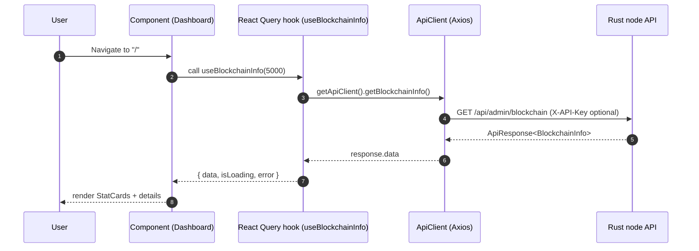
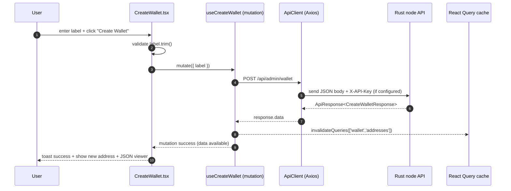

<div align="left">

<details>
<summary><b>📑 Chapter Navigation ▼</b></summary>

### Part I: Core Blockchain Implementation

1. <a href="../01-Introduction.md">Chapter 1: Introduction & Overview</a> - Book introduction, project structure, technical stack
2. <a href="../bitcoin-blockchain/README.md">Chapter 1.2: Introduction to Bitcoin & Blockchain</a> - Bitcoin and blockchain fundamentals
3. <a href="../bitcoin-blockchain/whitepaper-rust/00-Bitcoin-Whitepaper-Summary.md">Chapter 1.3: Bitcoin Whitepaper</a> - Bitcoin Whitepaper
4. <a href="../bitcoin-blockchain/whitepaper-rust/00-Bitcoin-Whitepaper-Rust-Encoding-Summary.md">Chapter 1.4: Bitcoin Whitepaper In Rust</a> - Bitcoin Whitepaper In Rust
5. <a href="../bitcoin-blockchain/Rust-Project-Index.md">Chapter 2.0: Rust Blockchain Project</a> - Blockchain Project
6. <a href="../bitcoin-blockchain/primitives/README.md">Chapter 2.1: Primitives</a> - Core data structures
7. <a href="../bitcoin-blockchain/util/README.md">Chapter 2.2: Utilities</a> - Utility functions and helpers
8. <a href="../bitcoin-blockchain/crypto/README.md">Chapter 2.3: Cryptography</a> - Cryptographic primitives and libraries
9. <a href="../bitcoin-blockchain/chain/README.md">Chapter 2.4: Blockchain (Technical Foundations)</a> - Proof Of Work
10. <a href="../bitcoin-blockchain/store/README.md">Chapter 2.5: Storage Layer</a> - Persistent storage implementation
11. <a href="../bitcoin-blockchain/chain/10-Whitepaper-Step-5-Block-Acceptance.md">Chapter 2.6: Block Acceptance (Whitepaper §5, Step 5)</a> - Proof Of Work
12. <a href="../bitcoin-blockchain/net/README.md">Chapter 2.7: Network Layer</a> - Peer-to-peer networking and protocol
13. <a href="../bitcoin-blockchain/node/README.md">Chapter 2.8: Node Orchestration</a> - Node context and coordination
14. <a href="../bitcoin-blockchain/wallet/README.md">Chapter 2.9: Wallet System</a> - Wallet implementation and key management
15. <a href="../bitcoin-blockchain/web/README.md">Chapter 3: Web API Architecture</a> - REST API implementation
16. <a href="../bitcoin-desktop-ui/03-Desktop-Admin-UI.md">Chapter 4: Desktop Admin Interface</a> - Iced framework architecture
17. <a href="../bitcoin-wallet-ui/04-Wallet-UI.md">Chapter 5: Wallet User Interface</a> - Wallet UI implementation
18. <a href="../bitcoin-wallet-ui/05-Embedded-Database.md">Chapter 6: Embedded Database & Persistence</a> - SQLCipher integration
19. **Chapter 7: Web Admin Interface** ← *You are here*

### Part II: Deployment & Operations

20. <a href="../ci/docker-compose/01-Introduction.md">Chapter 8: Docker Compose Deployment</a> - Docker Compose guide
21. <a href="../ci/kubernetes/README.md">Chapter 9: Kubernetes Deployment</a> - Kubernetes production guide
22. <a href="../rust/README.md">Chapter 10: Rust Language Guide</a> - Rust programming language reference

</details>

</div>

---
<div align="right">

**[← Back to Main Book](../../README.md)**

</div>

---

## Chapter 7: Web Admin Interface

**Part I: Core Blockchain Implementation**

<div align="center">

**📚 [← Chapter 6: Embedded Database](../bitcoin-wallet-ui/05-Embedded-Database.md)** | **Chapter 7: Web Admin Interface** | **[Chapter 8: Docker Compose →](../ci/docker-compose/01-Introduction.md)** 📚

</div>

---

## Overview

> **Methods involved**
> - `App` (`bitcoin-web-ui/src/App.tsx`, [Listing 7.2](06A-Web-Admin-UI-Code-Listings.md#listing-72-srcapptsx))
> - `ApiConfigProvider`, `useApiConfig` (`bitcoin-web-ui/src/contexts/ApiConfigContext.tsx`, [Listing 7.3](06A-Web-Admin-UI-Code-Listings.md#listing-73-srccontextsapiconfigcontexttsx))
> - `ApiClient`, `getApiClient`, `updateApiClient` (`bitcoin-web-ui/src/services/api.ts`, [Listing 7.4](06A-Web-Admin-UI-Code-Listings.md#listing-74-srcservicesapits))
> - `useBlockchainInfo` and other hooks (`bitcoin-web-ui/src/hooks/useApi.ts`, [Listing 7.5](06A-Web-Admin-UI-Code-Listings.md#listing-75-srchooksuseapits))

This chapter explains the Web Admin UI in `bitcoin-web-ui/`: a React + TypeScript single-page application (SPA) that calls the Rust node’s **admin API** (`/api/admin/*`) and renders a professional administrative interface.

This is a **code-centric book chapter**. Every referenced function is either printed in full here or linked to a **complete verbatim listing** in:

- **[Chapter 7A: Web Admin Interface — Complete Code Listings](06A-Web-Admin-UI-Code-Listings.md)**

---

## The architectural spine (what to read first)

> **Methods involved**
> - `main.tsx` ([Listing 7.1](06A-Web-Admin-UI-Code-Listings.md#listing-71-srcmaintsx))
> - `App` ([Listing 7.2](06A-Web-Admin-UI-Code-Listings.md#listing-72-srcapptsx))
> - `getApiClient` / `updateApiClient` ([Listing 7.4](06A-Web-Admin-UI-Code-Listings.md#listing-74-srcservicesapits))
> - hooks in `useApi.ts` ([Listing 7.5](06A-Web-Admin-UI-Code-Listings.md#listing-75-srchooksuseapits))

To understand the entire application quickly, read the code in this order:

1. **`src/main.tsx`**: bootstraps React into the DOM (Listing 7.1).
2. **`src/App.tsx`**: composes providers + routes + layout (Listing 7.2).
3. **`src/contexts/ApiConfigContext.tsx`**: the “global config” for base URL and API key (Listing 7.3).
4. **`src/services/api.ts`**: the HTTP boundary (one method per endpoint) (Listing 7.4).
5. **`src/hooks/useApi.ts`**: the “query/mutation surface” used by components (Listing 7.5).
6. **Feature components** (Dashboard, Blockchain screens, Wallet screens): each is a thin layer that calls hooks and renders results.

---

## Diagram: the layer boundaries (UI → hooks → HTTP)

> **Methods involved**
> - `ApiClient` (`bitcoin-web-ui/src/services/api.ts`, [Listing 7.4](06A-Web-Admin-UI-Code-Listings.md#listing-74-srcservicesapits))
> - hooks in `useApi.ts` (`bitcoin-web-ui/src/hooks/useApi.ts`, [Listing 7.5](06A-Web-Admin-UI-Code-Listings.md#listing-75-srchooksuseapits))
> - representative components: `Dashboard`, `CreateWallet` ([Listings 7.10, 7.21](06A-Web-Admin-UI-Code-Listings.md))

```mermaid
flowchart TB
  subgraph UI[UI layer: routes + components]
    App[App.tsx<br/>routes + providers]
    Screens[Screens<br/>Dashboard / Wallet / Mining / ...]
  end

  subgraph Data[Data layer: React Query hooks]
    Hooks[useApi.ts<br/>useQuery / useMutation<br/>cache keys + invalidation]
  end

  subgraph HTTP[HTTP boundary]
    Client[ApiClient (Axios)<br/>one method per endpoint]
  end

  subgraph Server[Rust node]
    API[/api/admin/* endpoints/]
  end

  App --> Screens
  Screens --> Hooks
  Hooks --> Client
  Client --> API
```

The payoff of this structure is local reasoning:

- A component answers: “what do we render?”
- A hook answers: “how do we fetch/cache/invalidate?”
- The API client answers: “what URL, what HTTP verb, what headers, what types?”

---

## Diagram: end-to-end data flow (click → API → render)

> **Methods involved**
> - `useBlockchainInfo` ([Listing 7.5](06A-Web-Admin-UI-Code-Listings.md#listing-75-srchooksuseapits))
> - `ApiClient.getBlockchainInfo` ([Listing 7.4](06A-Web-Admin-UI-Code-Listings.md#listing-74-srcservicesapits))
> - `Dashboard` ([Listing 7.10](06A-Web-Admin-UI-Code-Listings.md#listing-710-srccomponentsdashboarddashboardtsx))



The key design decision is separation of concerns:

- **Components** render UI and own local form state.
- **Hooks** define cache keys, enablement, invalidation, and mutation feedback.
- **ApiClient** performs the HTTP requests and returns typed responses.

---

## Entry point (`src/main.tsx`)

> **Methods involved**
> - entrypoint `render` call ([Listing 7.1](06A-Web-Admin-UI-Code-Listings.md#listing-71-srcmaintsx))

`main.tsx` is intentionally minimal: it mounts the app and imports global CSS. This is an architectural advantage: there is exactly one composition root (`App`) and exactly one place where providers and routing are defined.

Full listing: [Listing 7.1](06A-Web-Admin-UI-Code-Listings.md#listing-71-srcmaintsx).

---

## Composition root: providers + routes (`src/App.tsx`)

> **Methods involved**
> - `App` ([Listing 7.2](06A-Web-Admin-UI-Code-Listings.md#listing-72-srcapptsx))

`App.tsx` is the most important file for “what exists” in the UI:

- It defines the global **React Query client** (retry policy, focus refetch behavior).
- It enables global **API configuration** via `ApiConfigProvider`.
- It creates the **routing table** for all screens.
- It mounts the `Layout`, which provides the consistent navbar + sidebar.

Full listing: [Listing 7.2](06A-Web-Admin-UI-Code-Listings.md#listing-72-srcapptsx).

---

## Global configuration: base URL and API key (`ApiConfigContext`)

> **Methods involved**
> - `ApiConfigProvider`, `useApiConfig` ([Listing 7.3](06A-Web-Admin-UI-Code-Listings.md#listing-73-srccontextsapiconfigcontexttsx))

The web UI cannot assume a fixed backend address or key in all deployments. The solution is:

- store `baseURL` and `apiKey` in **React Context**,
- persist them to **localStorage**,
- and update the API client singleton when they change.

This yields a simple rule for the rest of the codebase:

- Components do **not** pass baseURL/apiKey around as props.
- API calls always go through `getApiClient()` and therefore always use the latest config.

Full listing: [Listing 7.3](06A-Web-Admin-UI-Code-Listings.md#listing-73-srccontextsapiconfigcontexttsx).

---

## The HTTP boundary: `ApiClient` (`src/services/api.ts`)

> **Methods involved**
> - `ApiClient` + `getApiClient` + `updateApiClient` ([Listing 7.4](06A-Web-Admin-UI-Code-Listings.md#listing-74-srcservicesapits))

This module is the only place that “knows” about:

- endpoint paths (`/api/admin/...`),
- request shape (GET vs POST),
- and authentication header injection (`X-API-Key`).

Everything above it (hooks/components) is *business/UI logic*; everything below it is *HTTP transport*.

Full listing: [Listing 7.4](06A-Web-Admin-UI-Code-Listings.md#listing-74-srcservicesapits).

---

## The data-access surface: React Query hooks (`src/hooks/useApi.ts`)

> **Methods involved**
> - All hooks in [Listing 7.5](06A-Web-Admin-UI-Code-Listings.md#listing-75-srchooksuseapits)

Hooks are the UI’s public “data layer.” Each hook defines:

- a **query key** (cache identity),
- a **query function** (which ApiClient method to call),
- and optional behavior:
  - `enabled` gates the request until input exists,
  - `refetchInterval` provides auto-refresh,
  - `onSuccess` invalidates caches and triggers toast messages for mutations.

The most important hooks to understand first are:

- `useBlockchainInfo(refetchInterval?)` for dashboards and global status.
- `useCreateWallet`, `useSendTransaction`, `useGenerateBlocks` for mutations.
- `useAllBlocks` and `useAllTransactions` for on-demand “bulk” screens (`enabled: false`).

Full listing: [Listing 7.5](06A-Web-Admin-UI-Code-Listings.md#listing-75-srchooksuseapits).

---

## The UI shell: layout + navigation (Layout / Navbar / Sidebar)

> **Methods involved**
> - `Layout` ([Listing 7.6](06A-Web-Admin-UI-Code-Listings.md#listing-76-srccomponentslayoutlayouttsx))
> - `Navbar` ([Listing 7.7](06A-Web-Admin-UI-Code-Listings.md#listing-77-srccomponentslayoutnavbartsx))
> - `Sidebar` ([Listing 7.8](06A-Web-Admin-UI-Code-Listings.md#listing-78-srccomponentslayoutsidebartsx))
> - `useApiConfig` ([Listing 7.3](06A-Web-Admin-UI-Code-Listings.md#listing-73-srccontextsapiconfigcontexttsx))

The UI shell exists so the rest of the code can be “page focused.” Two aspects are worth understanding:

- **API configuration UX** is concentrated in the navbar. That means any page can assume the API client is configured; it does not need its own base-url inputs.
- **Sidebar state tracks the current route**, so deep links keep the correct menu open (`openMenuPath` is derived from `location.pathname`).

Full listings: [Listings 7.6–7.8](06A-Web-Admin-UI-Code-Listings.md).

---

## A representative query screen: `Dashboard`

> **Methods involved**
> - `Dashboard` ([Listing 7.10](06A-Web-Admin-UI-Code-Listings.md#listing-710-srccomponentsdashboarddashboardtsx))
> - `useBlockchainInfo` ([Listing 7.5](06A-Web-Admin-UI-Code-Listings.md#listing-75-srchooksuseapits))
> - `formatDate` ([Listing 7.15](06A-Web-Admin-UI-Code-Listings.md#listing-715-srcutilsdatets))

The dashboard is the simplest example of the project’s standard query flow:

1. Call a hook.
2. If loading, render `LoadingSpinner`.
3. If error, render `ErrorMessage`.
4. If data, render a UI view that mixes:
   - “human-friendly” components (`StatCard`),
   - and exact values (formatted timestamps, hashes, etc.).

Full listing: [Listing 7.10](06A-Web-Admin-UI-Code-Listings.md#listing-710-srccomponentsdashboarddashboardtsx).

---

## A representative mutation screen: `CreateWallet`

> **Methods involved**
> - `CreateWallet` ([Listing 7.21](06A-Web-Admin-UI-Code-Listings.md#listing-721-srccomponentswalletcreatewallettsx))
> - `useCreateWallet` ([Listing 7.5](06A-Web-Admin-UI-Code-Listings.md#listing-75-srchooksuseapits))

The “create wallet” screen demonstrates the project’s mutation conventions:

- UI handles local form state (`label`).
- Hook handles mutation lifecycle + user feedback:
  - success toast,
  - cache invalidation (`wallet/addresses`).

Full listing: [Listing 7.21](06A-Web-Admin-UI-Code-Listings.md#listing-721-srccomponentswalletcreatewallettsx).

---

## Diagram: mutation flow (create wallet)

> **Methods involved**
> - `CreateWallet` ([Listing 7.21](06A-Web-Admin-UI-Code-Listings.md#listing-721-srccomponentswalletcreatewallettsx))
> - `useCreateWallet` ([Listing 7.5](06A-Web-Admin-UI-Code-Listings.md#listing-75-srchooksuseapits))
> - `ApiClient.createWallet` ([Listing 7.4](06A-Web-Admin-UI-Code-Listings.md#listing-74-srcservicesapits))



---

## A screen that mixes UI state + bulk loading: `AllBlocks` / `AllTransactions`

> **Methods involved**
> - `AllBlocks` ([Listing 7.19](06A-Web-Admin-UI-Code-Listings.md#listing-719-srccomponentsblockchainallblockstsx))
> - `AllTransactions` ([Listing 7.29](06A-Web-Admin-UI-Code-Listings.md#listing-729-srccomponentstransactionsalltransactionstsx))
> - `getApiClient` ([Listing 7.4](06A-Web-Admin-UI-Code-Listings.md#listing-74-srcservicesapits))

These screens show the project’s “bulk load escape hatch” pattern:

- React Query hooks are configured with `enabled: false` to avoid auto-fetching.
- The component triggers fetches on-demand via `refetch()`.
- When loading “all pages,” the component uses the API client directly in a loop.

This is a pragmatic compromise: React Query is excellent for caching and typical screen loads, while an explicit loop is simpler for “load everything” workflows.

Full listings: [Listings 7.19 and 7.29](06A-Web-Admin-UI-Code-Listings.md).

---

## Summary

> **Methods involved**
> - All key functions are listed in [Chapter 7A](06A-Web-Admin-UI-Code-Listings.md)

The Web Admin UI follows a clean layering approach:

- **Routes and providers** are composed in `App.tsx`.
- **Global configuration** is managed by `ApiConfigContext`.
- **HTTP transport** is isolated in `ApiClient`.
- **Caching + async lifecycle** are expressed in React Query hooks.
- **Components** remain thin and predictable: render based on `data/isLoading/error`.

Continue to the complete listings in Chapter 7A to read any module in full.

---

<div align="center">

**Reading order**

**[← Previous: Embedded Database — Code Listings](../bitcoin-wallet-ui/05A-Embedded-Database-Code-Listings.md)** | **[Next: Web Admin Interface — Code Listings →](06A-Web-Admin-UI-Code-Listings.md)**

</div>

---

