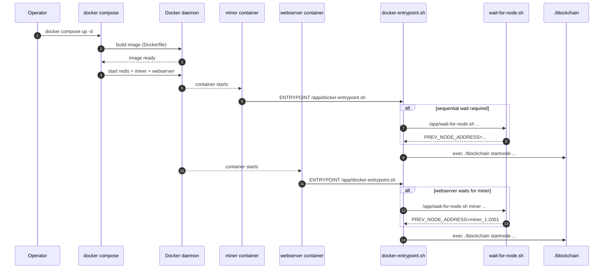

<div align="left">

<details>
<summary><b>Chapter Navigation ▼</b></summary>

### Part I: Foundations & Core Implementation

1. <a href="../../00-Quick-Start.md">Chapter 1: Quick Start</a>
2. <a href="../../01-Introduction.md">Chapter 2: Introduction & Overview</a>
3. <a href="../../bitcoin-blockchain/README.md">Chapter 3: Introduction to Blockchain</a>
4. <a href="../../bitcoin-blockchain/whitepaper-rust/00-Bitcoin-Whitepaper-Summary.md">Chapter 4: Bitcoin Whitepaper</a>
5. <a href="../../bitcoin-blockchain/whitepaper-rust/00-Bitcoin-Whitepaper-Rust-Encoding-Summary.md">Chapter 5: Bitcoin Whitepaper in Rust</a>
6. <a href="../../bitcoin-blockchain/Rust-Project-Index.md">Chapter 6: Rust Blockchain Project</a>
7. <a href="../../bitcoin-blockchain/primitives/README.md">Chapter 7: Primitives</a>
8. <a href="../../bitcoin-blockchain/util/README.md">Chapter 8: Utilities</a>
9. <a href="../../bitcoin-blockchain/crypto/README.md">Chapter 9: Cryptography</a>
10. <a href="../../bitcoin-blockchain/chain/01-Domain-Model.md">Chapter 10: Domain Model</a>
11. <a href="../../bitcoin-blockchain/chain/02-Blockchain-State-Management.md">Chapter 11: Blockchain State Management</a>
12. <a href="../../bitcoin-blockchain/chain/03-Chain-State-and-Storage.md">Chapter 12: Chain State and Storage</a>
13. <a href="../../bitcoin-blockchain/chain/04-UTXO-Set.md">Chapter 13: UTXO Set</a>
14. <a href="../../bitcoin-blockchain/chain/05-Transaction-Lifecycle.md">Chapter 14: Transaction Lifecycle</a>
15. <a href="../../bitcoin-blockchain/chain/06-Block-Lifecycle-and-Mining.md">Chapter 15: Block Lifecycle and Mining</a>
16. <a href="../../bitcoin-blockchain/chain/07-Consensus-and-Validation.md">Chapter 16: Consensus and Validation</a>
17. <a href="../../bitcoin-blockchain/chain/08-Node-Orchestration.md">Chapter 17: Node Orchestration</a>
18. <a href="../../bitcoin-blockchain/chain/09-Transaction-To-Block.md">Chapter 18: Transaction to Block</a>
19. <a href="../../bitcoin-blockchain/chain/10-Whitepaper-Step-5-Block-Acceptance.md">Chapter 19: Block Acceptance</a>
20. <a href="../../bitcoin-blockchain/store/README.md">Chapter 20: Storage Layer</a>
21. <a href="../../bitcoin-blockchain/net/README.md">Chapter 21: Network Layer</a>
22. <a href="../../bitcoin-blockchain/node/README.md">Chapter 22: Node Orchestration</a>
23. <a href="../../bitcoin-blockchain/wallet/README.md">Chapter 23: Wallet System</a>
24. <a href="../../bitcoin-blockchain/web/README.md">Chapter 24: Web API Architecture</a>
25. <a href="../../bitcoin-desktop-ui-iced/04.1-Desktop-Admin-UI-Iced.md">Chapter 25: Desktop Admin (Iced)</a>
26. <a href="../../bitcoin-desktop-ui-iced/04.1A-Desktop-Admin-UI-Code-Walkthrough.md">25A: Code Walkthrough</a>
27. <a href="../../bitcoin-desktop-ui-iced/04.1B-Desktop-Admin-UI-Update-Loop.md">25B: Update Loop</a>
28. <a href="../../bitcoin-desktop-ui-iced/04.1C-Desktop-Admin-UI-View-Layer.md">25C: View Layer</a>
29. <a href="../../bitcoin-desktop-ui-tauri/04.2-Desktop-Admin-UI-Tauri.md">Chapter 26: Desktop Admin (Tauri)</a>
30. <a href="../../bitcoin-desktop-ui-tauri/04.2A-Tauri-Admin-Rust-Backend.md">26A: Rust Backend</a>
31. <a href="../../bitcoin-desktop-ui-tauri/04.2B-Tauri-Admin-Frontend-Infrastructure.md">26B: Frontend Infrastructure</a>
32. <a href="../../bitcoin-desktop-ui-tauri/04.2C-Tauri-Admin-Frontend-Pages.md">26C: Frontend Pages</a>
33. <a href="../../bitcoin-wallet-ui-iced/05.1-Wallet-UI-Iced.md">Chapter 27: Wallet UI (Iced)</a>
34. <a href="../../bitcoin-wallet-ui-iced/05.1A-Wallet-UI-Code-Listings.md">27A: Code Listings</a>
35. <a href="../../bitcoin-wallet-ui-tauri/05.2-Wallet-UI-Tauri.md">Chapter 28: Wallet UI (Tauri)</a>
36. <a href="../../bitcoin-wallet-ui-tauri/05.2A-Tauri-Wallet-Rust-Backend.md">28A: Rust Backend</a>
37. <a href="../../bitcoin-wallet-ui-tauri/05.2B-Tauri-Wallet-Frontend-Infrastructure.md">28B: Frontend Infrastructure</a>
38. <a href="../../bitcoin-wallet-ui-tauri/05.2C-Tauri-Wallet-Frontend-Pages.md">28C: Frontend Pages</a>
39. <a href="../../embedded-database/06-Embedded-Database.md">Chapter 29: Embedded Database</a>
40. <a href="../../embedded-database/06A-Embedded-Database-Code-Listings.md">29A: Code Listings</a>
41. <a href="../../bitcoin-web-ui/06-Web-Admin-UI.md">Chapter 30: Web Admin Interface</a>
42. <a href="../../bitcoin-web-ui/06A-Web-Admin-UI-Code-Listings.md">30A: Code Listings</a>
### Part II: Deployment & Operations

43. <a href="01-Introduction.md">Chapter 31: Docker Compose Deployment</a>
44. <a href="01A-Docker-Compose-Code-Listings.md">31A: Code Listings</a>
45. <a href="../kubernetes/README.md">Chapter 32: Kubernetes Deployment</a>
46. <a href="../kubernetes/01A-Kubernetes-Code-Listings.md">32A: Code Listings</a>
### Part III: Language Reference

47. <a href="../../rust/README.md">Chapter 33: Rust Language Guide</a>
### Appendices

48. <a href="../../Glossary.md">Glossary</a>
49. <a href="../../Bibliography.md">Bibliography</a>
50. <a href="../../Appendix-Source-Reference.md">Source Reference</a>

</details>

</div>

---
<div align="right">

**[← Back to Main Book](../../../README.md)**

</div>

---

## Chapter 22, Section 2: Architecture & Execution Flow

**Part II: Deployment & Operations** | **Chapter 31: Docker Compose Deployment**

<div align="center">

**[← Section 1: Introduction](01-Introduction.md)** | **Section 2: Architecture & Execution Flow** | **[Section 3: Deployment Topology →](03-Deployment-Topology.md)**

</div>

---

## Prerequisites

Before reading this section, you should have:
- Completed [Section 1: Introduction & Quick Start](01-Introduction.md)
- Basic understanding of Docker containers and Docker Compose
- Familiarity with container networking concepts

## Learning Objectives

After reading this section, you will understand:
- How containers are named and identified in the deployment system
- How instance numbers are detected and used
- The complete execution timeline from Docker Compose initialization through blockchain node startup
- The role of health checks and dependencies in the startup process
- Container lifecycle and service type identification

---

This section explains the container architecture, naming conventions, instance identification, and the complete execution flow when starting containers.

> **Methods involved:**
> - `docker-entrypoint.sh` (`ci/docker-compose/configs/docker-entrypoint.sh`, [Listing 22A.2](01A-Docker-Compose-Code-Listings.md#listing-22a2-cidocker-composeconfigsdocker-entrypointsh))
> - `docker-compose.yml` (`ci/docker-compose/configs/docker-compose.yml`, [Listing 22A.1](01A-Docker-Compose-Code-Listings.md#listing-22a1-cidocker-composeconfigsdocker-composeyml))
> - Docker image build: `Dockerfile` (`ci/docker-compose/configs/Dockerfile`, [Listing 22A.11](01A-Docker-Compose-Code-Listings.md#listing-22a11-cidocker-composeconfigsdockerfile))
> - `wait-for-node.sh` (`ci/docker-compose/configs/wait-for-node.sh`, [Listing 22A.3](01A-Docker-Compose-Code-Listings.md#listing-22a3-cidocker-composeconfigswait-for-nodesh))

## Container Architecture and Naming

### Container Naming System

The entrypoint derives container identity from Docker's `HOSTNAME` value and normalizes it into `CONTAINER_NAME`. The complete implementation (including fallbacks and Kubernetes StatefulSet compatibility) is in [Listing 22A.2](01A-Docker-Compose-Code-Listings.md#listing-22a2-cidocker-composeconfigsdocker-entrypointsh).

#### The Chain of Events

##### 1. Docker Sets HOSTNAME Environment Variable

When Docker starts a container, it automatically sets the `HOSTNAME` environment variable to the container's hostname, which is typically the container name.

##### 2. Docker Compose Container Naming

When using Docker Compose, containers are named using this pattern:

```text
<project>_<service>_<instance_number>
```

**Examples:**
- `blockchain_miner_1` (first miner instance)
- `blockchain_miner_2` (second miner instance)
- `blockchain_webserver_1` (first webserver instance)
- `blockchain_webserver_2` (second webserver instance)

**Note:** The project name defaults to the directory name (e.g., `blockchain`), but can be overridden with:
- `COMPOSE_PROJECT_NAME` environment variable
- `-p` or `--project-name` flag in docker compose commands

##### 3. Entrypoint Script Reads HOSTNAME

The entrypoint script reads `HOSTNAME` into `CONTAINER_NAME`:

See the exact code path in [Listing 22A.2](01A-Docker-Compose-Code-Listings.md#listing-22a2-cidocker-composeconfigsdocker-entrypointsh).

If `HOSTNAME` is not set (shouldn't happen in Docker), it defaults to an empty string.

##### 4. Instance Number Extraction

The script then extracts the instance number from `CONTAINER_NAME`:

The full instance-number extraction logic (Compose `_N` suffix, Kubernetes `-ordinal` suffix, and a safe default) is in [Listing 22A.2](01A-Docker-Compose-Code-Listings.md#listing-22a2-cidocker-composeconfigsdocker-entrypointsh).

**How it works:**
- The regex pattern `_([0-23]+)$` matches an underscore followed by one or more digits at the end of the string
- `BASH_REMATCH[1]` captures the first (and only) capture group, which is the instance number
- If no match is found, `INSTANCE_NUMBER` defaults to `1`

##### 5. Service Type Detection

The script also detects the service type from the container name:

See the complete service-type detection and port selection logic in [Listing 22A.2](01A-Docker-Compose-Code-Listings.md#listing-22a2-cidocker-composeconfigsdocker-entrypointsh).

**How it works:**
- Checks if the container name contains the string "miner" or "webserver"
- Sets `SERVICE_NAME_FROM_CONTAINER` accordingly
- This is used as a fallback if environment variables aren't set

### Example Flow

#### For Miner Instance 1:

1. **Docker Compose creates container**: `blockchain_miner_1`
2. **Docker sets HOSTNAME**: `HOSTNAME=blockchain_miner_1`
3. **Entrypoint script reads**: `CONTAINER_NAME="blockchain_miner_1"`
4. **Extracts instance number**: `INSTANCE_NUMBER=1`
5. **Detects service type**: `SERVICE_NAME_FROM_CONTAINER="miner"`

#### For Webserver Instance 2:

1. **Docker Compose creates container**: `blockchain_webserver_2`
2. **Docker sets HOSTNAME**: `HOSTNAME=blockchain_webserver_2`
3. **Entrypoint script reads**: `CONTAINER_NAME="blockchain_webserver_2"`
4. **Extracts instance number**: `INSTANCE_NUMBER=2`
5. **Detects service type**: `SERVICE_NAME_FROM_CONTAINER="webserver"`

### Verification

You can verify this by checking inside a running container:

```bash
# Check HOSTNAME environment variable
docker compose exec miner_1 env | grep HOSTNAME
# Output: HOSTNAME=blockchain_miner_1

# Or check the hostname directly
docker compose exec miner_1 hostname
# Output: blockchain_miner_1

# Check instance number detection
docker compose exec miner_1 echo $INSTANCE_NUMBER
# Output: 1
```

### Custom Container Names

If you set `container_name` in docker compose.yml (not recommended for scaling), Docker will use that name instead:

```yaml
services:
  miner:
    container_name: my-custom-miner-name
    # ...
```

In this case:
- `HOSTNAME=my-custom-miner-name`
- `CONTAINER_NAME="my-custom-miner-name"`
- Instance number extraction might fail (defaults to 1)
- Service type detection might fail (falls back to environment variables)

**Note:** Using `container_name` prevents scaling, so it's not recommended for multi-instance setups.

## Port Calculation

Based on the instance number, ports are calculated as follows:

### Miners

```bash
P2P_PORT=$((2001 + INSTANCE_NUMBER - 1))
```

**Examples:**
- Instance 1: `2001 + 1 - 1 = 2001`
- Instance 2: `2001 + 2 - 1 = 2002`
- Instance 3: `2001 + 3 - 1 = 2003`

### Webservers

```bash
WEB_PORT=$((8080 + INSTANCE_NUMBER - 1))
P2P_PORT=$((2101 + INSTANCE_NUMBER - 1))
```

**Examples:**
- Instance 1: Web `8080`, P2P `2101`
- Instance 2: Web `8081`, P2P `2102`
- Instance 3: Web `8082`, P2P `2103`

## Data Directory Structure

Each instance uses an isolated data directory based on its instance number:

```bash
DATA_DIR="data${INSTANCE_NUMBER}"
BLOCKS_TREE="blocks${INSTANCE_NUMBER}"
```

**Examples:**
- Instance 1: `data1/`, `blocks1/`
- Instance 2: `data2/`, `blocks2/`
- Instance 3: `data3/`, `blocks3/`

### Volume Mounting

Data directories are stored within Docker volumes:

**Miners:**
- Volume: `miner-data`
- Mount point: `/app/data`
- Instance directories: `/app/data/data1`, `/app/data/data2`, etc.

**Webservers:**
- Volume: `webserver-data`
- Mount point: `/app/data`
- Instance directories: `/app/data/data1`, `/app/data/data2`, etc.

**Wallets:**
- Miners: `miner-wallets` → `/app/wallets`
- Webservers: `webserver-wallets` → `/app/wallets`
- Wallet file location: `/app/wallets/wallets.dat` (inside container)
- Environment variable: `WALLET_FILE=wallets/wallets.dat`

### Container Lifecycle

#### Creation

1. Docker Compose reads `docker compose.yml`
2. Creates containers with names following the pattern `<project>_<service>_<number>`
3. Sets `HOSTNAME` environment variable
4. Mounts volumes
5. Sets environment variables from compose file

#### Startup

1. Container starts
2. Entrypoint script (`docker-entrypoint.sh`) executes
3. Script reads `HOSTNAME` → `CONTAINER_NAME`
4. Extracts instance number and service type
5. Calculates ports and data directories
6. Configures node connection (if sequential startup enabled)
7. Executes blockchain binary

#### Runtime

- Containers run independently
- Each has its own isolated data directory
- Containers communicate via Docker network using service names
- Health checks run periodically

#### Shutdown

- Containers stop gracefully
- Data persists in volumes
- Volumes are not deleted unless explicitly removed with `docker compose down -v`

---

## Execution Flow and Startup Process

### Code Execution Order Overview

```text
1. docker-compose.yml (Docker Compose reads configuration)
   ↓
2. Dockerfile (builds the `blockchain` binary into an image)
   ↓
3. docker-entrypoint.sh (Container startup script)
   ├─ wait-for-node.sh (if sequential startup requires waiting)
   ↓
4. /app/blockchain startnode ... (Rust binary entry point)
```

In this deployment chapter, we stop at the boundary where the entrypoint hands control to the Rust binary. The Rust runtime behavior (P2P networking, storage, web API) is covered in the earlier implementation chapters.

### Startup Timeline (Sequence View)



### Phase 1: Docker Compose Initialization

#### Step 1.1: Parse docker-compose.yml

**File**: `docker-compose.yml`

Docker Compose reads the configuration and creates two services:

1. **`miner` service**:
   - Port mapping: `2001:2001` (host:container)
   - Volumes: `miner-data:/app/data`, `miner-wallets:/app/wallets`
   - Environment variables set:
     - `NODE_IS_MINER=yes`
     - `NODE_IS_WEB_SERVER=no`
     - `NODE_CONNECT_NODES=local` (default)
     - `SEQUENTIAL_STARTUP=yes` (default)
     - `WALLET_ADDRESS_POOL=<comma-separated-addresses>` (Option 1: auto-select by instance number)
     - `NODE_MINING_ADDRESS=<wallet-address>` (Option 2: direct assignment, at least one must be set)
     - `WALLET_FILE=wallets/wallets.dat`

2. **`webserver` service**:
   - Port mappings: `8080:8080`, `2101:2001`
   - Volumes: `webserver-data:/app/data`, `webserver-wallets:/app/wallets`
   - **Dependency**: `depends_on: miner: condition: service_healthy`
   - Environment variables set:
     - `NODE_IS_MINER=no`
     - `NODE_IS_WEB_SERVER=yes`
     - `NODE_CONNECT_NODES=miner_1:2001` (default - connects to first miner)
     - `SEQUENTIAL_STARTUP=yes` (default)
     - `BITCOIN_API_ADMIN_KEY=admin-secret`
     - `BITCOIN_API_WALLET_KEY=wallet-secret`
     - `WALLET_FILE=wallets/wallets.dat`

#### Step 2: Container Creation

Docker Compose creates containers:
- `blockchain_miner_1` (or `<project>_miner_1`)
- `blockchain_webserver_1` (or `<project>_webserver_1`)

**Note**: Webserver depends on miner (`depends_on: miner: condition: service_healthy`), so:
1. Miner starts first
2. Miner health check passes (port 2001 listening)
3. Webserver starts after miner is healthy

### Phase 2: Miner Container Startup

#### Step 6: Container Initialization

**Container**: `blockchain_miner_1`

1. Docker mounts volumes:
   - `miner-data` → `/app/data`
   - `miner-wallets` → `/app/wallets`

2. Docker sets environment variables from `docker-compose.yml`

3. Docker sets `HOSTNAME` environment variable to container name: `blockchain_miner_1`

#### Step 7: Entrypoint Script Execution

**File**: `docker-entrypoint.sh` (line 1)

The entrypoint script executes and configures the miner instance. It performs container identification, instance number extraction, port calculation, and data directory setup before finally executing the blockchain binary.

See the exact execution logic in [Listing 22A.2](01A-Docker-Compose-Code-Listings.md#listing-22a2-cidocker-composeconfigsdocker-entrypointsh).

**Key configuration steps:**
- Get container name from HOSTNAME
- Determine instance number
- Determine service type and calculate ports
- Set up isolated data directory
- For additional instances: wait for previous node to be ready
- Determine wallet address from pool or direct assignment
- Validate required environment variables
- Build and execute blockchain binary command

### Phase 3: Webserver Container Startup

#### Step 3.1: Container Initialization

**Container**: `blockchain_webserver_1`

1. Docker mounts volumes:
   - `webserver-data` → `/app/data`
   - `webserver-wallets` → `/app/wallets`

2. Docker sets environment variables from `docker-compose.yml`

3. Docker sets `HOSTNAME` to: `blockchain_webserver_1`

#### Step 3.2: Entrypoint Script Execution

**File**: `docker-entrypoint.sh`

Similar to the miner startup, the entrypoint script performs all initialization steps, including:
- Container identity extraction
- Service type detection
- Port calculation (web port 8080, P2P port 2101 for instance 1)
- Sequential startup coordination (waits for miner to be ready)
- Auto-configuration to connect to miner
- Blockchain binary execution

The system resolves hostnames to IP addresses (where needed) before calling the Rust binary. This is operationally important because the Rust CLI expects `IP:port` socket addresses.

See the exact resolution and the final `exec` in [Listing 22A.2](01A-Docker-Compose-Code-Listings.md#listing-22a2-cidocker-composeconfigsdocker-entrypointsh).

### Phase 4: Health Checks (Background)

Docker Compose starts health checks after containers start:

**Note**: The miner health check must pass before the webserver container starts (due to `depends_on: condition: service_healthy`).

#### Miner Health Check
Defined in `docker-compose.yml` ([Listing 22A.1](01A-Docker-Compose-Code-Listings.md#listing-22a1-cidocker-composeconfigsdocker-composeyml)):
```bash
# Every 10 seconds, check if port 2001 is listening
timeout 1 bash -c 'echo > /dev/tcp/localhost/2001'
```

#### Webserver Health Check
Defined in `docker-compose.yml` ([Listing 22A.1](01A-Docker-Compose-Code-Listings.md#listing-22a1-cidocker-composeconfigsdocker-composeyml)):
```bash
# Every 10 seconds, check HTTP health endpoint
curl -f http://localhost:8080/api/health/ready
```

### What Changes When You Scale

Scaling does not introduce new execution phases; it changes **parameterization** inside `docker-entrypoint.sh`:

- **Instance identity**: derived from container name → `INSTANCE_NUMBER`
- **Per-instance ports**:
  - miners: $2001 + (INSTANCE\_NUMBER - 1)$
  - webservers: HTTP $8080 + (INSTANCE\_NUMBER - 1)$, P2P mapping $2101 + (INSTANCE\_NUMBER - 1)$
- **Per-instance storage**: the entrypoint chooses `dataN` / `blocksN` so each instance gets an isolated view of chain state
- **Sequential startup decision**: miners wait only if `INSTANCE_NUMBER > 1`, while webservers wait for miners when enabled

All of this logic is in [Listing 22A.2](01A-Docker-Compose-Code-Listings.md#listing-22a2-cidocker-composeconfigsdocker-entrypointsh) and [Listing 22A.3](01A-Docker-Compose-Code-Listings.md#listing-22a3-cidocker-composeconfigswait-for-nodesh).

## Summary

```text
Docker Compose
    ↓
Creates container with name: blockchain_miner_1
    ↓
Docker sets HOSTNAME=blockchain_miner_1
    ↓
Entrypoint script: CONTAINER_NAME="${HOSTNAME:-}"
    ↓
CONTAINER_NAME="blockchain_miner_1"
    ↓
Extract INSTANCE_NUMBER=1 from container name
    ↓
Detect SERVICE_TYPE="miner" from container name
    ↓
Calculate P2P_PORT=2001, DATA_DIR=data1
    ↓
Configure and start blockchain node
```

## Key Points

1. **Container names follow a strict pattern**: `<project>_<service>_<number>`
2. **Instance numbers are extracted automatically** from container names
3. **Ports are calculated** based on instance numbers
4. **Data directories are isolated** per instance within shared volumes
5. **Service types are detected** from container names as a fallback
6. **Custom container names break scaling** - avoid using `container_name` in compose files
7. **Execution flow is deterministic** - same steps always occur from initialization through binary startup
8. **Health checks coordinate startup** - webservers wait for miners to be healthy
9. **Sequential startup ensures connectivity** - nodes wait for previous nodes before connecting

---

<div align="center">

**Local Navigation - Table of Contents**

| [← Previous Section: Introduction](01-Introduction.md) | [↑ Table of Contents](#) | [Next Section: Deployment Topology →](03-Deployment-Topology.md) |
|:---:|:---:|:---:|
| *Section 1* | *Current Section* | *Section 3* |

</div>

---
