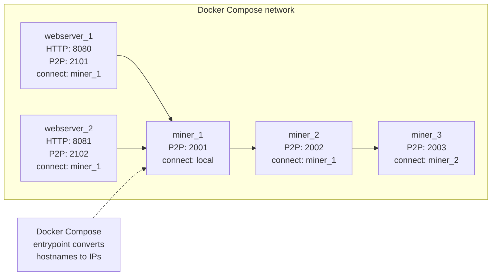

<div align="left">

<details>
<summary><b>Chapter Navigation ▼</b></summary>

### Part I: Foundations & Core Implementation

1. <a href="../../00-Quick-Start.md">Chapter 1: Quick Start</a>
2. <a href="../../01-Introduction.md">Chapter 2: Introduction & Overview</a>
3. <a href="../../bitcoin-blockchain/README.md">Chapter 3: Introduction to Blockchain</a>
4. <a href="../../bitcoin-blockchain/whitepaper-rust/00-Bitcoin-Whitepaper-Summary.md">Chapter 4: Bitcoin Whitepaper</a>
5. <a href="../../bitcoin-blockchain/whitepaper-rust/00-Bitcoin-Whitepaper-Rust-Encoding-Summary.md">Chapter 5: Bitcoin Whitepaper in Rust</a>
6. <a href="../../bitcoin-blockchain/Rust-Project-Index.md">Chapter 6: Rust Blockchain Project</a>
7. <a href="../../bitcoin-blockchain/primitives/README.md">Chapter 7: Primitives</a>
8. <a href="../../bitcoin-blockchain/util/README.md">Chapter 8: Utilities</a>
9. <a href="../../bitcoin-blockchain/crypto/README.md">Chapter 9: Cryptography</a>
10. <a href="../../bitcoin-blockchain/chain/01-Domain-Model.md">Chapter 10: Domain Model</a>
11. <a href="../../bitcoin-blockchain/chain/02-Blockchain-State-Management.md">Chapter 11: Blockchain State Management</a>
12. <a href="../../bitcoin-blockchain/chain/03-Chain-State-and-Storage.md">Chapter 12: Chain State and Storage</a>
13. <a href="../../bitcoin-blockchain/chain/04-UTXO-Set.md">Chapter 13: UTXO Set</a>
14. <a href="../../bitcoin-blockchain/chain/05-Transaction-Lifecycle.md">Chapter 14: Transaction Lifecycle</a>
15. <a href="../../bitcoin-blockchain/chain/06-Block-Lifecycle-and-Mining.md">Chapter 15: Block Lifecycle and Mining</a>
16. <a href="../../bitcoin-blockchain/chain/07-Consensus-and-Validation.md">Chapter 16: Consensus and Validation</a>
17. <a href="../../bitcoin-blockchain/chain/08-Node-Orchestration.md">Chapter 17: Node Orchestration</a>
18. <a href="../../bitcoin-blockchain/chain/09-Transaction-To-Block.md">Chapter 18: Transaction to Block</a>
19. <a href="../../bitcoin-blockchain/chain/10-Whitepaper-Step-5-Block-Acceptance.md">Chapter 19: Block Acceptance</a>
20. <a href="../../bitcoin-blockchain/store/README.md">Chapter 20: Storage Layer</a>
21. <a href="../../bitcoin-blockchain/net/README.md">Chapter 21: Network Layer</a>
22. <a href="../../bitcoin-blockchain/node/README.md">Chapter 22: Node Orchestration</a>
23. <a href="../../bitcoin-blockchain/wallet/README.md">Chapter 23: Wallet System</a>
24. <a href="../../bitcoin-blockchain/web/README.md">Chapter 24: Web API Architecture</a>
25. <a href="../../bitcoin-desktop-ui-iced/04.1-Desktop-Admin-UI-Iced.md">Chapter 25: Desktop Admin (Iced)</a>
26. <a href="../../bitcoin-desktop-ui-iced/04.1A-Desktop-Admin-UI-Code-Walkthrough.md">25A: Code Walkthrough</a>
27. <a href="../../bitcoin-desktop-ui-iced/04.1B-Desktop-Admin-UI-Update-Loop.md">25B: Update Loop</a>
28. <a href="../../bitcoin-desktop-ui-iced/04.1C-Desktop-Admin-UI-View-Layer.md">25C: View Layer</a>
29. <a href="../../bitcoin-desktop-ui-tauri/04.2-Desktop-Admin-UI-Tauri.md">Chapter 26: Desktop Admin (Tauri)</a>
30. <a href="../../bitcoin-desktop-ui-tauri/04.2A-Tauri-Admin-Rust-Backend.md">26A: Rust Backend</a>
31. <a href="../../bitcoin-desktop-ui-tauri/04.2B-Tauri-Admin-Frontend-Infrastructure.md">26B: Frontend Infrastructure</a>
32. <a href="../../bitcoin-desktop-ui-tauri/04.2C-Tauri-Admin-Frontend-Pages.md">26C: Frontend Pages</a>
33. <a href="../../bitcoin-wallet-ui-iced/05.1-Wallet-UI-Iced.md">Chapter 27: Wallet UI (Iced)</a>
34. <a href="../../bitcoin-wallet-ui-iced/05.1A-Wallet-UI-Code-Listings.md">27A: Code Listings</a>
35. <a href="../../bitcoin-wallet-ui-tauri/05.2-Wallet-UI-Tauri.md">Chapter 28: Wallet UI (Tauri)</a>
36. <a href="../../bitcoin-wallet-ui-tauri/05.2A-Tauri-Wallet-Rust-Backend.md">28A: Rust Backend</a>
37. <a href="../../bitcoin-wallet-ui-tauri/05.2B-Tauri-Wallet-Frontend-Infrastructure.md">28B: Frontend Infrastructure</a>
38. <a href="../../bitcoin-wallet-ui-tauri/05.2C-Tauri-Wallet-Frontend-Pages.md">28C: Frontend Pages</a>
39. <a href="../../embedded-database/06-Embedded-Database.md">Chapter 29: Embedded Database</a>
40. <a href="../../embedded-database/06A-Embedded-Database-Code-Listings.md">29A: Code Listings</a>
41. <a href="../../bitcoin-web-ui/06-Web-Admin-UI.md">Chapter 30: Web Admin Interface</a>
42. <a href="../../bitcoin-web-ui/06A-Web-Admin-UI-Code-Listings.md">30A: Code Listings</a>
### Part II: Deployment & Operations

43. <a href="01-Introduction.md">Chapter 31: Docker Compose Deployment</a>
44. <a href="01A-Docker-Compose-Code-Listings.md">31A: Code Listings</a>
45. <a href="../kubernetes/README.md">Chapter 32: Kubernetes Deployment</a>
46. <a href="../kubernetes/01A-Kubernetes-Code-Listings.md">32A: Code Listings</a>
### Part III: Language Reference

47. <a href="../../rust/README.md">Chapter 33: Rust Language Guide</a>
### Appendices

48. <a href="../../Glossary.md">Glossary</a>
49. <a href="../../Bibliography.md">Bibliography</a>
50. <a href="../../Appendix-Source-Reference.md">Source Reference</a>

</details>

</div>

---
<div align="right">

**[← Back to Main Book](../../../README.md)**

</div>

---

## Chapter 22, Section 3: Deployment Topology

**Part II: Deployment & Operations** | **Chapter 31: Docker Compose Deployment**

<div align="center">

**[← Section 2: Architecture & Execution](02-Architecture-and-Execution.md)** | **Section 3: Deployment Topology** | **[Section 4: Deployment Scenarios & Operations →](04-Deployment-Scenarios-and-Operations.md)**

</div>

---

## Prerequisites

Before reading this section, you should have:
- Completed [Section 2: Architecture & Execution](02-Architecture-and-Execution.md)
- Understanding of Docker networking basics
- Familiarity with TCP/IP networking concepts

## Learning Objectives

After reading this section, you will understand:
- How nodes discover and connect to each other
- Network topology and node relationships
- Port mapping and external access strategies
- Sequential startup coordination
- Scaling methods and their implications

---

This section explains network configuration, node connections, port management, scaling strategies, and sequential startup mechanisms in a coherent narrative. All these topics work together to provide a complete deployment topology.

> **Methods involved:**
> - `docker-entrypoint.sh` connection normalization + resolution ([Listing 22A.2](01A-Docker-Compose-Code-Listings.md#listing-22a2-cidocker-composeconfigsdocker-entrypointsh))
> - `wait-for-node.sh` (sequential startup address selection, [Listing 22A.3](01A-Docker-Compose-Code-Listings.md#listing-22a3-cidocker-composeconfigswait-for-nodesh))
> - `docker-compose.scale.sh` (override generation + scaling, [Listing 22A.4](01A-Docker-Compose-Code-Listings.md#listing-22a4-cidocker-composeconfigsdocker-composescalesh))
> - `generate-compose-ports.sh` (override generation only, [Listing 22A.5](01A-Docker-Compose-Code-Listings.md#listing-22a5-cidocker-composeconfigsgenerate-compose-portssh))

## Network Overview

The blockchain network uses a peer-to-peer (P2P) architecture where:
- **Miners** form a chain, with each miner connecting to the previous one
- **Webservers** always connect to miners (specifically `miner_1:2001`), never to other webservers
- The first miner acts as a **seed node** using `NODE_CONNECT_NODES=local`



## Network Configuration and Node Connections

### Miner Connection Chain

When scaling miners, they form a sequential chain:

- **Miner 1**: `NODE_CONNECT_NODES=local` (acts as seed node)
- **Miner 2**: `NODE_CONNECT_NODES=miner_1:2001` (connects to Miner 1)
- **Miner 3**: `NODE_CONNECT_NODES=miner_2:2002` (connects to Miner 2)
- **Miner 4**: `NODE_CONNECT_NODES=miner_3:2003` (connects to Miner 3)
- And so on...

#### How Miner Connections Are Configured

**Miner Instance 1 (Seed Node)**

Configuration:
- `NODE_CONNECT_NODES="local"` (from docker compose.yml default)
- `INSTANCE_NUMBER=1`
- Sequential startup skipped (first instance)

Result: Miner 1 acts as seed node, creates genesis block if needed.

**Miner Instance 2+**

Configuration:
- `NODE_CONNECT_NODES="local"` (from docker compose.yml default, will be replaced)
- `INSTANCE_NUMBER > 1`
- Sequential startup enabled

When sequential startup is enabled, the entrypoint calls the wait script to discover and connect to the previous miner instance. The exact logic is in [Listing 22A.2](01A-Docker-Compose-Code-Listings.md#listing-22a2-cidocker-composeconfigsdocker-entrypointsh).

Result: Miner N connects to Miner N-1, Miner N+1 connects to Miner N, etc.

#### Example: 3 Miners

**Miner 1** (`blockchain_miner_1`):
- `NODE_CONNECT_NODES="local"`
- P2P Port: 2001
- Acts as seed node

**Miner 2** (`blockchain_miner_2`):
- Waits for Miner 1
- `NODE_CONNECT_NODES="miner_1:2001"` (auto-configured)
- P2P Port: 2002

**Miner 3** (`blockchain_miner_3`):
- Waits for Miner 2
- `NODE_CONNECT_NODES="miner_2:2002"` (auto-configured)
- P2P Port: 2003

### Webserver Connection Behavior

**Important**: Webservers **always** connect to miners, never to other webservers.

#### Default Behavior

All webservers connect to the first miner (`miner_1:2001`):

- **Webserver 1**: `NODE_CONNECT_NODES=miner_1:2001`
- **Webserver 2**: `NODE_CONNECT_NODES=miner_1:2001`
- **Webserver 3**: `NODE_CONNECT_NODES=miner_1:2001`
- All webservers connect to the same miner

#### How Webserver Connections Are Configured

**Webserver Instance 1**

Configuration:
- `NODE_CONNECT_NODES="miner_1:2001"` (from docker compose.yml default)
- `INSTANCE_NUMBER=1`
- Sequential startup skipped (first instance)

Result: Webserver 1 connects to Miner 1.

**Webserver Instance 2+**

Configuration:
- `NODE_CONNECT_NODES="miner_1:2001"` (from docker compose.yml default)
- `INSTANCE_NUMBER > 1`
- Sequential startup enabled

When sequential startup is enabled, webservers wait for miner_1 to be ready before starting. This ensures all webservers connect to a live miner.

Result: All webservers connect to `miner_1:2001`, regardless of instance number.

#### Example: 1 Miner + 3 Webservers

**Miner 1** (`blockchain_miner_1`):
- `NODE_CONNECT_NODES="local"`
- P2P Port: 2001
- Acts as seed node

**Webserver 1** (`blockchain_webserver_1`):
- `NODE_CONNECT_NODES="miner_1:2001"` (auto-configured)
- Web Port: 8080, P2P Port: 2101
- Connects to Miner 1

**Webserver 2** (`blockchain_webserver_2`):
- Waits for `miner_1:2001` (not webserver_1)
- `NODE_CONNECT_NODES="miner_1:2001"` (always first miner)
- Web Port: 8081, P2P Port: 2102
- Connects to Miner 1

**Webserver 3** (`blockchain_webserver_3`):
- Waits for `miner_1:2001` (not webserver_2)
- `NODE_CONNECT_NODES="miner_1:2001"` (always first miner)
- Web Port: 8082, P2P Port: 2103
- Connects to Miner 1

### Network Topologies

#### Single Miner + Multiple Webservers (Star Topology)

```text
miner_1:2001 (seed node, "local")
    ↑
    ├── webserver_1:2101 → connects to miner_1:2001
    ├── webserver_2:2102 → connects to miner_1:2001
    └── webserver_3:2103 → connects to miner_1:2001
```

All webservers form a star topology around the single miner.

#### Multiple Miners (Chain Topology)

```text
miner_1:2001 (seed, "local")
    ↑
miner_2:2002 → connects to miner_1:2001
    ↑
miner_3:2003 → connects to miner_2:2002
```

Miners form a chain, with each miner connecting to the previous one.

#### Multiple Miners + Multiple Webservers (Hybrid Topology)

```text
miner_1:2001 (seed, "local")
    ↑
    ├── miner_2:2002 → connects to miner_1:2001
    │       ↑
    │   miner_3:2003 → connects to miner_2:2002
    │
    ├── webserver_1:2101 → connects to miner_1:2001
    ├── webserver_2:2102 → connects to miner_1:2001
    └── webserver_3:2103 → connects to miner_1:2001
```

Miners form a chain, while all webservers connect to the first miner.

---

## Port Mapping and External Access

### The Port Mapping Challenge with Scaling

**Docker Compose only maps ports for the first instance of each service** when using `--scale`.

#### Without `--scale`

If you run `docker compose up -d` **without** `--scale`:
- You get **1 instance** of each service (1 miner, 1 webserver)
- ✅ **Ports ARE mapped** for that single instance:
  - ✅ `miner_1`: Port `2001` → `localhost:2001` (accessible externally)
  - ✅ `webserver_1`: Ports `8080` and `2101` → `localhost:8080` and `localhost:2101` (accessible externally)

#### With `--scale`: Port Mapping Limitation

If you run:
```bash
docker compose up -d --scale miner=2 --scale webserver=1
```

**Port Mapping Result:**
- ✅ `miner_1`: Port `2001` **IS mapped** to host (accessible externally)
- ❌ `miner_2`: Port `2002` **NOT mapped** to host (only accessible via Docker network)
- ✅ `webserver_1`: Ports `8080` and `2101` **ARE mapped** to host (accessible externally)

**Key Point**: When using `--scale`, only the **first instance** gets ports mapped. Additional instances created by scaling do NOT get ports mapped to the host.

### Solution: Use Scaling Helper Script (Recommended)

The `docker compose.scale.sh` script **automatically generates port mappings** for all instances, ensuring all ports are accessible externally.

#### Recommended: Use Helper Script

```bash
cd configs
# Automatically generates port mappings and scales services
./docker-compose.scale.sh 2 1  # 2 miners, 1 webserver
```

This script:
1. Automatically generates `docker compose.override.yml` with port mappings for all instances
2. Scales services with all ports accessible externally
3. Maps ports for **all instances**:
   - ✅ `miner_1`: Port `2001` → `localhost:2001`
   - ✅ `miner_2`: Port `2002` → `localhost:2002`
   - ✅ `webserver_1`: Port `8080` → `localhost:8080`, Port `2101` → `localhost:2101`

**All ports are automatically accessible externally!**

#### Alternative: Manual Port Override File

If you prefer to generate the override file manually:

```bash
cd configs
# Step 1: Generate override file for 2 miners and 1 webserver
./generate-compose-ports.sh 2 1
```

This creates `docker compose.override.yml` with port mappings for all instances, then:

```bash
# Step 2: Start services (override file is automatically used)
docker compose up -d --scale miner=2 --scale webserver=1
```

### Port Mapping Reference

#### Miners

| Instance | Internal Port | External Port (with override) | Accessible Without Override? |
|----------|---------------|-------------------------------|------------------------------|
| miner_1  | 2001          | 2001                          | ✅ Yes                       |
| miner_2  | 2002          | 2002                          | ❌ No                        |
| miner_3  | 2003          | 2003                          | ❌ No                        |

#### Webservers

| Instance   | Internal Web Port | External Web Port (with override) | Internal P2P Port | External P2P Port (with override) | Accessible Without Override? |
|------------|-------------------|------------------------------------|-------------------|-----------------------------------|------------------------------|
| webserver_1 | 8080              | 8080                              | 2101              | 2101                              | ✅ Yes                       |
| webserver_2 | 8081              | 8081                              | 2102              | 2102                              | ❌ No                        |
| webserver_3 | 8082              | 8082                              | 2103              | 2103                              | ❌ No                        |

---

## Sequential Startup Coordination

### How Sequential Startup Works

When `SEQUENTIAL_STARTUP=yes` (default), nodes start in sequence:

1. **Instance 1** starts immediately (no wait needed)
2. **Instance 2** waits for Instance 1 to be ready, then connects to it
3. **Instance 3** waits for Instance 2 to be ready, then connects to it
4. And so on...

Each node automatically sets `NODE_CONNECT_NODES` to the previous node's address.

### Configuration

#### Enable Sequential Startup (Default)

Sequential startup is enabled by default. No configuration needed:

```bash
cd configs
./docker-compose.scale.sh 3 2
```

#### Disable Sequential Startup

To disable sequential startup and start all nodes simultaneously:

```bash
SEQUENTIAL_STARTUP=no ./docker-compose.scale.sh 3 2
```

Or:

```bash
SEQUENTIAL_STARTUP=no docker compose up -d --scale miner=3 --scale webserver=2
```

**Note**: Disabling sequential startup may cause connection issues if nodes try to connect before their target nodes are ready.

### How Nodes Connect

#### Miners
- **Miner 1**: Starts as seed node (`NODE_CONNECT_NODES=local`)
- **Miner 2**: Connects to `miner_1:2001`
- **Miner 3**: Connects to `miner_2:2002`
- **Miner 4**: Connects to `miner_3:2003`
- And so on...

#### Webservers

**Important**: Webservers **always** connect to miners, never to other webservers.

- **Webserver 1**: Connects to `miner_1:2001` (first miner)
- **Webserver 2**: Connects to `miner_1:2001` (first miner, not webserver_1)
- **Webserver 3**: Connects to `miner_1:2001` (first miner, not webserver_2)
- All webservers connect to the same miner (`miner_1:2001`)

### Health Checks and Wait Script Behavior

The wait script (`wait-for-node.sh`) uses a **combined loop** that:
- Iterates backwards through miner instances (miner_2, miner_1, etc.)
- For each miner instance, waits for it to be ready (up to 60 attempts)
- Checks if the P2P port is listening (TCP connection test)
- When a ready miner is found, outputs `PREV_NODE_ADDRESS=hostname:port` and exits immediately

**For Miners**: Waits for previous miner instance
- Miner 2 waits for `miner_1:2001`
- Miner 3 waits for `miner_2:2002` (or falls back to `miner_1:2001` if miner_2 doesn't exist)

**For Webservers**: Always waits for miners (iterates backwards to find available miner)
- Webserver 2 waits for `miner_1:2001` (not webserver_1)
- Webserver 3 waits for `miner_1:2001` (checks miner_2 first, then falls back to miner_1)

### Wait Timeout

The wait script will:
- Check every 2 seconds
- Retry up to 60 times (2 minutes total)
- Fail if the previous node doesn't become ready

---

## Scaling Methods Comparison

### Quick Answer

**For blockchain nodes (ports must be accessible externally):**
- ✅ **Use**: `cd configs && ./docker-compose.scale.sh 3 2` (recommended)
- ❌ **Don't use**: `docker compose up -d --scale miner=3 --scale webserver=2` (only first instance gets ports)

### Method 1: Helper Script (Recommended for Blockchain)

```bash
cd configs
./docker-compose.scale.sh 3 2
```

**What it does:**
1. ✅ Automatically generates `docker-compose.override.yml` with port mappings for ALL instances
2. ✅ Scales services with all ports accessible externally
3. ✅ All instances have ports mapped

**Result**: ✅ All ports accessible externally (required for blockchain P2P networking)

### Method 2: Direct Docker Compose Command (Not Recommended for Blockchain)

```bash
cd configs
docker compose up -d --scale miner=3 --scale webserver=2
```

**What it does:**
1. ❌ Does NOT generate port override file
2. ❌ Only maps ports for the first instance of each service
3. ❌ Additional instances do NOT have ports mapped

**Result**: ❌ Only first instance ports accessible (insufficient for blockchain)

### Method 3: Manual Override + Direct Command (Works, but Manual)

```bash
cd configs
# Step 1: Generate port override file manually
./generate-compose-ports.sh 3 2

# Step 2: Scale with direct command
docker compose up -d --scale miner=3 --scale webserver=2
```

**What it does:**
1. ✅ Generates `docker-compose.override.yml` with port mappings
2. ✅ Scales services
3. ✅ All instances have ports mapped (same as Method 1)

**Result**: ✅ All ports accessible externally (same as helper script, but requires 2 steps)

### When to Use Each Method

**Use Helper Script (`./docker-compose.scale.sh`) When:**
- ✅ **Blockchain nodes** (ports must be accessible for P2P networking)
- ✅ You want automatic port mapping
- ✅ You want simplicity (one command)
- ✅ You're scaling multiple instances

**Use Direct Command (`docker compose up -d --scale`) When:**
- ❌ **NOT recommended for blockchain** (only first instance gets ports)
- ✅ You're testing/developing and don't need external access to all instances
- ✅ You only need the first instance accessible externally
- ✅ You're using a load balancer/reverse proxy (only need one entry point)

### Scaling Running Containers

Docker Compose **can scale running containers** without stopping them. When you run `./docker-compose.scale.sh` or `docker compose up -d --scale`, it:

1. **Keeps existing containers running** - No downtime
2. **Adds new containers** if scaling up
3. **Stops and removes containers** if scaling down (starting from highest instance numbers)

#### Scaling Up

```bash
cd configs
# Current: 1 miner, 1 webserver
# Scale to: 3 miners, 2 webservers
./docker-compose.scale.sh 3 2
```

**What happens:**
- `miner_1` continues running (no change)
- `miner_2` container starts (new)
- `miner_3` container starts (new)
- `webserver_1` continues running (no change)
- `webserver_2` container starts (new)

#### Scaling Down

```bash
cd configs
# Current: 3 miners, 2 webservers
# Scale to: 2 miners, 1 webserver
./docker-compose.scale.sh 2 1
```

**What happens:**
- `miner_1` continues running
- `miner_2` continues running
- `miner_3` stops and is removed (highest instance number)
- `webserver_1` continues running
- `webserver_2` stops and is removed (highest instance number)

#### How New Containers Connect

When you scale up, new containers automatically:

1. **Detect their instance number** from container name (e.g., `blockchain_miner_2`)
2. **Wait for previous node** (if sequential startup enabled)
3. **Connect to the network**:
   - **Miners**: Connect to previous miner (e.g., `miner_2` connects to `miner_1`)
   - **Webservers**: Always connect to first miner (`miner_1:2001`)

### Important Notes

#### Port Mapping Limitation

**Important**: When using `--scale` directly (without helper script), Docker Compose only maps ports for the **first instance** of each service:
- `miner_1`: Port 2001 mapped to host ✅
- `miner_2`, `miner_3`: Use internal ports only (accessible via Docker network) ❌

**Note**: If you run `docker compose up -d` **without** `--scale`, you get 1 instance and its ports ARE mapped. The limitation only applies when scaling to multiple instances.

#### Data Persistence

Each instance maintains its own data directory:
- `miner_1`: `/app/data/data1` (in volume `miner-data`)
- `miner_2`: `/app/data/data2` (in volume `miner-data`)
- `webserver_1`: `/app/data/data1` (in volume `webserver-data`)
- `webserver_2`: `/app/data/data2` (in volume `webserver-data`)

When scaling down, the data directories remain in the volume (not deleted). This means:
- If you scale back up, the data will still be there
- To start fresh, you need to remove volumes: `docker compose down -v`

---

## Troubleshooting

### Node Not Connecting

1. **Check if target node is ready**:
   ```bash
   # For miners
   docker compose exec miner_2 nc -zv miner_1 2001

   # For webservers
   docker compose exec webserver_2 nc -zv miner_1 2001
   ```

2. **Check logs for connection errors**:
   ```bash
   docker compose logs miner_2 | grep -i connect
   docker compose logs webserver_2 | grep -i connect
   ```

3. **Verify NODE_CONNECT_NODES**:
   ```bash
   docker compose exec miner_2 env | grep NODE_CONNECT_NODES
   docker compose exec webserver_2 env | grep NODE_CONNECT_NODES
   ```

### Port Conflicts

```bash
docker compose ps
netstat -tulpn | grep -E '2001|8080'
```

### Nodes Not Forming Chain

If miners aren't forming a chain:
1. **Check sequential startup is enabled**: `SEQUENTIAL_STARTUP=yes`
2. **Verify NODE_CONNECT_NODES**: Should be "local" for miner_1, or auto-configured for others
3. **Check wait script output**: Look for "Previous node is ready!" messages in logs

---

## Key Points

1. **Miner 1 is always the seed node**: Uses `NODE_CONNECT_NODES=local`
2. **Additional miners form a chain**: Each connects to the previous miner
3. **All webservers connect to miner_1**: They never connect to other webservers
4. **Sequential startup ensures connectivity**: Nodes wait for their target node before starting
5. **Override behavior**: Explicit `NODE_CONNECT_NODES` values are preserved (except "local")
6. **Port mapping requires helper script** for all instances to be accessible externally
7. **Scaling doesn't affect network topology** - same patterns apply whether you have 1 or 10 instances

---

<div align="center">

**Local Navigation - Table of Contents**

| [← Previous Section: Architecture & Execution](02-Architecture-and-Execution.md) | [↑ Table of Contents](#) | [Next Section: Deployment Scenarios & Operations →](04-Deployment-Scenarios-and-Operations.md) |
|:---:|:---:|:---:|
| *Section 2* | *Current Section* | *Section 4* |

</div>

---
