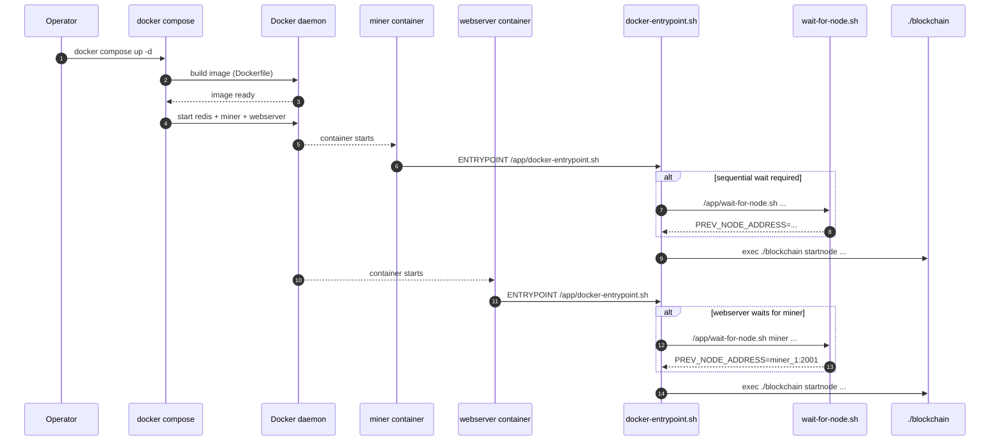

<div align="left">

<details>
<summary><b>📑 Chapter Navigation ▼</b></summary>

### Part I: Core Blockchain Implementation

1. <a href="../../01-Introduction.md">Chapter 1: Introduction & Overview</a> - Book introduction, project structure, technical stack
2. <a href="../../bitcoin-blockchain/README.md">Chapter 1.2: Introduction to Bitcoin & Blockchain</a> - Bitcoin and blockchain fundamentals
3. <a href="../../bitcoin-blockchain/whitepaper-rust/00-Bitcoin-Whitepaper-Summary.md">Chapter 1.3: Bitcoin Whitepaper</a> - Bitcoin Whitepaper
4. <a href="../../bitcoin-blockchain/whitepaper-rust/00-Bitcoin-Whitepaper-Rust-Encoding-Summary.md">Chapter 1.4: Bitcoin Whitepaper In Rust</a> - Bitcoin Whitepaper In Rust
5. <a href="../../bitcoin-blockchain/Rust-Project-Index.md">Chapter 2.0: Rust Blockchain Project</a> - Blockchain Project
6. <a href="../../bitcoin-blockchain/primitives/README.md">Chapter 2.1: Primitives</a> - Core data structures
7. <a href="../../bitcoin-blockchain/util/README.md">Chapter 2.2: Utilities</a> - Utility functions and helpers
8. <a href="../../bitcoin-blockchain/crypto/README.md">Chapter 2.3: Cryptography</a> - Cryptographic primitives and libraries
9. <a href="../../bitcoin-blockchain/chain/README.md">Chapter 2.4: Blockchain (Technical Foundations)</a> - Proof Of Work
10. <a href="../../bitcoin-blockchain/store/README.md">Chapter 2.5: Storage Layer</a> - Persistent storage implementation
11. <a href="../../bitcoin-blockchain/chain/10-Whitepaper-Step-5-Block-Acceptance.md">Chapter 2.6: Block Acceptance (Whitepaper §5, Step 5)</a> - Proof Of Work
12. <a href="../../bitcoin-blockchain/net/README.md">Chapter 2.7: Network Layer</a> - Peer-to-peer networking and protocol
13. <a href="../../bitcoin-blockchain/node/README.md">Chapter 2.8: Node Orchestration</a> - Node context and coordination
14. <a href="../../bitcoin-blockchain/wallet/README.md">Chapter 2.9: Wallet System</a> - Wallet implementation and key management
15. <a href="../../bitcoin-blockchain/web/README.md">Chapter 3: Web API Architecture</a> - REST API implementation
16. <a href="../../bitcoin-desktop-ui-iced/03-Desktop-Admin-UI.md">Chapter 4: Desktop Admin Interface</a> - Iced framework architecture
17. <a href="../../bitcoin-wallet-ui-iced/04-Wallet-UI.md">Chapter 5: Wallet User Interface</a> - Wallet UI implementation
18. <a href="../../bitcoin-wallet-ui-iced/05-Embedded-Database.md">Chapter 6: Embedded Database & Persistence</a> - SQLCipher integration
19. <a href="../../bitcoin-web-ui/06-Web-Admin-UI.md">Chapter 7: Web Admin Interface</a> - React/TypeScript web UI

### Part II: Deployment & Operations

20. **Chapter 8: Docker Compose Deployment** ← *You are here*
21. <a href="../kubernetes/README.md">Chapter 9: Kubernetes Deployment</a> - Kubernetes production guide
22. <a href="../../rust/README.md">Chapter 10: Rust Language Guide</a> - Rust programming language reference

</details>

</div>

---
<div align="right">

**[← Back to Main Book](../../../README.md)**

</div>

---

## Chapter 8, Section 3: Execution Flow & Startup Process

**Part II: Deployment & Operations** | **Chapter 8: Docker Compose Deployment**

<div align="center">

**📚 [← Section 2: Architecture](02-Architecture.md)** | **Section 3: Execution Flow** | **[Section 4: Network Configuration →](04-Network-Configuration.md)** 📚

</div>

---

## Prerequisites

Before reading this section, you should have:
- Completed [Section 2: Architecture & Container System](02-Architecture.md)
- Understanding of Docker Compose service definitions
- Basic knowledge of shell scripting (helpful but not required)

## Learning Objectives

After reading this section, you will understand:
- The complete execution timeline from Docker Compose initialization to blockchain node startup
- How entrypoint scripts orchestrate container startup
- The role of health checks and dependencies
- How the multi-stage Docker build process works

---

This section provides a detailed walkthrough of the complete execution flow when starting containers, from Docker Compose initialization through to the blockchain nodes running.

> **Methods involved**
> - `docker-compose.yml` (`ci/docker-compose/configs/docker-compose.yml`, [Listing 8.1](01A-Docker-Compose-Code-Listings.md#listing-81-cidocker-composeconfigsdocker-composeyml))
> - Docker image build: `Dockerfile` (`ci/docker-compose/configs/Dockerfile`, [Listing 8.11](01A-Docker-Compose-Code-Listings.md#listing-811-cidocker-composeconfigsdockerfile))
> - `docker-entrypoint.sh` (`ci/docker-compose/configs/docker-entrypoint.sh`, [Listing 8.2](01A-Docker-Compose-Code-Listings.md#listing-82-cidocker-composeconfigsdocker-entrypointsh))
> - `wait-for-node.sh` (`ci/docker-compose/configs/wait-for-node.sh`, [Listing 8.3](01A-Docker-Compose-Code-Listings.md#listing-83-cidocker-composeconfigswait-for-nodesh))

## Code Execution Order Overview

```
1. docker-compose.yml (Docker Compose reads configuration)
   ↓
2. Dockerfile (builds the `blockchain` binary into an image)
   ↓
3. docker-entrypoint.sh (Container startup script)
   ├─ wait-for-node.sh (if sequential startup requires waiting)
   ↓
4. /app/blockchain startnode ... (Rust binary entry point)
```

In this deployment chapter, we stop at the boundary where the entrypoint hands control to the Rust binary. The Rust runtime behavior (P2P networking, storage, web API) is covered in the earlier implementation chapters.

---

## Startup timeline (sequence view)



## Phase 1: Docker Compose Initialization

### Step 1.1: Parse docker-compose.yml

**File**: `docker-compose.yml`

Docker Compose reads the configuration and creates two services:

1. **`miner` service**:
   - Port mapping: `2001:2001` (host:container)
   - Volumes: `miner-data:/app/data`, `miner-wallets:/app/wallets`
   - Environment variables set:
     - `NODE_IS_MINER=yes`
     - `NODE_IS_WEB_SERVER=no`
     - `NODE_CONNECT_NODES=local` (default)
     - `SEQUENTIAL_STARTUP=yes` (default)
     - `WALLET_ADDRESS_POOL=<comma-separated-addresses>` (Option 1: auto-select by instance number)
     - `NODE_MINING_ADDRESS=<wallet-address>` (Option 2: direct assignment, at least one must be set)
     - `WALLET_FILE=wallets/wallets.dat`

2. **`webserver` service**:
   - Port mappings: `8080:8080`, `2101:2001`
   - Volumes: `webserver-data:/app/data`, `webserver-wallets:/app/wallets`
   - **Dependency**: `depends_on: miner: condition: service_healthy`
   - Environment variables set:
     - `NODE_IS_MINER=no`
     - `NODE_IS_WEB_SERVER=yes`
     - `NODE_CONNECT_NODES=miner_1:2001` (default - connects to first miner)
     - `SEQUENTIAL_STARTUP=yes` (default)
     - `BITCOIN_API_ADMIN_KEY=admin-secret`
     - `BITCOIN_API_WALLET_KEY=wallet-secret`
     - `WALLET_FILE=wallets/wallets.dat`

### Step 1.2: Container Creation

Docker Compose creates containers:
- `blockchain_miner_1` (or `<project>_miner_1`)
- `blockchain_webserver_1` (or `<project>_webserver_1`)

**Note**: Webserver depends on miner (`depends_on: miner: condition: service_healthy`), so:
1. Miner starts first
2. Miner health check passes (port 2001 listening)
3. Webserver starts after miner is healthy

## Phase 2: Miner Container Startup

### Step 2.1: Container Initialization

**Container**: `blockchain_miner_1`

1. Docker mounts volumes:
   - `miner-data` → `/app/data`
   - `miner-wallets` → `/app/wallets`

2. Docker sets environment variables from `docker-compose.yml`

3. Docker sets `HOSTNAME` environment variable to container name: `blockchain_miner_1`

### Step 2.2: Entrypoint Script Execution

**File**: `docker-entrypoint.sh` (line 1)

**Line 1-12**: Set default values from environment
```bash
NODE_IS_MINER="yes"           # From docker-compose.yml
NODE_IS_WEB_SERVER="no"       # From docker-compose.yml
NODE_CONNECT_NODES="local"    # From docker-compose.yml (default)
NODE_MINING_ADDRESS="<wallet-address>"  # REQUIRED: Must be set
```

**Line 36**: Get container name
```bash
CONTAINER_NAME="blockchain_miner_1"  # From HOSTNAME
```

**Line 37-48**: Determine instance number
```bash
# Pattern match: blockchain_miner_1 matches _([0-9]+)$
INSTANCE_NUMBER=1  # Extracted from container name
```

**Line 52-57**: Determine service name from container
```bash
# Pattern match: "blockchain_miner_1" contains "miner"
SERVICE_NAME_FROM_CONTAINER="miner"
```

**Line 61-64**: Determine service type and calculate ports
```bash
SERVICE_TYPE="miner"  # From container name pattern match
P2P_PORT=$((2001 + 1 - 1))  # = 2001
```

**Line 84-85**: Set data directory names
```bash
DATA_DIR="data1"
BLOCKS_TREE="blocks1"
```

**Line 82-110**: Set up isolated data directory
```bash
# Base directory where volume is mounted
BASE_DATA_DIR="/app/data"
INSTANCE_DATA_DIR_NAME="data1"
INSTANCE_DATA_DIR="/app/data/data1"

# Export environment variables
export NODE_ADDR="0.0.0.0:2001"
export TREE_DIR="data/data1"  # Relative to /app, stored within volume
export BLOCKS_TREE="blocks1"

# Create isolated data directory
mkdir -p "/app/data/data1"  # Creates isolated directory within volume
echo "Using isolated blockchain data directory: /app/data/data1"
```

**Line 114-123**: Auto-configure webserver connection (not applicable for miner, skipped)

**Line 126**: Check sequential startup condition
```bash
# SEQUENTIAL_STARTUP=yes (from env)
# INSTANCE_NUMBER=1
# Condition: [ "yes" = "yes" ] && [ 1 -gt 1 ]
# Result: false (INSTANCE_NUMBER is 1, not > 1)
# SKIP wait script (first instance doesn't wait)
```

**Line 238-260**: Determine wallet address from pool or direct assignment
```bash
# Option 1: Use WALLET_ADDRESS_POOL (comma-separated list)
if [ -n "${WALLET_ADDRESS_POOL}" ]; then
    # Convert to array and select by instance number
    IFS=',' read -ra ADDRESSES <<< "${WALLET_ADDRESS_POOL}"
    INDEX=$((INSTANCE_NUMBER - 1))
    NODE_MINING_ADDRESS="${ADDRESSES[${INDEX}]}"
    # Instance 1 → index 0, Instance 2 → index 1, etc.
fi

# Option 2: Use NODE_MINING_ADDRESS directly
# If neither is set, exit with error
```

**Line 262-264**: Validate required environment variables
```bash
# NODE_MINING_ADDRESS must be set (either from pool or direct)
if [ -z "${NODE_MINING_ADDRESS}" ]; then
    echo "ERROR: Either WALLET_ADDRESS_POOL or NODE_MINING_ADDRESS must be set"
    exit 1
fi
```

**Line 266-267**: Build command
```bash
CMD="./blockchain startnode yes no local -- <wallet-address>"
# Format: startnode <is_miner> <is_web_server> <connect_nodes> -- <mining_address>
# Note: Wallet address is required (selected from pool or direct assignment)
```

**Line 212-229**: Log configuration
```
==========================================
Starting blockchain node
  Service Type: miner
  Instance Number: 1
  Container Name: blockchain_miner_1
  Mode: miner=yes, webserver=no
  P2P Port: 2001
  Data Directory: /app/data/data1 (isolated per instance)
  TREE_DIR: data/data1
  Connect Nodes: local
==========================================
```

**Line 232**: Execute blockchain binary
```bash
exec ./blockchain startnode yes no local
```

### Step 2.3: Entrypoint hands control to the Rust binary

The entrypoint’s responsibility ends at an `exec` of the Rust binary:

- **exact command construction** is in `docker-entrypoint.sh` ([Listing 8.2](01A-Docker-Compose-Code-Listings.md#listing-82-cidocker-composeconfigsdocker-entrypointsh))
- the binary’s internal behavior (P2P server, storage, optional web server) is covered in the earlier implementation chapters, not repeated here

At this point, the miner is “up” once it binds its P2P socket and begins accepting connections. Docker Compose health checks then determine when dependent services may start.

## Phase 3: Webserver Container Startup

### Step 3.1: Container Initialization

**Container**: `blockchain_webserver_1`

1. Docker mounts volumes:
   - `webserver-data` → `/app/data`
   - `webserver-wallets` → `/app/wallets`

2. Docker sets environment variables from `docker-compose.yml`

3. Docker sets `HOSTNAME` to: `blockchain_webserver_1`

### Step 3.2: Entrypoint Script Execution

**File**: `docker-entrypoint.sh`

**Line 1-12**: Set default values
```bash
NODE_IS_MINER="no"                  # From docker-compose.yml
NODE_IS_WEB_SERVER="yes"           # From docker-compose.yml
NODE_CONNECT_NODES="miner_1:2001"  # From docker-compose.yml (default)
NODE_MINING_ADDRESS="<wallet-address>"  # REQUIRED: Must be set
```

**Line 36**: Get container name
```bash
CONTAINER_NAME="blockchain_webserver_1"
```

**Line 37-48**: Determine instance number
```bash
INSTANCE_NUMBER=1  # Extracted from "blockchain_webserver_1"
```

**Line 52-57**: Determine service name
```bash
SERVICE_NAME_FROM_CONTAINER="webserver"  # Contains "webserver"
```

**Line 66-69**: Determine service type and ports
```bash
SERVICE_TYPE="webserver"
WEB_PORT=$((8080 + 1 - 1))   # = 8080
P2P_PORT=$((2101 + 1 - 1))  # = 2101
```

**Line 84-85**: Set data directory
```bash
DATA_DIR="data1"
BLOCKS_TREE="blocks1"
```

**Line 82-110**: Set up isolated data directory
```bash
# Base directory where volume is mounted
BASE_DATA_DIR="/app/data"
INSTANCE_DATA_DIR_NAME="data1"
INSTANCE_DATA_DIR="/app/data/data1"

# Export environment variables
export NODE_ADDR="0.0.0.0:2101"  # Note: Uses 2101, not 2001
export TREE_DIR="data/data1"  # Relative to /app, stored within volume
export BLOCKS_TREE="blocks1"

# Create isolated data directory
mkdir -p "/app/data/data1"  # Creates isolated directory within volume
echo "Using isolated blockchain data directory: /app/data/data1"
```

**Line 114-123**: Auto-configure webserver to connect to miner
```bash
# NODE_IS_WEB_SERVER=yes, NODE_IS_MINER=no
# INSTANCE_NUMBER=1
# NODE_CONNECT_NODES="miner_1:2001" (from docker-compose.yml default)
# Since INSTANCE_NUMBER=1, sets NODE_CONNECT_NODES="miner_1:2001"
# This ensures webserver connects to miner, not acts as seed node
```

**Line 126**: Check sequential startup
```bash
# SEQUENTIAL_STARTUP=yes
# INSTANCE_NUMBER=1
# Condition: [ "yes" = "yes" ] && [ 1 -gt 1 ]
# Result: false (first instance, no wait needed)
# SKIP wait script
```

**Line 205**: Build command
```bash
CMD="./blockchain startnode no yes miner_1:2001 -- <wallet-address>"
# Note: NODE_CONNECT_NODES is now "miner_1:2001" instead of "local"
# Note: Wallet address is now required for all nodes
```

**Line 212-229**: Log configuration
```
==========================================
Starting blockchain node
  Service Type: webserver
  Instance Number: 1
  Container Name: blockchain_webserver_1
  Mode: miner=no, webserver=yes
  P2P Port: 2101
  Web Port: 8080
  Data Directory: /app/data/data1 (isolated per instance)
  TREE_DIR: data/data1
  Connect Nodes: miner_1:2001
==========================================
```

**Line 232**: Execute blockchain binary

The entrypoint resolves hostnames to IP addresses (where needed) before calling the Rust binary. This is operationally important because the Rust CLI expects `IP:port` socket addresses.

See the exact resolution and the final `exec` in [Listing 8.2](01A-Docker-Compose-Code-Listings.md#listing-82-cidocker-composeconfigsdocker-entrypointsh).

### Step 3.3: Entrypoint hands control to the Rust binary

From the perspective of “deployment code,” the webserver container is “up” once:

- the process starts,
- it binds the HTTP port and P2P port in-container,
- and its readiness endpoint begins returning success (see health checks below).

The Rust implementation details are explained in the earlier blockchain chapters.

## Phase 4: Health Checks (Background)

Docker Compose starts health checks after containers start:

**Note**: The miner health check must pass before the webserver container starts (due to `depends_on: condition: service_healthy`).

### Miner Health Check
Defined in `docker-compose.yml` ([Listing 8.1](01A-Docker-Compose-Code-Listings.md#listing-81-cidocker-composeconfigsdocker-composeyml)):
```bash
# Every 10 seconds, check if port 2001 is listening
timeout 1 bash -c 'echo > /dev/tcp/localhost/2001'
```

### Webserver Health Check
Defined in `docker-compose.yml` ([Listing 8.1](01A-Docker-Compose-Code-Listings.md#listing-81-cidocker-composeconfigsdocker-composeyml)):
```bash
# Every 10 seconds, check HTTP health endpoint
curl -f http://localhost:8080/api/health/ready
```

## What changes when you scale

Scaling does not introduce new execution phases; it changes **parameterization** inside `docker-entrypoint.sh`:

- **Instance identity**: derived from container name → `INSTANCE_NUMBER`
- **Per-instance ports**:
  - miners: \(2001 + (INSTANCE\_NUMBER - 1)\)
  - webservers: HTTP \(8080 + (INSTANCE\_NUMBER - 1)\), P2P mapping \(2101 + (INSTANCE\_NUMBER - 1)\)
- **Per-instance storage**: the entrypoint chooses `dataN` / `blocksN` so each instance gets an isolated view of chain state
- **Sequential startup decision**: miners wait only if `INSTANCE_NUMBER > 1`, while webservers wait for miners when enabled

All of this logic is in [Listing 8.2](01A-Docker-Compose-Code-Listings.md#listing-82-cidocker-composeconfigsdocker-entrypointsh) and [Listing 8.3](01A-Docker-Compose-Code-Listings.md#listing-83-cidocker-composeconfigswait-for-nodesh).

---

<div align="center">

**Local Navigation - Table of Contents**

| [← Previous Section: Architecture](02-Architecture.md) | [↑ Table of Contents](#) | [Next Section: Network Configuration →](04-Network-Configuration.md) |
|:---:|:---:|:---:|
| *Section 2* | *Current Section* | *Section 4* |

</div>

---
