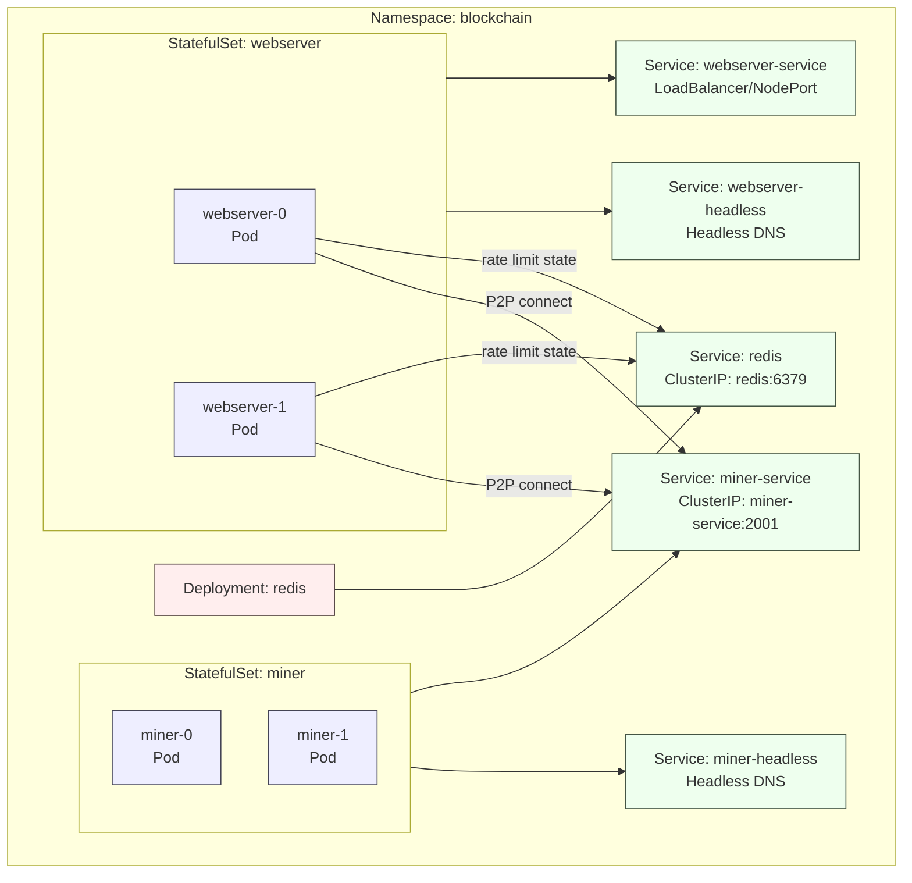

<div align="left">

<details>
<summary><b>Chapter Navigation ▼</b></summary>

### Part I: Foundations & Core Implementation

1. <a href="../../01-Introduction.md">Chapter 1: Introduction & Overview</a>
2. <a href="../../bitcoin-blockchain/README.md">Chapter 2: Introduction to Blockchain</a>
3. <a href="../../bitcoin-blockchain/whitepaper-rust/00-Bitcoin-Whitepaper-Summary.md">Chapter 3: Bitcoin Whitepaper</a>
4. <a href="../../bitcoin-blockchain/whitepaper-rust/00-Bitcoin-Whitepaper-Rust-Encoding-Summary.md">Chapter 4: Bitcoin Whitepaper In Rust</a>
5. <a href="../../bitcoin-blockchain/Rust-Project-Index.md">Chapter 5: Rust Blockchain Project</a>
6. <a href="../../bitcoin-blockchain/primitives/README.md">Chapter 6: Primitives</a>
7. <a href="../../bitcoin-blockchain/util/README.md">Chapter 7: Utilities</a>
8. <a href="../../bitcoin-blockchain/crypto/README.md">Chapter 8: Cryptography</a>
9. <a href="../../bitcoin-blockchain/chain/README.md">Chapter 9: Blockchain (Technical Foundations)</a>
10. <a href="../../bitcoin-blockchain/chain/10-Whitepaper-Step-5-Block-Acceptance.md">Chapter 10: Block Acceptance</a>
11. <a href="../../bitcoin-blockchain/store/README.md">Chapter 11: Storage Layer</a>
12. <a href="../../bitcoin-blockchain/net/README.md">Chapter 12: Network Layer</a>
13. <a href="../../bitcoin-blockchain/node/README.md">Chapter 13: Node Orchestration</a>
14. <a href="../../bitcoin-blockchain/wallet/README.md">Chapter 14: Wallet System</a>
15. <a href="../../bitcoin-blockchain/web/README.md">Chapter 15: Web API Architecture</a>
16. <a href="../../bitcoin-desktop-ui-iced/04.1-Desktop-Admin-UI-Iced.md">Chapter 16: Desktop Admin (Iced)</a>
17. <a href="../../bitcoin-desktop-ui-iced/04.1A-Desktop-Admin-UI-Code-Walkthrough.md">16A: Code Walkthrough</a>
18. <a href="../../bitcoin-desktop-ui-iced/04.1B-Desktop-Admin-UI-Update-Loop.md">16B: Update Loop</a>
19. <a href="../../bitcoin-desktop-ui-iced/04.1C-Desktop-Admin-UI-View-Layer.md">16C: View Layer</a>
20. <a href="../../bitcoin-desktop-ui-tauri/04.2-Desktop-Admin-UI-Tauri.md">Chapter 17: Desktop Admin (Tauri)</a>
21. <a href="../../bitcoin-desktop-ui-tauri/04.2A-Tauri-Admin-Rust-Backend.md">17A: Rust Backend</a>
22. <a href="../../bitcoin-desktop-ui-tauri/04.2B-Tauri-Admin-Frontend-Infrastructure.md">17B: Frontend Infrastructure</a>
23. <a href="../../bitcoin-desktop-ui-tauri/04.2C-Tauri-Admin-Frontend-Pages.md">17C: Frontend Pages</a>
24. <a href="../../bitcoin-wallet-ui-iced/05.1-Wallet-UI-Iced.md">Chapter 18: Wallet UI (Iced)</a>
25. <a href="../../bitcoin-wallet-ui-iced/05.1A-Wallet-UI-Code-Listings.md">18A: Code Listings</a>
26. <a href="../../bitcoin-wallet-ui-tauri/05.2-Wallet-UI-Tauri.md">Chapter 19: Wallet UI (Tauri)</a>
27. <a href="../../bitcoin-wallet-ui-tauri/05.2A-Tauri-Wallet-Rust-Backend.md">19A: Rust Backend</a>
28. <a href="../../bitcoin-wallet-ui-tauri/05.2B-Tauri-Wallet-Frontend-Infrastructure.md">19B: Frontend Infrastructure</a>
29. <a href="../../bitcoin-wallet-ui-tauri/05.2C-Tauri-Wallet-Frontend-Pages.md">19C: Frontend Pages</a>
30. <a href="../../embedded-database/06-Embedded-Database.md">Chapter 20: Embedded Database</a>
31. <a href="../../embedded-database/06A-Embedded-Database-Code-Listings.md">20A: Code Listings</a>
32. <a href="../../bitcoin-web-ui/06-Web-Admin-UI.md">Chapter 21: Web Admin Interface</a>
33. <a href="../../bitcoin-web-ui/06A-Web-Admin-UI-Code-Listings.md">21A: Code Listings</a>

### Part II: Deployment & Operations

34. <a href="../docker-compose/01-Introduction.md">Chapter 22: Docker Compose Deployment</a>
35. <a href="../docker-compose/01A-Docker-Compose-Code-Listings.md">22A: Code Listings</a>
36. **Chapter 23: Kubernetes Deployment** ← *You are here*
37. <a href="01A-Kubernetes-Code-Listings.md">23A: Code Listings</a>

### Part III: Language Reference

38. <a href="../../rust/README.md">Chapter 24: Rust Language Guide</a>

</details>

</div>

---
<div align="right">

**[← Back to Main Book](../../../README.md)**

</div>

---

## Chapter 23: Kubernetes Deployment

**Part II: Deployment & Operations**

<div align="center">

**[← Chapter 22: Docker Compose](../docker-compose/01-Introduction.md)** | **Chapter 23: Kubernetes** | **[End of Book →](#)**
</div>

---

> **Prerequisites:**: This chapter assumes you have read Chapter 22 (Docker Compose) and have basic familiarity with Kubernetes concepts (pods, services, deployments). If Kubernetes is new to you, the chapter defines each resource type as it appears — but having `kubectl` installed and a cluster available (even Minikube or Docker Desktop's built-in Kubernetes) will help you follow along.

**Why Kubernetes after Docker Compose?** Docker Compose is excellent for local development, but it runs on a single machine and has no built-in answer for node failures, rolling updates, or scaling beyond one host. Kubernetes solves these problems: if a blockchain node crashes, Kubernetes restarts it automatically; if you need more nodes, you change a replica count; if you push a new image, Kubernetes rolls it out without downtime. This chapter shows how the same Docker images from Chapter 22 are deployed into a system that can run in production.

> **What you will learn in this chapter:**
> - Deploy the blockchain network on Kubernetes for production-grade orchestration
> - Configure horizontal pod autoscaling and high availability
> - Migrate from Docker Compose to Kubernetes manifests
> - Implement production monitoring, troubleshooting, and operational procedures

> **Scope:** This chapter covers Kubernetes deployment using Minikube for learning and local development. We do not cover managed Kubernetes services (EKS, GKE, AKS), service mesh (Istio, Linkerd), or GitOps deployment pipelines (ArgoCD, Flux).

Every referenced deployment artifact is printed in full in the companion listings chapter:

- **[Chapter 23A: Kubernetes — Complete Code Listings](01A-Kubernetes-Code-Listings.md)**

## Table of Contents

1. [Section 1: Introduction & Quick Start](#section-1-introduction--quick-start)
   - [What You’ll Build](#what-youll-build)
   - [Why Kubernetes (vs Docker Compose)](#why-kubernetes-vs-docker-compose)
   - [Prerequisites & Tools](#prerequisites--tools)
   - [Choose Your Cluster (Minikube vs kind)](#choose-your-cluster-minikube-vs-kind)
   - [Quick Start (Minikube)](#quick-start-minikube)
   - [Accessing the Webserver (Port-Forward)](#accessing-the-webserver-port-forward)
   - [Rate Limiting (Webserver)](#rate-limiting-webserver)
   - [Common Operations](#common-operations)
   - [Cleanup](#cleanup)
   - [Troubleshooting](#troubleshooting)
2. [Section 2: Architecture & Core Concepts](02-Architecture.md)
3. [Section 3: Migration Guide](03-Migration.md)
4. [Section 4: Kubernetes Manifests](04-Manifests.md)
4.5. [Chapter 23A: Kubernetes — Complete Code Listings](01A-Kubernetes-Code-Listings.md)
5. [Section 5: Deployment & Operations](05-Deployment.md)
6. [Section 6: Autoscaling](06-Autoscaling.md)
7. [Section 7: Production & Advanced Topics](07-Production.md)

---

## Section 1: Introduction & Quick Start

### What You’ll Build

We’ll take our network from “it works on my laptop” to “it runs under a real orchestrator.”
Concretely, we deploy three building blocks:

- **Miners** as a **StatefulSet** (stable identity and stable storage per miner)
- **Webservers** as a **StatefulSet** (each webserver has its own blockchain DB and wallets)
- **Redis** as a small in-cluster service used by the webserver for **rate limiting** (shared state for `axum_rate_limiter`)

> **Important:** Kubernetes deployments require persistent volume claims for blockchain data. Without persistent storage, pod restarts will lose the entire chain state and force a full resynchronization.

By the end, you’ll be able to `kubectl port-forward` the webserver service and use the API from your machine.



### Why Kubernetes (vs Docker Compose)

Docker Compose excels for **local development**, but Kubernetes is built for **long-running** systems.

| Feature | Docker Compose | Kubernetes |
|---------|---------------|------------|
| **Self-healing** | Limited | ✅ Restarts and reschedules failed pods |
| **Rolling updates** | Manual | ✅ Built-in rollout/rollback |
| **Service discovery** | Docker DNS | ✅ Cluster DNS + Services |
| **Autoscaling** | Manual | ✅ HPA (Horizontal Pod Autoscaler) |
| **Stateful workloads** | Possible | ✅ First-class StatefulSets + PVC templates |

In this repo, Kubernetes matters because **miners and webservers are stateful** (disk-backed databases and wallets), and Kubernetes gives us the right primitives to manage that cleanly.

### Prerequisites & Tools

You need three things:

- **`kubectl`**: talk to the cluster (apply YAML, inspect state, logs).
- **A local cluster**: Minikube (recommended for this chapter) or kind.
- **Docker**: build the application image.

Optional but useful:

- **Kustomize**: patch manifests per environment (`kubectl apply -k`).
- **kubectx/kubens**: quick context/namespace switching.

#### Install (macOS via Homebrew)

```bash
brew install kubectl
brew install minikube
brew install docker  # Docker Desktop is the usual choice on macOS
```

Optional:

```bash
brew install kubectx
```

#### Install (Linux, generic)

Install kubectl (official):

```bash
curl -LO \
  "https://dl.k8s.io/release/$(curl -L -s \
  https://dl.k8s.io/release/stable.txt)/bin/linux/amd64/kubectl"
chmod +x kubectl
sudo mv kubectl /usr/local/bin/
kubectl version --client
```

Install Minikube (official):

```bash
curl -LO \
  https://storage.googleapis.com/minikube/releases/latest/minikube-linux-amd64
sudo install minikube-linux-amd64 /usr/local/bin/minikube
minikube version
```

### Choose Your Cluster (Minikube vs kind)

Both run a real Kubernetes API server locally.

- **Minikube**: best “learning cluster” and the smoothest workflow for this repo (we build the Docker image *into* the cluster).
- **kind**: best “fast disposable cluster”, great for CI-like workflows (you build normally, then load the image into the cluster).

kind image workflow example:

```bash
docker build -t blockchain-node:latest .
kind load docker-image blockchain-node:latest
```

### Quick Start (Minikube)

This is the shortest path to a working cluster.

#### 1) Start the cluster

```bash
cd ci/kubernetes
minikube start --cpus=4 --memory=3072mb --addons=metrics-server
```

Minikube **addons** are optional cluster components we can enable at startup. They’re a convenient way to activate common Kubernetes services without manually installing Helm charts.

- **Why we enable `metrics-server`**: it provides the **Metrics API** (`metrics.k8s.io`), which powers `kubectl top pods` and enables CPU/memory-based autoscaling via HPA.
- **List available addons**:

```bash
minikube addons list
```

Common useful addons include:

- **`metrics-server`**: enables `kubectl top ...` and provides the Metrics API that powers CPU/memory-based autoscaling (see Section 6: Autoscaling). Without this, HPA (Horizontal Pod Autoscaler) cannot measure resource usage and will not scale pods automatically.
- **`ingress`**: enables an Ingress controller for HTTP routing without port-forward.
- **`dashboard`**: enables the Kubernetes Dashboard UI for visual cluster inspection.
- **`registry`**: runs a local container registry for push/pull operations.
- **`csi-hostpath-driver`**: storage driver for PVCs (often enabled by default).

To enable and access the Dashboard:

```bash
minikube addons enable dashboard

# Launches the dashboard and opens your browser (or prints
# a URL, depending on environment)
minikube dashboard

# If you prefer a URL you can open manually:
minikube dashboard --url
```

<details>
<summary><b>Deep dive: what did <code>minikube start</code> change?</b></summary>

- Creates a local cluster and allocates CPU/memory.
- Updates your kubeconfig (`~/.kube/config`) so `kubectl` can connect (context becomes `minikube`).
- Stores cluster state under `~/.minikube/`.

Useful commands:

```bash
minikube status                 # Check if Minikube and
                                # Kubernetes components are running
kubectl config current-context  # Show which cluster kubectl
                                # targets (should be `minikube`)
kubectl get nodes               # List cluster nodes and
                                # readiness; confirms schedulability
minikube ip                     # Print the Minikube node IP
                                # (useful for NodePort access)
```

</details>

#### 2) Build the image into Minikube

```bash
# Use Minikube's Docker
eval $(minikube docker-env)

# Build image
# IMPORTANT: run the build from the repository root (build context),
# because the Dockerfile uses COPY paths like `ci/docker-compose/configs/...`.
cd ../../
docker build -t blockchain-node:latest -f Dockerfile .
cd ci/kubernetes/manifests
```

<details>
<summary><b>Deep dive: what does <code>eval $(minikube docker-env)</code> do?</b></summary>

It points your `docker` CLI at Minikube’s Docker daemon, so `docker build ...` stores images in the cluster.

Without this, your `docker` CLI talks to your **local** Docker daemon (e.g., Docker Desktop). The image you build exists only on your machine, and Minikube won’t use it unless you push to a registry.

After building, we usually restore Docker to normal:

```bash
eval $(minikube docker-env -u)
```

`minikube docker-env -u` prints shell commands that unset the environment variables redirecting your Docker CLI to Minikube. `eval` applies those to the current session only.

It’s safe because it doesn’t delete images or change Minikube—it simply restores your shell to use your usual Docker daemon.

</details>

#### 3) (Optional) Update secrets

Edit `03-secrets.yaml` to set your API keys, or use defaults for testing.

If we don’t provide a mining address (`MINER_ADDRESS`), the container auto-creates one on first startup and persists it in the wallet volume. This keeps the quick start smooth while still producing a real address we can back up later.

To apply changes to `03-secrets.yaml`, we apply the Secret and restart pods to inject the new values:

```bash
# From the repo root:
cd ci/kubernetes/manifests

# Apply the updated Secret
kubectl apply -f 03-secrets.yaml

# Restart workloads to pick up updated Secret env vars
kubectl rollout restart statefulset/webserver -n blockchain
kubectl rollout restart statefulset/miner -n blockchain
```

Optional verification:

```bash
kubectl get secret blockchain-secrets -n blockchain
```

#### 4) Deploy

```bash
# From the repo root:
cd ci/kubernetes/manifests
./deploy.sh
```

`./deploy.sh` is a convenience wrapper around a sequence of `kubectl` commands. It:

- Validates `kubectl` is installed and you’re connected to a cluster (`kubectl cluster-info`)
- Applies the manifests in dependency order (namespace → config → storage → Redis → workloads → services → autoscalers → PDB)
- Waits for miner/webserver pods to become Ready, then prints a status summary

**Commands it runs (high level):**

- `kubectl apply -f 01-namespace.yaml`
- `kubectl apply -f 02-configmap.yaml`
- `kubectl apply -f 14-configmap-rate-limit.yaml`
- `kubectl apply -f 03-secrets.yaml`
- `kubectl apply -f 04-pvc-miner.yaml`
- `kubectl apply -f 05-pvc-webserver.yaml`
- `kubectl apply -f 15-redis.yaml`
- `kubectl apply -f 06-statefulset-miner.yaml`
- `kubectl apply -f 07-deployment-webserver.yaml` (webserver runs as a StatefulSet)
- `kubectl apply -f 08-service-miner-headless.yaml`
- `kubectl apply -f 08-service-miner.yaml`
- `kubectl apply -f 09-service-webserver.yaml`
- `kubectl apply -f 10-hpa-webserver.yaml`
- `kubectl apply -f 11-hpa-miner.yaml`
- `kubectl apply -f 12-pod-disruption-budget.yaml`
- `kubectl wait --for=condition=ready pod -l app=miner -n blockchain --timeout=300s`
- `kubectl wait --for=condition=ready pod -l app=webserver -n blockchain --timeout=300s`

#### 5) Verify

```bash
kubectl get pods -n blockchain

kubectl wait --for=condition=ready pod -l app=miner -n \
  blockchain --timeout=300s
kubectl wait --for=condition=ready pod -l app=webserver -n \
  blockchain --timeout=300s
```

#### Useful Kubernetes Commands (Quick Reference)

Tip: these are grouped as copy/paste blocks. In most Markdown renderers you can click the code block’s copy button to copy the whole group.

**Status**

```bash
# List all namespaces
kubectl get namespaces

# Pod status + node/IP
kubectl get pods -n blockchain -o wide

# Services
kubectl get svc -n blockchain

# Pod IPs each Service routes to
kubectl get endpoints -n blockchain

# PersistentVolumeClaims
kubectl get pvc -n blockchain
```

**Debug a single pod**

```bash
# Check events, probe failures, image pull errors
kubectl describe pod <pod> -n blockchain

# View recent logs
kubectl logs -n blockchain <pod> -c blockchain-node --tail 200

# View logs from last crashed instance
kubectl logs -n blockchain <pod> -c blockchain-node --previous --tail 200

# Open a shell in the container
kubectl exec -n blockchain -it <pod> -- sh
```

**Rollouts / restarts**

```bash
# Watch rollout progress
kubectl rollout status statefulset/webserver -n blockchain

# Restart to pick up ConfigMap/Secret env var changes
kubectl rollout restart statefulset/webserver -n blockchain
```

**Events**

```bash
# Recent events (often the fastest root cause)
kubectl get events -n blockchain --sort-by=.lastTimestamp | tail -50
```

### Accessing the Webserver (Port-Forward)

```bash
kubectl port-forward -n blockchain svc/webserver-service 8080:8080
```

Then open http://localhost:8080 in your browser.

### Rate Limiting (Webserver)

The Kubernetes manifests deploy rate limiting “ready to go” (see `ci/kubernetes/manifests/`):

- **Redis**: `ci/kubernetes/manifests/15-redis.yaml` (service name `redis`, port 6379)
- **Settings**: `ci/kubernetes/manifests/14-configmap-rate-limit.yaml` (mounts `Settings.toml` into the webserver)
- **Env var**: `RL_SETTINGS_PATH=/app/Settings.toml`

To change limits/strategies, edit `ci/kubernetes/manifests/14-configmap-rate-limit.yaml`, apply it, and restart webserver pods:

```bash
# From the repo root:
cd ci/kubernetes/manifests
kubectl apply -f 14-configmap-rate-limit.yaml
kubectl rollout restart statefulset/webserver -n blockchain
```

### Common Operations

These are the commands you’ll use constantly once the cluster is up.

#### Scale Manually

```bash
# Scale webservers to 5 (webserver is a StatefulSet)
kubectl scale statefulset webserver -n blockchain --replicas=5

# Scale miners to 3 (miner is a StatefulSet)
kubectl scale statefulset miner -n blockchain --replicas=3
```

#### View Logs

```bash
# All miner logs
kubectl logs -n blockchain -l app=miner -f

# All webserver logs
kubectl logs -n blockchain -l app=webserver -f

# Specific pod
kubectl logs -n blockchain <pod-name> -f
```

#### Update Configuration

```bash
# Edit ConfigMap
kubectl edit configmap blockchain-config -n blockchain

# Restart pods to pick up changes
kubectl rollout restart statefulset/webserver -n blockchain
kubectl rollout restart statefulset/miner -n blockchain
```

#### Update Image

```bash
# Set new image
kubectl set image statefulset/webserver \
  blockchain-node=blockchain-node:v1.1.0 -n blockchain

# Check rollout
kubectl rollout status statefulset/webserver -n blockchain

# Rollback if needed
kubectl rollout undo statefulset/webserver -n blockchain
```

### Cleanup

```bash
# From the repo root:
cd ci/kubernetes/manifests
./undeploy.sh

# Or delete everything
kubectl delete namespace blockchain

# Stop the local cluster (keeps the cluster on disk)
minikube stop

# Or remove it completely
minikube delete
```

### Troubleshooting

We've organized this as a practical playbook: start with the symptom, run the diagnose commands, then apply the fix.

#### Get a High-Signal Snapshot

Run these commands to see “what is broken” in seconds:

```bash
kubectl get pods -n blockchain -o wide
kubectl get svc -n blockchain
kubectl get pvc -n blockchain
```

#### Symptom: `CrashLoopBackOff`

**What it means:** the container starts, exits, Kubernetes restarts it, and repeats.

**Diagnose:**

```bash
# "previous" shows logs from the last crashed container
# instance (most useful for crash loops)
kubectl logs -n blockchain <pod-name> -c blockchain-node \
  --previous --tail 200

# Events and probe failures
kubectl describe pod <pod-name> -n blockchain
```

**Common causes in this project:**

- **Invalid `MINER_ADDRESS` (placeholder)**
  - Symptom: miner logs show address validation failures (e.g. “invalid character”).
  - Fix: remove/omit the placeholder value and let the entrypoint auto-generate, or set a real address.
  - Verify the secret value:

```bash
kubectl get secret blockchain-secrets -n blockchain \
  -o jsonpath='{.data.MINER_ADDRESS}' | \
  base64 --decode; echo
```

#### Symptom: `Running` but `0/1` (Not Ready)

**What it means:** the container is running, but readiness probes fail, so Kubernetes will not route traffic to it.

**Diagnose:**

```bash
kubectl describe pod <pod-name> -n blockchain
```

Look for probe errors like:
- `Readiness probe failed: connect: connection refused` (process not listening)
- HTTP probe returns non-200 (server not ready yet)

**Common cause we hit:** ports mismatched between container behavior and Kubernetes probes.

- In Kubernetes, pods should generally listen on **stable in-pod ports** (e.g. miner P2P `2001`, webserver HTTP `8080`).
- If a pod listens on a different port, probes will fail even if the process is healthy.

#### Symptom: Webserver crashes with Sled DB lock errors

If you see errors like:

> `could not acquire lock on "/app/data/.../db": Resource temporarily unavailable`

**What it means:** multiple pods are trying to open the same on-disk Sled database concurrently (shared filesystem path).

**Fix (recommended):** ensure each webserver has **its own storage**, just like miners. In this repo we run webservers as a **StatefulSet** with per-pod PVCs. You can confirm per-pod PVCs exist:

```bash
kubectl get pvc -n blockchain | grep webserver
```

#### Symptom: Old webserver pods keep crashlooping after an upgrade

If you migrated webserver from a Deployment to a StatefulSet, you may briefly have both running.

**Diagnose:**

```bash
kubectl get deployment -n blockchain
kubectl get statefulset -n blockchain
```

**Fix:** delete the old Deployment so only the StatefulSet remains:

```bash
kubectl delete deployment webserver -n blockchain
```

#### Services Not Accessible (from your laptop)

**Why:** cluster networking is not directly reachable from the host by default. Use port-forwarding for Minikube/local dev.

**Fix:**

```bash
kubectl port-forward -n blockchain svc/webserver-service 8080:8080
curl -f http://localhost:8080/api/health/ready
```

**Diagnose inside the cluster:**

```bash
kubectl get endpoints -n blockchain
kubectl exec -n blockchain <pod-name> -- \
  curl http://webserver-service:8080/api/health/ready
```

#### HPA Not Working

```bash
# Check HPA status
kubectl describe hpa webserver-hpa -n blockchain

# Check resource usage
kubectl top pods -n blockchain
```

If `kubectl top ...` fails, you likely don’t have metrics available in your cluster (e.g. `metrics-server`). In Minikube you can enable it:

```bash
minikube addons enable metrics-server
```

Then verify the Metrics API is actually up (it can take a minute):

```bash
# Confirm the metrics-server pod is running
kubectl get pods -n kube-system | grep metrics-server

# Confirm the Metrics API endpoint is registered and Available=True
kubectl get apiservices | grep metrics
```

Once those look healthy, retry:

```bash
kubectl top pods -n blockchain
```

---

## Section 2: Architecture & Core Concepts

See [Section 2: Architecture & Core Concepts](02-Architecture.md) for detailed information about:
- Kubernetes architecture overview
- Core concepts (Namespaces, ConfigMaps, Secrets, Deployments, StatefulSets, Services)
- Differences from Docker Compose
- Service discovery and networking

---

## Section 3: Migration Guide

See [Section 3: Migration Guide](03-Migration.md) for detailed information about:
- Step-by-step migration from Docker Compose
- Image preparation and registry setup
- Creating Kubernetes resources
- Migration checklist
- Testing and verification

---

## Section 4: Kubernetes Manifests

See [Section 4: Kubernetes Manifests](04-Manifests.md) for detailed information about:
- Complete manifest examples with explanations
- Namespace configuration
- ConfigMaps and Secrets
- PersistentVolumeClaims
- StatefulSets and Deployments
- Services and networking
- HPA configuration

---

## Section 5: Deployment & Operations

See [Section 5: Deployment & Operations](05-Deployment.md) for detailed information about:
- Step-by-step deployment process
- Verification and monitoring
- Accessing services
- Scaling operations
- Updates and rollbacks
- Day-to-day operations

---

## Section 6: Autoscaling

See [Section 6: Autoscaling](06-Autoscaling.md) for detailed information about:
- HPA (Horizontal Pod Autoscaler) configuration
- Scaling policies and thresholds
- Metrics and monitoring
- Best practices
- Troubleshooting autoscaling

---

## Section 7: Production & Advanced Topics

See [Section 7: Production & Advanced Topics](07-Production.md) for detailed information about:
- Production considerations
- Security best practices
- Monitoring and alerting
- Backup strategies
- Advanced networking
- Troubleshooting guide

---

<div align="center">

**Local Navigation - Table of Contents**

| [↑ Table of Contents](#table-of-contents) | [Next Section: Architecture & Core Concepts →](02-Architecture.md) |
|:---:|:---:|:---:|
| *Current Section* | *Section 2* |

</div>

---

## Summary

- We deployed the blockchain network on Kubernetes for production-grade orchestration.
- We configured horizontal pod autoscaling and high availability.
- We migrated from Docker Compose to Kubernetes manifests.
- We implemented production monitoring, troubleshooting, and operational procedures.

> **Companion Chapter:** Complete Kubernetes manifests and deployment scripts are available in [23A: Code Listings](01A-Kubernetes-Code-Listings.md). In the print edition, these listings appear in the Appendix: Source Reference.

---

## Exercises

1. **Autoscaling Configuration** — Configure a Horizontal Pod Autoscaler to scale the blockchain node deployment between 3 and 10 replicas, targeting 60% CPU utilization. Submit a burst of transactions and observe the scaling behavior using `kubectl get hpa --watch`.

2. **Rolling Update Simulation** — Perform a rolling update of the blockchain node image. Monitor the update progress with `kubectl rollout status` and verify that no transactions are lost during the upgrade. What happens to in-flight requests during pod replacement?

---

## Additional Resources

- [Kubernetes Official Documentation](https://kubernetes.io/docs/)
- [Kubernetes HPA Documentation](https://kubernetes.io/docs/tasks/run-application/horizontal-pod-autoscale/)
- [StatefulSets Documentation](https://kubernetes.io/docs/concepts/workloads/controllers/statefulset/)
