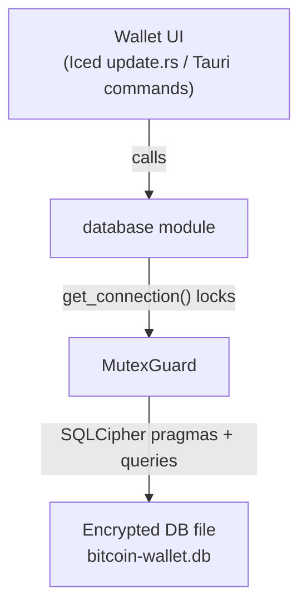

<div align="left">

<details>
<summary><b>📑 Chapter Navigation ▼</b></summary>

### Part I: Core Blockchain Implementation

1. <a href="../01-Introduction.md">Chapter 1: Introduction & Overview</a>
2. <a href="../bitcoin-blockchain/README.md">Chapter 1.2: Introduction to Bitcoin & Blockchain</a>
3. <a href="../bitcoin-blockchain/whitepaper-rust/00-Bitcoin-Whitepaper-Summary.md">Chapter 1.3: Bitcoin Whitepaper</a>
4. <a href="../bitcoin-blockchain/whitepaper-rust/00-Bitcoin-Whitepaper-Rust-Encoding-Summary.md">Chapter 1.4: Bitcoin Whitepaper In Rust</a>
5. <a href="../bitcoin-blockchain/Rust-Project-Index.md">Chapter 2.0: Rust Blockchain Project</a>
6. <a href="../bitcoin-blockchain/primitives/README.md">Chapter 2.1: Primitives</a>
7. <a href="../bitcoin-blockchain/util/README.md">Chapter 2.2: Utilities</a>
8. <a href="../bitcoin-blockchain/crypto/README.md">Chapter 2.3: Cryptography</a>
9. <a href="../bitcoin-blockchain/chain/README.md">Chapter 2.4: Blockchain (Technical Foundations)</a>
10. <a href="../bitcoin-blockchain/store/README.md">Chapter 2.5: Storage Layer</a>
11. <a href="../bitcoin-blockchain/chain/10-Whitepaper-Step-5-Block-Acceptance.md">Chapter 2.6: Block Acceptance</a>
12. <a href="../bitcoin-blockchain/net/README.md">Chapter 2.7: Network Layer</a>
13. <a href="../bitcoin-blockchain/node/README.md">Chapter 2.8: Node Orchestration</a>
14. <a href="../bitcoin-blockchain/wallet/README.md">Chapter 2.9: Wallet System</a>
15. <a href="../bitcoin-blockchain/web/README.md">Chapter 3: Web API Architecture</a>
16. <a href="../bitcoin-desktop-ui-iced/04.1-Desktop-Admin-UI-Iced.md">Chapter 4.1: Desktop Admin (Iced)</a>
17. <a href="../bitcoin-desktop-ui-iced/04.1A-Desktop-Admin-UI-Code-Walkthrough.md">4.1A: Code Walkthrough</a>
18. <a href="../bitcoin-desktop-ui-iced/04.1B-Desktop-Admin-UI-Update-Loop.md">4.1B: Update Loop</a>
19. <a href="../bitcoin-desktop-ui-iced/04.1C-Desktop-Admin-UI-View-Layer.md">4.1C: View Layer</a>
20. <a href="../bitcoin-desktop-ui-tauri/04.2-Desktop-Admin-UI-Tauri.md">Chapter 4.2: Desktop Admin (Tauri)</a>
21. <a href="../bitcoin-desktop-ui-tauri/04.2A-Tauri-Admin-Rust-Backend.md">4.2A: Rust Backend</a>
22. <a href="../bitcoin-desktop-ui-tauri/04.2B-Tauri-Admin-Frontend-Infrastructure.md">4.2B: Frontend Infrastructure</a>
23. <a href="../bitcoin-desktop-ui-tauri/04.2C-Tauri-Admin-Frontend-Pages.md">4.2C: Frontend Pages</a>
24. <a href="../bitcoin-wallet-ui-iced/05.1-Wallet-UI-Iced.md">Chapter 5.1: Wallet UI (Iced)</a>
25. <a href="../bitcoin-wallet-ui-iced/05.1A-Wallet-UI-Code-Listings.md">5.1A: Code Listings</a>
26. <a href="../bitcoin-wallet-ui-tauri/05.2-Wallet-UI-Tauri.md">Chapter 5.2: Wallet UI (Tauri)</a>
27. <a href="../bitcoin-wallet-ui-tauri/05.2A-Tauri-Wallet-Rust-Backend.md">5.2A: Rust Backend</a>
28. <a href="../bitcoin-wallet-ui-tauri/05.2B-Tauri-Wallet-Frontend-Infrastructure.md">5.2B: Frontend Infrastructure</a>
29. <a href="../bitcoin-wallet-ui-tauri/05.2C-Tauri-Wallet-Frontend-Pages.md">5.2C: Frontend Pages</a>
30. **Chapter 6: Embedded Database** ← *You are here*
31. <a href="06A-Embedded-Database-Code-Listings.md">6A: Code Listings</a>
32. <a href="../bitcoin-web-ui/06-Web-Admin-UI.md">Chapter 7: Web Admin Interface</a>
33. <a href="../bitcoin-web-ui/06A-Web-Admin-UI-Code-Listings.md">7A: Code Listings</a>

### Part II: Deployment & Operations

34. <a href="../ci/docker-compose/01-Introduction.md">Chapter 8: Docker Compose Deployment</a>
35. <a href="../ci/docker-compose/01A-Docker-Compose-Code-Listings.md">8A: Code Listings</a>
36. <a href="../ci/kubernetes/README.md">Chapter 9: Kubernetes Deployment</a>
37. <a href="../ci/kubernetes/01A-Kubernetes-Code-Listings.md">9A: Code Listings</a>

### Part III: Language Reference

38. <a href="../rust/README.md">Chapter 10: Rust Language Guide</a>

</details>

</div>

---
<div align="right">

**[← Back to Main Book](../../README.md)**

</div>

---

## Chapter 6: Embedded Database & Persistence (SQLCipher)

**Part I: Core Blockchain Implementation**

<div align="center">

**📚 [← Chapter 5.1: Wallet UI (Iced)](../bitcoin-wallet-ui-iced/05.1-Wallet-UI-Iced.md)** | **Chapter 6: Embedded Database** | **[Chapter 7: Web Admin UI →](../bitcoin-web-ui/06-Web-Admin-UI.md)** 📚

</div>

---

## Overview

> **Methods involved**
> - `generate_database_password` (Iced: `src/main.rs`, Tauri: `src-tauri/src/main.rs`)
> - `database::init_database` (Iced: `src/database.rs`; Tauri: `src-tauri/src/database/mod.rs`)
> - `load_settings`, `save_settings` / `save_settings_db`
> - `save_wallet_address`, `load_wallet_addresses`
> - `delete_wallet_address_db`, `update_wallet_label_db` (Tauri only)

Both wallet applications in this project — the Iced wallet (Chapter 5) and the Tauri wallet (Chapter 9) — persist user configuration and wallet addresses in an **encrypted SQLite database** built via SQLCipher. This chapter covers the **shared persistence layer** used by both, explaining the patterns once so that neither wallet chapter needs to repeat the material.

The two reader-facing goals are:

- **Security**: sensitive values (like API keys) are stored encrypted at rest, without requiring the user to type a passphrase.
- **Continuity**: wallet addresses and settings survive process restarts, so the wallet list is stable and the node connection is remembered.

The database code in both apps is **nearly identical**. The Iced wallet stores it in a single file (`src/database.rs`), while the Tauri wallet organizes it into a module directory (`src-tauri/src/database/mod.rs` + `tests.rs`). The schema, key derivation, initialization sequence, and CRUD operations are the same. We will note the few differences as they arise.

To keep this chapter readable without a repository open, the complete, verbatim source files are provided in **[Chapter 6A: Embedded Database — Complete Code Listings](06A-Embedded-Database-Code-Listings.md)**.

---

## What we store (and why)

> **Methods involved**
> - `create_tables` ([Listing 6.1](06A-Embedded-Database-Code-Listings.md#listing-61-iced-wallet-srcdatabasers), [Listing 6.2](06A-Embedded-Database-Code-Listings.md#listing-62-tauri-wallet-src-taurisrcdatabasemodrs))

This persistence layer is intentionally small and pragmatic. We store four tables:

- **`settings`**: `base_url`, `api_key` — required so the UI can reconnect to the node without retyping configuration each time.
- **`wallet_addresses`**: `address`, optional `label`, `created_at` — required so the wallet list is stable and selectable after restart.
- **`schema_version`**: `version` — required so the database can evolve safely over time via migrations.
- **`users`**: `first_name`, `last_name`, `profile_picture` (BLOB) — present to support future UI work; in the current code the persistence primitives exist (schema + migrations), even if UI integration is minimal.

---

## Architecture: a single encrypted database + a single guarded connection

> **Methods involved**
> - `init_database` ([Listing 6.1](06A-Embedded-Database-Code-Listings.md#listing-61-iced-wallet-srcdatabasers), [Listing 6.2](06A-Embedded-Database-Code-Listings.md#listing-62-tauri-wallet-src-tauisrcdatabasemodrs))
> - `get_connection` ([Listing 6.1](06A-Embedded-Database-Code-Listings.md#listing-61-iced-wallet-srcdatabasers), [Listing 6.2](06A-Embedded-Database-Code-Listings.md#listing-62-tauri-wallet-src-tauisrcdatabasemodrs))

Both wallets use a single global connection:

```rust
static DB_CONN: OnceLock<Mutex<Connection>> = OnceLock::new();
```

This is a deliberate trade-off suitable for a GUI application:

- it avoids passing a connection through every call,
- it ensures access is serialized (SQLite `Connection` is not safe to share without synchronization),
- and it keeps the API of the module simple — any function in the module can call `get_connection()` to get a `MutexGuard<Connection>`.



The `OnceLock` guarantees that `init_database` can only succeed once per process. After that, `get_connection()` serves as the narrow waist: every read/write operation acquires the mutex, executes its query, and releases the lock when the guard drops.

---

## Cargo dependency: `rusqlite` with `bundled-sqlcipher`

> **Methods involved**
> - `Cargo.toml` in both wallets ([Listing 6.1](06A-Embedded-Database-Code-Listings.md#listing-61-iced-wallet-srcdatabasers) preamble, [Listing 6.2](06A-Embedded-Database-Code-Listings.md#listing-62-tauri-wallet-src-tauisrcdatabasemodrs) preamble)

Both wallets declare the same dependency:

```toml
rusqlite = { version = "0.31", features = ["bundled-sqlcipher"] }
dirs = "5.0"
```

The `bundled-sqlcipher` feature compiles SQLCipher from source during `cargo build`, so no external SQLCipher library installation is needed. The `dirs` crate provides cross-platform data directory resolution (e.g., `~/Library/Application Support` on macOS, `~/.local/share` on Linux, `%APPDATA%` on Windows).

---

## Key derivation: deterministic password generation

> **Methods involved**
> - `generate_database_password` (Iced: `main.rs`, Tauri: `main.rs`)

The database password is generated without user interaction. Both wallets use an **identical** `generate_database_password` function — in fact, the Tauri version includes the comment "EXACT replica from bitcoin-wallet-ui-iced":

```rust
fn generate_database_password() -> String {
    use std::collections::hash_map::DefaultHasher;
    use std::hash::{Hash, Hasher};

    let mut hasher = DefaultHasher::new();

    // Use username
    if let Ok(username) = std::env::var("USER") {
        username.hash(&mut hasher);
    } else if let Ok(username) = std::env::var("USERNAME") {
        username.hash(&mut hasher);
    }

    // Use home directory
    if let Some(home) = dirs::home_dir() {
        home.to_string_lossy().hash(&mut hasher);
    }

    // Use application name
    "bitcoin-wallet-ui".hash(&mut hasher);

    // Convert to hex string
    format!("{:x}", hasher.finish())
}
```

This design emphasizes **zero-interaction UX**: the user is never prompted for a passphrase, but the file is still encrypted at rest. The password is deterministic — the same user on the same machine always produces the same key — which means both the Iced and Tauri wallets can open the same database file.

Three inputs feed the hash:

1. **Username**: from `$USER` (Unix/macOS) or `$USERNAME` (Windows).
2. **Home directory**: via `dirs::home_dir()`, which resolves platform-specific paths.
3. **Application name**: the literal string `"bitcoin-wallet-ui"`.

The `DefaultHasher` produces a 64-bit hash, which is converted to a hex string. This is not cryptographically strong key derivation (it is not using PBKDF2 or Argon2), but it is sufficient for a local development/learning tool: the encryption prevents casual file inspection, and the determinism avoids lockout.

> **Design note**: Because the application name `"bitcoin-wallet-ui"` is the same in both Iced and Tauri wallets, and because both store the file at the same path (`<data_dir>/bitcoin-wallet-ui/bitcoin-wallet.db`), the two wallet apps share the same database. This is intentional — a user who switches between the two frontends sees the same wallets and settings.

---

## Database initialization

> **Methods involved**
> - `init_database` ([Listing 6.1](06A-Embedded-Database-Code-Listings.md#listing-61-iced-wallet-srcdatabasers), [Listing 6.2](06A-Embedded-Database-Code-Listings.md#listing-62-tauri-wallet-src-tauisrcdatabasemodrs))
> - `get_database_path`

The initialization sequence is identical in both wallets. The caller generates the password and passes it in:

```rust
// In main() — identical in both wallets
let db_password = generate_database_password();
if let Err(e) = database::init_database(&db_password) {
    eprintln!("Failed to initialize database: {}", e);
    // Continue anyway - settings will use defaults
}
```

### Annotated listing: `init_database`

```rust
pub fn init_database(password: &str) -> SqliteResult<()> {
    let db_path = get_database_path();

    // 1) Ensure the parent directory exists. This makes the module robust on first run.
    if let Some(parent) = db_path.parent() {
        std::fs::create_dir_all(parent).map_err(|e| {
            // Map an I/O error into a rusqlite error so we keep one error domain.
            rusqlite::Error::SqliteFailure(
                rusqlite::ffi::Error::new(rusqlite::ffi::SQLITE_CANTOPEN),
                Some(format!("Failed to create database directory: {}", e)),
            )
        })?;
    }

    // 2) Open (or create) the SQLite file.
    let conn = Connection::open(&db_path)?;

    // 3) Critical SQLCipher step: set the encryption key *immediately* after opening.
    //    If the key is wrong, subsequent reads will fail with "file is encrypted…".
    conn.pragma_update(None, "key", password)?;

    // 4) Enable foreign keys (good SQLite hygiene; harmless if unused).
    conn.pragma_update(None, "foreign_keys", "ON")?;

    // 5) Create base schema + apply migrations before the connection is exposed.
    create_tables(&conn)?;
    run_migrations(&conn)?;

    // 6) Store the connection globally for the rest of the process lifetime.
    DB_CONN.set(Mutex::new(conn)).map_err(|_| {
        rusqlite::Error::SqliteFailure(
            rusqlite::ffi::Error::new(rusqlite::ffi::SQLITE_MISUSE),
            Some("Database already initialized".to_string()),
        )
    })?;

    Ok(())
}
```

The six-step sequence is worth internalizing because it embodies a pattern we reuse:

1. **Ensure directories exist** — `create_dir_all` is idempotent.
2. **Open the file** — `Connection::open` creates the file if it doesn't exist.
3. **Set the encryption key** — this must be the very first pragma. If we ran any other SQL first, SQLCipher would treat the database as unencrypted.
4. **Enable foreign keys** — SQLite disables them by default.
5. **Create tables and run migrations** — before exposing the connection to any caller.
6. **Store globally** — `OnceLock::set` fails if already initialized, which we surface as a `SQLITE_MISUSE` error.

### `get_database_path`

The database file location is resolved via the `dirs` crate:

```rust
fn get_database_path() -> PathBuf {
    let mut path = dirs::data_dir().unwrap_or_else(|| PathBuf::from("."));
    path.push("bitcoin-wallet-ui");
    path.push(DB_FILENAME);
    path
}
```

This resolves to platform-specific paths:

| Platform | Path |
|----------|------|
| macOS | `~/Library/Application Support/bitcoin-wallet-ui/bitcoin-wallet.db` |
| Linux | `~/.local/share/bitcoin-wallet-ui/bitcoin-wallet.db` |
| Windows | `%APPDATA%/bitcoin-wallet-ui/bitcoin-wallet.db` |

---

## Connection acquisition: `get_connection`

> **Methods involved**
> - `get_connection` ([Listing 6.1](06A-Embedded-Database-Code-Listings.md#listing-61-iced-wallet-srcdatabasers), [Listing 6.2](06A-Embedded-Database-Code-Listings.md#listing-62-tauri-wallet-src-tauisrcdatabasemodrs))

`get_connection` is the narrow waist of the module: every read/write operation goes through it. It ensures the database was initialized and acquires the global mutex:

```rust
fn get_connection() -> SqliteResult<std::sync::MutexGuard<'static, Connection>> {
    DB_CONN
        .get()
        .ok_or_else(|| {
            // The database was never initialized — the UI must call init_database at startup.
            rusqlite::Error::SqliteFailure(
                rusqlite::ffi::Error::new(rusqlite::ffi::SQLITE_MISUSE),
                Some("Database not initialized".to_string()),
            )
        })?
        .lock()
        .map_err(|_| {
            // A poisoned mutex implies a previous panic while holding the lock.
            rusqlite::Error::SqliteFailure(
                rusqlite::ffi::Error::new(rusqlite::ffi::SQLITE_MISUSE),
                Some("Failed to acquire database lock".to_string()),
            )
        })
}
```

Two things can go wrong: `OnceLock::get()` returns `None` if `init_database` was never called, and `Mutex::lock()` returns `Err` if a previous caller panicked while holding the lock (poisoning the mutex). Both are mapped into the `rusqlite::Error` domain so every database function has a uniform error type.

---

## Schema and defaults: `create_tables`

> **Methods involved**
> - `create_tables` ([Listing 6.1](06A-Embedded-Database-Code-Listings.md#listing-61-iced-wallet-srcdatabasers), [Listing 6.2](06A-Embedded-Database-Code-Listings.md#listing-62-tauri-wallet-src-tauisrcdatabasemodrs))

Read `create_tables` with three lenses:

- **Singleton settings**: `settings.id` has `CHECK (id = 1)` so there can be only one row.
- **Uniqueness**: `wallet_addresses.address` is `UNIQUE` to prevent duplicates.
- **Schema versioning**: `schema_version` is created and initialized to `SCHEMA_VERSION` (currently 2).

### Annotated listing: `create_tables`

```rust
fn create_tables(conn: &Connection) -> SqliteResult<()> {
    // ── Settings table ──
    // The singleton pattern: CHECK(id = 1) prevents multiple rows.
    // This means every query can use WHERE id = 1 without ambiguity.
    conn.execute(
        "CREATE TABLE IF NOT EXISTS settings (
            id INTEGER PRIMARY KEY CHECK (id = 1),
            base_url TEXT NOT NULL DEFAULT 'http://127.0.0.1:8080',
            api_key TEXT NOT NULL DEFAULT '',
            created_at TEXT NOT NULL DEFAULT (datetime('now')),
            updated_at TEXT NOT NULL DEFAULT (datetime('now'))
        )",
        [],
    )?;

    // Populate the singleton row once (first-run initialization).
    // The API key defaults to the BITCOIN_API_WALLET_KEY env var, falling back to a
    // development default. This means first-run UX requires no manual configuration.
    let count: i64 = conn.query_row("SELECT COUNT(*) FROM settings", [], |row| row.get(0))?;
    if count == 0 {
        conn.execute(
            "INSERT INTO settings (id, base_url, api_key) VALUES (1, 'http://127.0.0.1:8080', ?)",
            params![
                std::env::var("BITCOIN_API_WALLET_KEY")
                    .unwrap_or_else(|_| "wallet-secret".to_string())
            ],
        )?;
    }

    // ── Wallet addresses table ──
    // UNIQUE(address) prevents duplicates across restarts and re-creates.
    conn.execute(
        "CREATE TABLE IF NOT EXISTS wallet_addresses (
            id INTEGER PRIMARY KEY AUTOINCREMENT,
            address TEXT NOT NULL UNIQUE,
            label TEXT,
            created_at TEXT NOT NULL DEFAULT (datetime('now')),
            updated_at TEXT NOT NULL DEFAULT (datetime('now'))
        )",
        [],
    )?;

    // Performance index for lookups and ORDER BY patterns.
    conn.execute(
        "CREATE INDEX IF NOT EXISTS idx_wallet_addresses_address ON wallet_addresses(address)",
        [],
    )?;

    // ── User profile table ──
    // Another singleton (CHECK(id = 1)). Supports future profile features.
    conn.execute(
        "CREATE TABLE IF NOT EXISTS users (
            id INTEGER PRIMARY KEY CHECK (id = 1),
            first_name TEXT,
            last_name TEXT,
            profile_picture BLOB,
            created_at TEXT NOT NULL DEFAULT (datetime('now')),
            updated_at TEXT NOT NULL DEFAULT (datetime('now'))
        )",
        [],
    )?;

    // ── Schema version table ──
    // Tracks the current schema version for migration logic.
    conn.execute(
        "CREATE TABLE IF NOT EXISTS schema_version (
            version INTEGER PRIMARY KEY
        )",
        [],
    )?;

    let version_count: i64 =
        conn.query_row("SELECT COUNT(*) FROM schema_version", [], |row| row.get(0))?;
    if version_count == 0 {
        conn.execute(
            "INSERT INTO schema_version (version) VALUES (?)",
            params![SCHEMA_VERSION],
        )?;
    }

    Ok(())
}
```

The schema embodies a pattern we call the **singleton table**: `CHECK (id = 1)` on both `settings` and `users` prevents more than one row. This is a simple and effective alternative to a key-value store when you have a fixed set of fields.

---

## Migrations: evolving the database safely

> **Methods involved**
> - `run_migrations` ([Listing 6.1](06A-Embedded-Database-Code-Listings.md#listing-61-iced-wallet-srcdatabasers), [Listing 6.2](06A-Embedded-Database-Code-Listings.md#listing-62-tauri-wallet-src-tauisrcdatabasemodrs))

Migrations exist to handle one of the most common real-world problems: shipping a new binary against a database created by an older version.

The current code includes one migration, from schema version 1 to version 2:

- **Change**: `users.profile_picture_path` (TEXT) → `users.profile_picture` (BLOB).
- **Challenge**: SQLite does not support `ALTER COLUMN` to change a column type.
- **Solution**: Recreate the table via `execute_batch` within a transaction.

### Annotated listing: `run_migrations`

```rust
fn run_migrations(conn: &Connection) -> SqliteResult<()> {
    // Read the version from schema_version; missing row defaults to 0.
    let current_version: i32 = conn
        .query_row("SELECT version FROM schema_version LIMIT 1", [], |row| {
            row.get(0)
        })
        .unwrap_or(0);

    // ── Migration 1 → 2 ──
    // Detect whether the legacy column `profile_picture_path` (TEXT) exists
    // and whether the new column `profile_picture` (BLOB) is already present.
    if current_version < 2 {
        let table_info: Vec<TableColumnInfo> = conn
            .prepare("PRAGMA table_info(users)")?
            .query_map([], |row| {
                Ok((
                    row.get::<_, String>(1)?,  // column name
                    row.get::<_, String>(2)?,  // column type
                    row.get(3)?,               // notnull
                    row.get(4)?,               // default_value
                    row.get(5)?,               // pk
                    false,                     // placeholder (unused)
                ))
            })?
            .collect::<Result<Vec<_>, _>>()?;

        let has_old_column = table_info
            .iter()
            .any(|(name, _, _, _, _, _)| name == "profile_picture_path");
        let has_new_column = table_info
            .iter()
            .any(|(name, _, _, _, _, _)| name == "profile_picture");

        if has_old_column && !has_new_column {
            // Case 1: Old column exists, new column doesn't.
            // Recreate the table in a transaction, copying compatible columns.
            conn.execute_batch(
                "BEGIN TRANSACTION;
                 CREATE TABLE users_new (
                     id INTEGER PRIMARY KEY CHECK (id = 1),
                     first_name TEXT,
                     last_name TEXT,
                     profile_picture BLOB,
                     created_at TEXT NOT NULL DEFAULT (datetime('now')),
                     updated_at TEXT NOT NULL DEFAULT (datetime('now'))
                 );
                 INSERT INTO users_new (id, first_name, last_name, created_at, updated_at)
                 SELECT id, first_name, last_name, created_at, updated_at FROM users;
                 DROP TABLE users;
                 ALTER TABLE users_new RENAME TO users;
                 COMMIT;",
            )?;
        } else if !has_new_column {
            // Case 2: New column missing (but old column may or may not exist).
            conn.execute("ALTER TABLE users ADD COLUMN profile_picture BLOB", [])?;

            if has_old_column {
                // If old column also exists, recreate to drop it.
                conn.execute_batch(
                    "BEGIN TRANSACTION;
                     CREATE TABLE users_new (
                         id INTEGER PRIMARY KEY CHECK (id = 1),
                         first_name TEXT,
                         last_name TEXT,
                         profile_picture BLOB,
                         created_at TEXT NOT NULL DEFAULT (datetime('now')),
                         updated_at TEXT NOT NULL DEFAULT (datetime('now'))
                     );
                     INSERT INTO users_new (id, first_name, last_name, created_at, updated_at)
                     SELECT id, first_name, last_name, created_at, updated_at FROM users;
                     DROP TABLE users;
                     ALTER TABLE users_new RENAME TO users;
                     COMMIT;",
                )?;
            }
        }

        conn.execute("UPDATE schema_version SET version = ?", params![2])?;
    }

    // Catch-all: ensure schema_version reflects the latest constant.
    if current_version < SCHEMA_VERSION {
        conn.execute(
            "UPDATE schema_version SET version = ?",
            params![SCHEMA_VERSION],
        )?;
    }

    Ok(())
}
```

The migration uses SQLite's `PRAGMA table_info()` to introspect the current schema before making changes. This makes the migration idempotent: running it against a database that has already been migrated is a no-op. The "recreate table" technique — create a new table with the desired schema, copy the data, drop the old table, rename the new table — is the standard approach for SQLite schema changes that go beyond what `ALTER TABLE` can express.

---

## Data types

> **Methods involved**
> - `Settings`, `WalletAddress` struct definitions

Both wallets define the same two public types. The only difference is that the Tauri wallet adds `Serialize` and `Deserialize` derives (required for Tauri IPC serialization):

### Iced wallet

```rust
#[derive(Debug, Clone)]
pub struct Settings {
    pub base_url: String,
    pub api_key: String,
}

#[derive(Debug, Clone)]
pub struct WalletAddress {
    pub address: String,
    pub label: Option<String>,
    pub created_at: String,
}
```

### Tauri wallet

```rust
#[derive(Debug, Clone, Serialize, Deserialize)]
pub struct Settings {
    pub base_url: String,
    pub api_key: String,
}

#[derive(Debug, Clone, Serialize, Deserialize)]
pub struct WalletAddress {
    pub address: String,
    pub label: Option<String>,
    pub created_at: String,
}
```

The `WalletAddress` constructor is identical in both:

```rust
impl WalletAddress {
    pub fn new(address: String, label: Option<String>) -> Self {
        Self {
            address,
            label,
            created_at: String::new(), // Will be set by database
        }
    }
}
```

The empty `created_at` is intentional: the database's `DEFAULT (datetime('now'))` clause assigns the timestamp on insert.

---

## Settings persistence: load and save

> **Methods involved**
> - `load_settings` ([Listing 6.1](06A-Embedded-Database-Code-Listings.md#listing-61-iced-wallet-srcdatabasers), [Listing 6.2](06A-Embedded-Database-Code-Listings.md#listing-62-tauri-wallet-src-tauisrcdatabasemodrs))
> - `save_settings` (Iced) / `save_settings_db` (Tauri)

### `load_settings`

```rust
pub fn load_settings() -> SqliteResult<Settings> {
    let conn = get_connection()?;

    // Because settings is a singleton table, the query expects exactly one row.
    conn.query_row(
        "SELECT base_url, api_key FROM settings WHERE id = 1",
        [],
        |row| {
            Ok(Settings {
                base_url: row.get(0)?,
                api_key: row.get(1)?,
            })
        },
    )
}
```

### `save_settings` / `save_settings_db`

The implementations are identical except for the function name. The Tauri wallet uses `save_settings_db` to avoid naming conflicts with the Tauri command layer:

```rust
pub fn save_settings(settings: &Settings) -> SqliteResult<()> {
    let conn = get_connection()?;

    // Positional parameters avoid string concatenation and injection hazards.
    conn.execute(
        "UPDATE settings SET base_url = ?, api_key = ?, updated_at = datetime('now') WHERE id = 1",
        params![settings.base_url, settings.api_key],
    )?;

    Ok(())
}
```

---

## Wallet address persistence: insert-or-update ("upsert") behavior

> **Methods involved**
> - `save_wallet_address` ([Listing 6.1](06A-Embedded-Database-Code-Listings.md#listing-61-iced-wallet-srcdatabasers), [Listing 6.2](06A-Embedded-Database-Code-Listings.md#listing-62-tauri-wallet-src-tauisrcdatabasemodrs))
> - `load_wallet_addresses`

The wallet list must be stable under these operations:

- creating a new wallet (insert),
- creating another wallet with the same address (update label; should not duplicate),
- loading all wallets (display list, newest first).

### `save_wallet_address`

The upsert pattern: attempt an `INSERT`, catch the uniqueness constraint violation, fall back to `UPDATE`, and always return the full record:

```rust
pub fn save_wallet_address(wallet: &WalletAddress) -> SqliteResult<WalletAddress> {
    let conn = get_connection()?;

    // Try an insert first. This covers the common "new wallet created" path.
    match conn.execute(
        "INSERT INTO wallet_addresses (address, label, updated_at) VALUES (?, ?, datetime('now'))",
        params![wallet.address, wallet.label],
    ) {
        Ok(_) => {
            // Re-query to return a complete record, including created_at assigned by SQLite.
            conn.query_row(
                "SELECT address, label, created_at FROM wallet_addresses WHERE address = ?",
                params![wallet.address],
                |row| {
                    Ok(WalletAddress {
                        address: row.get(0)?,
                        label: row.get(1)?,
                        created_at: row.get(2)?,
                    })
                },
            )
        }
        Err(rusqlite::Error::SqliteFailure(err, _))
            if err.code == rusqlite::ErrorCode::ConstraintViolation =>
        {
            // Address already exists — update mutable fields (label + updated_at).
            conn.execute(
                "UPDATE wallet_addresses SET label = ?, updated_at = datetime('now') WHERE address = ?",
                params![wallet.label, wallet.address],
            )?;

            // Return the updated record so the caller can refresh its model.
            conn.query_row(
                "SELECT address, label, created_at FROM wallet_addresses WHERE address = ?",
                params![wallet.address],
                |row| {
                    Ok(WalletAddress {
                        address: row.get(0)?,
                        label: row.get(1)?,
                        created_at: row.get(2)?,
                    })
                },
            )
        }
        Err(e) => Err(e),
    }
}
```

This gives a stable call pattern: the caller always gets a complete `WalletAddress` back, regardless of whether the operation was insert or update. The `ConstraintViolation` match arm is the key — it converts what would normally be an error into a fallback update.

### `load_wallet_addresses`

```rust
pub fn load_wallet_addresses() -> SqliteResult<Vec<WalletAddress>> {
    let conn = get_connection()?;

    let mut stmt = conn.prepare(
        "SELECT address, label, created_at FROM wallet_addresses ORDER BY created_at DESC",
    )?;

    let addresses = stmt.query_map([], |row| {
        Ok(WalletAddress {
            address: row.get(0)?,
            label: row.get(1)?,
            created_at: row.get(2)?,
        })
    })?;

    let mut result = Vec::new();
    for address in addresses {
        result.push(address?);
    }

    Ok(result)
}
```

The `ORDER BY created_at DESC` ensures the most recently created wallet appears first in the list.

---

## Additional Tauri operations: delete and update label

> **Methods involved**
> - `delete_wallet_address_db`, `update_wallet_label_db` (Tauri only, [Listing 6.2](06A-Embedded-Database-Code-Listings.md#listing-62-tauri-wallet-src-tauisrcdatabasemodrs))

The Tauri wallet adds two CRUD operations that the Iced wallet does not have. These support the wallet management UI where users can delete wallets and rename labels inline:

```rust
pub fn delete_wallet_address_db(address: &str) -> SqliteResult<()> {
    let conn = get_connection()?;
    conn.execute("DELETE FROM wallet_addresses WHERE address = ?", params![address])?;
    Ok(())
}

pub fn update_wallet_label_db(address: &str, label: &str) -> SqliteResult<()> {
    let conn = get_connection()?;
    conn.execute(
        "UPDATE wallet_addresses SET label = ?, updated_at = datetime('now') WHERE address = ?",
        params![label, address],
    )?;
    Ok(())
}
```

These follow the same pattern as all other CRUD operations: acquire the connection, execute a parameterized query, return the result.

---

## Iced vs. Tauri: what differs and what doesn't

The database layer is the most shared code between the two wallet frontends. Here is a precise comparison:

| Aspect | Iced Wallet | Tauri Wallet |
|--------|-------------|--------------|
| **File location** | `src/database.rs` (single file) | `src-tauri/src/database/mod.rs` + `tests.rs` |
| **Schema** | 4 tables, version 2 | 4 tables, version 2 (identical) |
| **`generate_database_password`** | In `main.rs` | In `main.rs` (identical) |
| **`init_database`** | Identical | Identical |
| **`create_tables`** | Identical | Identical |
| **`run_migrations`** | Identical | Identical |
| **`Settings` / `WalletAddress`** | `Debug, Clone` | `Debug, Clone, Serialize, Deserialize` |
| **`save_settings`** | `save_settings` | `save_settings_db` (renamed) |
| **Delete wallet** | Not implemented | `delete_wallet_address_db` |
| **Update label** | Not implemented | `update_wallet_label_db` |
| **Unit tests** | None in database module | 7 tests in `tests.rs` |
| **DB path** | `<data_dir>/bitcoin-wallet-ui/bitcoin-wallet.db` | Same path (shared DB) |

The takeaway: the schema and initialization are identical. The Tauri wallet adds `Serialize`/`Deserialize` (needed for IPC), renames one function to avoid command-layer naming conflicts, and adds delete + label update operations.

---

## Unit tests (Tauri wallet)

> **Methods involved**
> - `tests.rs` ([Listing 6.3](06A-Embedded-Database-Code-Listings.md#listing-63-tauri-wallet-src-tauisrcdatabasetestsrs))

The Tauri wallet includes a test suite that validates the database layer without SQLCipher encryption (using in-memory SQLite). The test helper `setup_test_db()` creates the same schema in memory, then each test exercises a specific aspect:

| Test | What it validates |
|------|------------------|
| `test_schema_creation` | All four tables exist after setup |
| `test_settings_crud` | Read defaults, update, verify changes |
| `test_wallet_address_crud` | Insert, read, update label, delete |
| `test_wallet_address_uniqueness` | Duplicate address insert fails |
| `test_wallet_list_ordering` | `ORDER BY created_at DESC` returns newest first |
| `test_schema_version` | Version table contains expected value (2) |
| `test_settings_singleton_constraint` | `CHECK(id = 1)` rejects `id = 2` |

These tests use `Connection::open_in_memory()` without encryption, which isolates the database logic from SQLCipher's key management. This is a practical testing pattern: the SQL schema and CRUD logic are the same whether or not the file is encrypted, so in-memory tests cover the logic without the complexity of key setup.

---

## Integration points in the wallet UIs

This database layer is integrated at three points in each wallet, though the specific mechanism differs:

### Iced wallet integration

1. **Startup** (`main.rs`): `generate_database_password()` → `database::init_database(&db_password)`.
2. **Initial model** (`WalletApp::new`): calls `load_settings()` and `load_wallet_addresses()` to populate the Iced model.
3. **Update loop** (`update.rs`): `Message::SaveSettings` calls `save_settings()`; `Message::WalletCreated` calls `save_wallet_address()`.

Persistence is a side effect in the state machine (`update`), not in the view.

### Tauri wallet integration

1. **Startup** (`main.rs`): `generate_database_password()` → `database::init_database(&db_password)`.
2. **AppState initialization** (`config/mod.rs`): `AppState::default()` calls `load_settings()` to populate initial state from the database with env var fallback.
3. **Tauri commands** (`commands/settings.rs`, `commands/wallet.rs`): each `#[tauri::command]` handler calls the appropriate database function. For example, `create_wallet` calls the remote API then `save_wallet_address()` to persist locally.

The Tauri integration is more fine-grained because each command handler is an independent async function, rather than a single `update` state machine.

---

## Summary

The SQLCipher persistence layer provides a minimal but production-appropriate foundation shared by both wallet frontends:

- **Encryption at rest** via SQLCipher, with a deterministic password that requires no user interaction.
- **A small schema** with singleton constraints, uniqueness guarantees, and sensible defaults.
- **Migrations** for safe schema evolution, using SQLite's table-recreation technique.
- **A simple API** centered on `get_connection()` as the single access point.
- **Shared database file** between both wallet UIs, enabling seamless frontend switching.

Complete code listings are in [Chapter 6A](06A-Embedded-Database-Code-Listings.md).

For how this database layer is used within each wallet's full architecture:
- **Iced wallet**: see [Chapter 5.1](../bitcoin-wallet-ui-iced/05.1-Wallet-UI-Iced.md)
- **Tauri wallet**: see [Chapter 5.2](../bitcoin-wallet-ui-tauri/05.2-Wallet-UI-Tauri.md), with Rust backend details in [Chapter 5.2A](../bitcoin-wallet-ui-tauri/05.2A-Tauri-Wallet-Rust-Backend.md)

---

<div align="center">

**📚 [← Previous: Wallet UI (Iced)](../bitcoin-wallet-ui-iced/05.1-Wallet-UI-Iced.md)** | **Chapter 6: Embedded Database & Persistence** | **[Next: Web Admin Interface →](../bitcoin-web-ui/06-Web-Admin-UI.md)** 📚

</div>

---

<div align="center">

**Reading order**

**[← Previous: Wallet UI (Iced)](../bitcoin-wallet-ui-iced/05.1-Wallet-UI-Iced.md)** | **[Next: Embedded Database — Code Listings →](06A-Embedded-Database-Code-Listings.md)**

</div>

---
